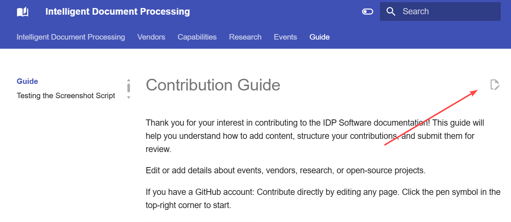
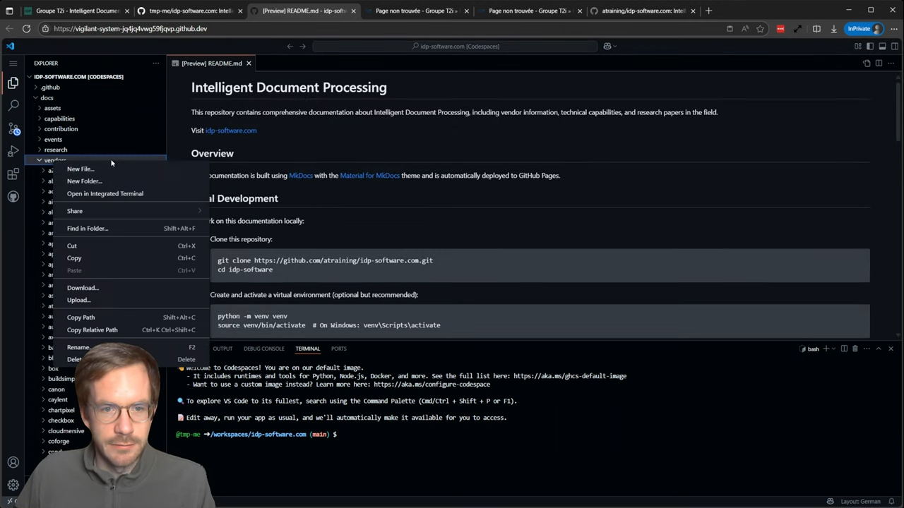
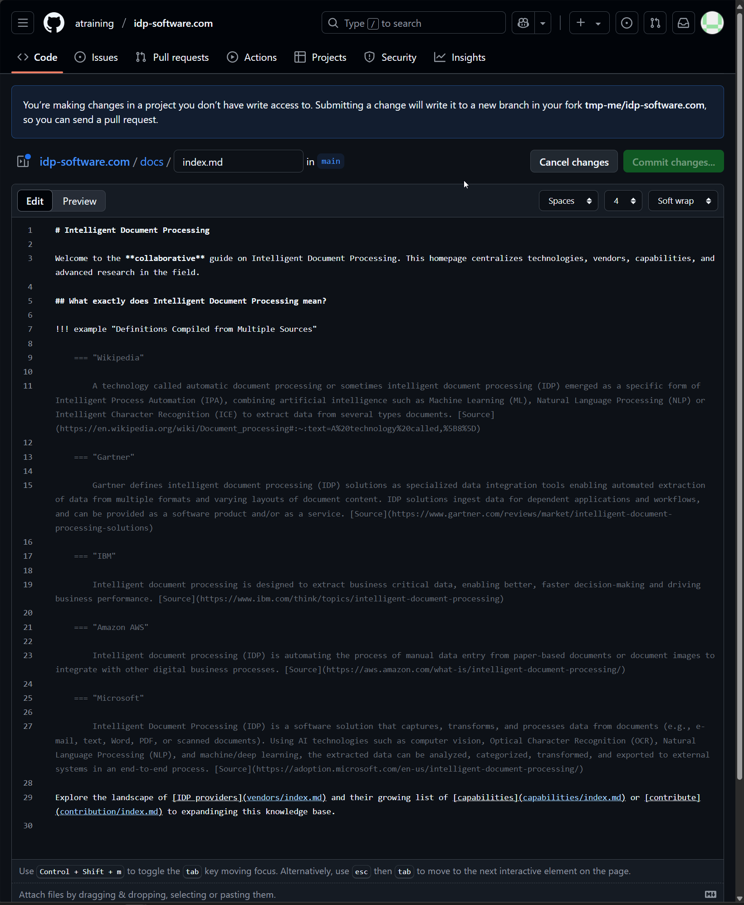
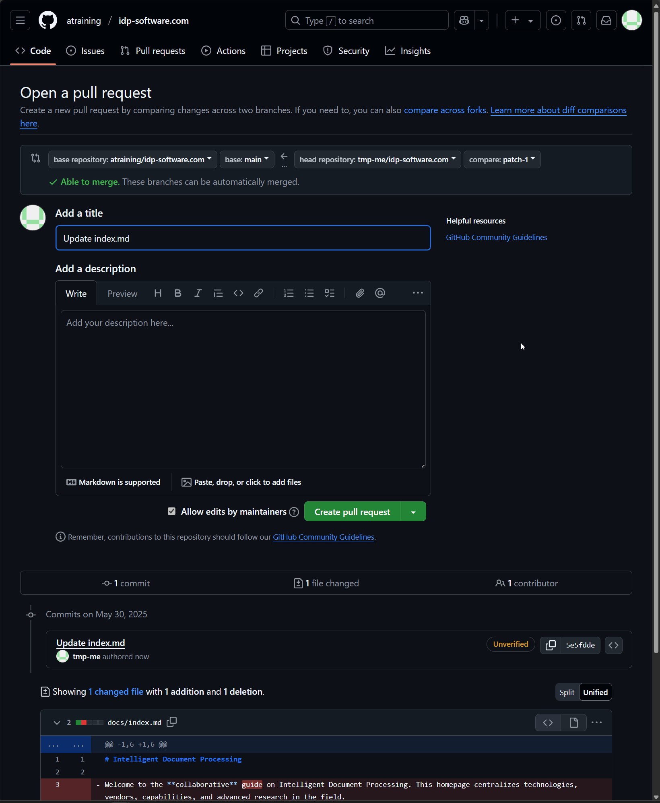
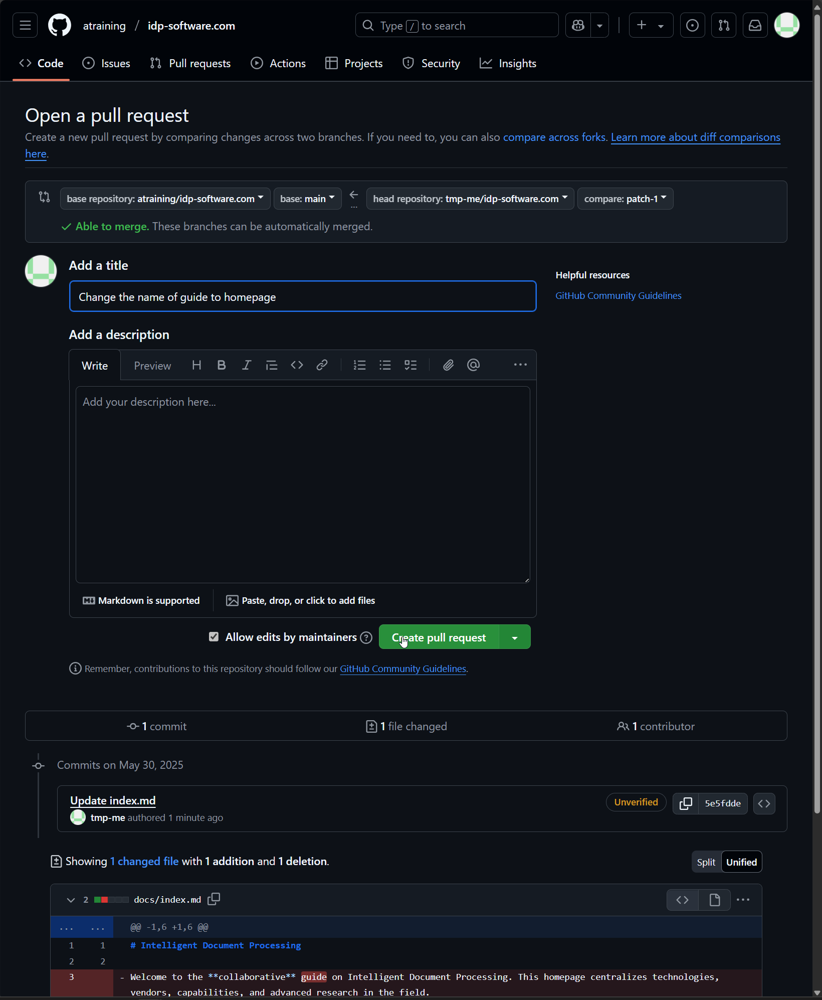

# Contribution Guide

Thank you for your interest in contributing to the IDP Software documentation! This guide will help you understand how to add content, structure your contributions, and submit them for review.

Edit or add details about events, vendors, research, or open-source projects. 

If you have a GitHub account: Contribute directly by editing any page. Click the pen symbol in the top-right corner to start.



[Create a GitHub Ticket](https://github.com/atraining/idp-software.com/issues/new/choose) if you don't know how to contribute by editing the page and create a Pull Request.

After your pull request is merged, you will show up as an author of the page on the homepage.


[ Watch the full video how to change this homeapge](https://www.youtube.com/watch?v=L4tHgBJCk8U)

## How to Edit a Page that does exist already

Follow these steps to contribute to the repository, even without technical expertise.

1. **Create a GitHub Account**  
   You need an [account on GitHub](https://docs.github.com/en/get-started/start-your-journey/creating-an-account-on-github) before making any edits to the page. Sign up if you don't have one.

2. **Fork the Repository**  
   Forking makes a personal copy of the repository under your GitHub account.  
   

3. **Edit the Content**  
   Locate the file you want to edit in your forked repository. Make your changes directly using the GitHub editor.    If you're unfamiliar with Markdown, watch this [helpful video](https://www.youtube.com/watch?v=qhoXn4bIE1s).  
   

4. **Commit Your Changes**  
   After editing, click "Commit changes." Add a clear and concise commit message explaining what you changed (e.g., "Fixed typo in Section 3").  
   

5. **Create a Pull Request**  
   A pull request sends your changes for review. Click the "Create Pull Request" option.  
   

6. **Add a Title and Description**  
   Provide a meaningful title for your pull request, such as "Add new section for troubleshooting." This helps reviewers understand the purpose of your update quickly.  
   

7. **Submit the Pull Request**  
   Finalize your contribution by clicking the "Submit" button.  
   

8. **Wait for Review**  
   I will review your submission. If it's approved, it will be added to the website. If changes are needed, I’ll provide feedback via comments in the pull request. You’ll get an email notification about it.

By following this process, you help improve our documentation seamlessly—thank you for your contribution!


## Documentation Structure

The documentation is organized into the following main sections:

- **Vendors**: Information about specific IDP software vendors
- **Capabilities**: Details about technical capabilities of IDP software
- **User Guide**: General guidance on using IDP software
- **Events**: 
- **Contribution**: Guidelines for contributors (this section)

## How to Add Content

#### Adding or Editing Research or Open Source Repositories in the Documentation

To add a new research paper or an open source repository to the documentation, follow these steps:

1. **Create the research paper folder structure**:
   
   Create a new folder under `docs/research/` using the format `YYYY-MM-DD-short-title`, where the date is the publication date of the paper (e.g., `docs/research/2024-03-22-docpedia/`).

   ```
   docs/
   └── research/
       └── YYYY-MM-DD-short-title/
           ├── assets/
           │   ├── paper-overview.png
           │   └── author-last-name-year.bib
           └── index.md
   ```

2. **Create the `index.md` file**:
   
   Create an `index.md` file in the research paper folder with the following template:

   ```markdown
   # Full Paper Title

   **Publication Date**: YYYY-MM-DD  
   **ArXiv Link**: [https://arxiv.org/abs/XXXX.XXXXX](https://arxiv.org/abs/XXXX.XXXXX)  
   **PDF**: [https://arxiv.org/pdf/XXXX.XXXXX](https://arxiv.org/pdf/XXXX.XXXXX)  
   **Authors**: Author 1, Author 2, etc.

   

   ## Abstract

   Copy the abstract from the paper or write a concise summary.

   ## Key Innovations

   1. **Innovation 1**: Description
   2. **Innovation 2**: Description
   3. **Innovation 3**: Description

   ## Methodology

   Describe the methodology used in the paper.

   ## Experimental Results

   Summarize the key experimental results.

   | Benchmark | Performance | Improvement over Baseline |
   |-----------|-------------|---------------------------|
   | Benchmark 1 | XX.X% | +X.X% |
   | Benchmark 2 | XX.X% | +X.X% |

   ## Implications for IDP

   Discuss how this research impacts the field of Intelligent Document Processing.

   ## Limitations and Future Work

   Highlight limitations and potential future research directions.

   ## Citation

   ```bibtex
   --8<-- "research/YYYY-MM-DD-short-title/assets/yyyy-mm-dd-author-last-name.bib"
   ```

   ## Resources

   - [Official GitHub Repository](https://github.com/link) (if available)
   - [Project Website](https://website.com) (if available)
   - [ArXiv Paper](https://arxiv.org/abs/XXXX.XXXXX)
   ```

4. **Add resources to the assets directory**:
   
   Create an `assets` directory in the research paper folder and add:
   
   - A representative image from the paper or a visual summary
   - A BibTeX citation file named with the first author's last name and year (e.g., `duggal2024docpedia.bib`)

6. **No need to update navigation**:
   
   The awesome-pages plugin automatically includes all research paper folders in the navigation in reverse chronological order.

The research paper will now appear in the documentation navigation under the Research section, with the most recent papers appearing first.

### Adding or Editing Vendors in the Documentation

#### Vendor's Status 

Before proceeding, verify if the software vendor is already listed:  

- ***Existing Vendor***: If the vendor is already listed, locate it on the homepage. Use the "Edit this page" button to update the page directly.  
- ***New Vendor***: If the vendor is not listed, follow the instructions below to create a new entry.

#### Adding a new Vendor

1. **Create a Vendor Folder**  
   Create a new folder under `docs/vendors/` with the vendor's name in lowercase. Use hyphens instead of spaces. For example:  
   ```
   docs/
   └── vendors/
       └── vendor-name/
           ├── assets/
           │   └── vendor-name.png
           └── index.md
   ```

3. **Edit the `index.md` File**  
   Copy the structure below into your `index.md` file inside the folder:  

   ```markdown
   # Vendor Name
   
   Brief description of the vendor and their IDP solution. (maximum 155 characters)

   ]

   <!-- IMPORTANT: Make sure to follow the three step structure.
        1. the headline
        2. the brief description
        3. link to the logo.
   
   This will make sure that your post ist automatically SEO optimized
   -->

   ## Overview

   Detailed description of the vendor's offerings, history, and position in the IDP market.
   
   Use [links](https://vendor-homepage.com/very-important/) to proof that your text uses relevant sources of information.
   
   <!-- Pleaese link sources -->

   ## Key Features

   - **Feature 1**: Description
   - **Feature 2**: Description
   - **Feature 3**: Description
   - **Feature 4**: Description
   - **Feature 5**: Description

   ## Use Cases

   ### Use Case 1

   Description of how the vendor's solution addresses this use case.

   ### Use Case 2

   Description of how the vendor's solution addresses this use case.
   
   ... more use cases

   ## Technical Specifications

   | Feature | Specification |
   |---------|---------------|
   | Deployment Options | Cloud, On-premise, etc. |
   | API | REST, SOAP, etc. |
   | Supported Languages | List of languages |
   | Document Formats | PDF, TIFF, etc. |
   | Integrations | List of integrations |

   ## Getting Started

   Steps to get started with the vendor's solution.
   
   If you discover a different video produced by an independent party that talks about the tool, please add a link to this one. Please do not (!) use sales videos made by the vendor.
   
   [YouTube Video](https://youtube.com/xxxxxx)

   ## Resources

   - [Vendor Website](https://vendor-website.com)
   - [Documentation](https://vendor-website.com/docs)
   - [GitHub/Resources](https://github.com/vendor)

   ## Contact Information

   - Website: [vendor-website.com](https://vendor-website.com)
   - Email: contact@vendor-website.com
   - Phone: +1 123-456-7890
   ```

> **Note**: Ensure all information is accurate and factual.

4. **Create a Screenshot (Optional)**  
   Place add a screenhot of the vendor's homepage inside the `assets/` folder as `vendor-name.png`. This ensures consistent presentation. This will automatically provide you with a good social preview.
5. **Commit Your Changes**  
   Write a descriptive commit message explaining your update, e.g., "Added new vendor 'vendor-name.'"  
6**Create a Pull Request**  
   Follow the steps earlier mentioned (see the "How to Contribute" section). Ensure your pull request provides a clear title and description for the reviewers.   


#### Existing Vendors: Editing Content  

1. **Search for the Vendor**  
   On the homepage, look for the vendor you want to edit.

2. **Use the "Edit This Page" Button**  
   Click on the "Edit this page" button. This opens the existing page for direct updates. Scroll up to read *How to Edit a Page that does exist already*.

3. **Make Edits and Submit Changes**  
   Modify the content as needed. Use appropriate headings and maintain the Markdown structure. Commit your changes with a clear message, such as "Updated vendor features."

After completing your edits or creating a new vendor folder, follow the pull request process:  

1. **Commit Your Changes**  
   Write a descriptive commit message explaining your update, e.g., "Added new vendor 'vendor-name.'"  
2. **Create a Pull Request**  
   Follow the steps earlier mentioned (see the "How to Contribute" section). Ensure your pull request provides a clear title and description for the reviewers.   

Thank you for your contribution to the project! With each update, you help maintain relevant, well-structured documentation.

The vendor will now appear in the documentation navigation, and users can access the vendor's page to learn about their IDP solution.

> **Note**: Ensure all information is accurate and factual.

### Events

Follow the same structure as before.

Please make sure to capitalize the short name of the vent it will show up in the navigation on the left.

