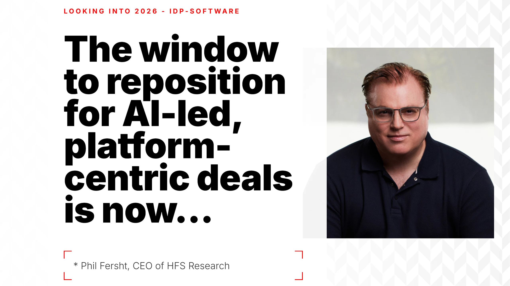

# The IDP Market's $10 Billion Consolidation: What 68 Vendors Reveal About AI's Real Adoption

**Analysis Period:** December 1, 2025 - December 31, 2025
**Date Published:** January 4, 2026
**Author:** IDP Software Analysis Team

---

## The Real Story Behind the Biggest Deal You Haven't Heard About

On December 28, 2025, [Coforge](/vendors/coforge/index.md)—a mid-tier Indian IT services company—announced it would pay [$2.35 billion for Encora](https://economictimes.indiatimes.com/markets/stocks/news/coforge-shares-in-focus-on-announcing-2-35-billion-acquisition-of-ai-firm-encora/articleshow/126222690.cms), a US-based AI engineering firm. That's 30% of Coforge's entire revenue. In one deal.

This isn't growth. **It's demand for capability**.

As Trip Chowdhry, Managing Director at Global Equities Research, [put it bluntly](https://www.ndtvprofit.com/markets/forward-looking-deal-market-veteran-on-coforges-235-billion-encora-acquisition): "If this acquisition was not there, Coforge would not be in any conversation with the customer in 2026."

Translation: Without AI capabilities on paper, Coforge gets shut out of deals entirely. The vendor doesn't even make the shortlist.

This is the story playing out across the intelligent document processing and automation market. Between December 1, 2025 and January 4, 2026, we tracked news from 300 IDP vendors+ and found content mentioning 68 different vendors. What we found wasn't innovation—it was an industry buying its way into a market that doesn't fully exist yet.

Follow us on LinkedIn [https://www.linkedin.com/company/idp-software](https://www.linkedin.com/company/idp-software)
---

## The Paradox: Billions Spent on AI Nobody's Actually Using

Here's what the marketing materials won't tell you: **Only 15% of organizations are meaningfully deploying generative AI** despite the billions being spent on acquisitions, according to [industry analysis](https://it.slashdot.org/story/25/12/26/1756219/indian-it-was-supposed-to-die-from-ai-instead-its-billing-for-the-cleanup).

Yet in this 29-day period alone:
- [Coforge](/vendors/coforge/index.md): [$2.35 billion for Encora](https://economictimes.indiatimes.com/markets/stocks/news/coforge-shares-in-focus-on-announcing-2-35-billion-acquisition-of-ai-firm-encora/articleshow/126222690.cms)
- [Adobe](/vendors/adobe/index.md): [$1.9 billion for SEMrush](https://www.saastr.com/hooray-you-got-profitable-thats-great-but-its-not-enough-its-time-to-reaccelerate-growth/)
- [HCLTech](/vendors/hcltech/index.md): [$400 million across three deals in one week](https://www.livemint.com/companies/hcltech-400-million-acquisitions-ai-offerings-data-offerings-jaspersoft-wobby-hpe-telecom-solutions-11766463875927.html)
- Indian IT sector: [$4.3 billion in acquisitions in FY25](https://www.livemint.com/companies/indian-it-s-m-a-spend-a-record-high-of-4-3-billion-in-2025-11766918672527.html)

The math doesn't add up. Vendors are buying AI capabilities for customers who aren't ready to use them.

The gap creates a 2-3 year window where enterprises need "preparatory services"—data cleanup, cloud migration, system integration—before they can actually deploy AI at scale. That's not a feature of AI adoption. That's a bug that consultants are billing for.

---

## Five Market Forces Every Enterprise Buyer Needs to Understand

### Market Force #1: The Acquisition Panic

**The Pattern:** Companies aren't acquiring for growth—they're acquiring to stay relevant.

[HCLTech](/vendors/hcltech/index.md) spent [$400 million in a single week](https://www.livemint.com/companies/hcltech-400-million-acquisitions-ai-offerings-data-offerings-jaspersoft-wobby-hpe-telecom-solutions-11766463875927.html): $240M for Jaspersoft (business intelligence), $160M for HPE's Telco Solutions, and $5.3M for Wobby (agentic AI). All cash. All urgent.

Phil Fersht, CEO of HFS Research, [explained why the pace matters](https://www.livemint.com/companies/hcltech-400-million-acquisitions-ai-offerings-data-offerings-jaspersoft-wobby-hpe-telecom-solutions-11766463875927.html): "The pace matters because it shows management believes the window to reposition for AI-led, platform-centric deals is now, not over the next few years."

**The Market Data:**
- RPA market: [$35.27B (2026) → $247.34B by 2035](https://www.globenewswire.com/news-release/2025/12/16/3206126/0/en/Robotic-Process-Automation-RPA-Market-Size-Expands-from-USD-35-27-Bn-in-2026-to-USD-247-34-Bn-by-2035-Fueled-by-AI-Powered-Automation-and-Digitalization.html)
- Hyper-automation market: [$179.96B by 2032, 16.89% CAGR](https://www.globenewswire.com/news-release/2025/12/17/3206924/0/en/Hyper-Automation-Market-Set-for-Strong-Expansion-to-USD-179-96-Billion-by-2032-Driven-by-Rising-Demand-for-Operational-Efficiency-and-Cost-Reduction-SNS-Insider.html)

**What It Means for Buyers:**
These acquisitions create **integration risk**. [Coforge](/vendors/coforge/index.md)'s Encora deal involves 21% equity dilution and won't be EPS-accretive until FY27. [HCLTech](/vendors/hcltech/index.md)'s margin dropped 100 basis points. You're not just evaluating a vendor—you're evaluating their ability to execute complex integrations while serving you.

Ask: *Which capabilities are native vs. acquired? How long until integration is complete? Who's responsible if things break?*

---

### Market Force #2: The Specialist Advantage

**The Pattern:** Domain-specific AI is beating general-purpose models in production.

[ABBYY](/vendors/abbyy/index.md)'s AI strategist Jon Knisley [articulated this shift](https://techcrunch.com/2026/01/02/in-2026-ai-will-move-from-hype-to-pragmatism/) clearly: "The efficiency, cost-effectiveness, and adaptability of SLMs [small language models] make them ideal for tailored applications where precision is paramount."

This isn't marketing speak. It's a bet that precision matters more than flexibility for document processing.

**Real-World Proof:**
Insurance Australia Group deployed [Appian](/vendors/appian/index.md)'s AI platform for [property underwriting](https://www.itnews.com.au/news/iag-reworks-data-ingestion-for-property-underwriters-622069). Initial accuracy: 68%. After working with Appian's team for "a couple of short months": 96-98%.

Damien Gallagher, IAG's Executive GM of CX and Growth, [confirmed](https://www.itnews.com.au/news/iag-reworks-data-ingestion-for-property-underwriters-622069): "We quickly learned through that proof-of-concept what the power of AI was going to be able to deliver, but at 68 percent we were a long way away from where we needed to be."

That 30-point accuracy jump? That eliminated manual data entry processes that previously took half a day across seven different systems.

**What It Means for Buyers:**
General-purpose AI platforms will pitch flexibility. Specialists will pitch accuracy. **Accuracy wins in production**. But accuracy requires training data, iteration, and domain expertise.

The question isn't "Does your AI work?" It's "Show me a customer in my industry who got from 68% to 96% and how long it took."

---

### Market Force #3: The New Entrants Are Winning on Economics

**The Pattern:** AI-native competitors are commoditizing incumbents—fast.

While not in our vendor summary, the broader market shows how quickly this happens. New entrants with AI-native architectures are benchmarking better accuracy at radically lower costs than established players. The technology advantage window is measured in months, not years.

**The Price War:**
This dynamic affects enterprise buying decisions directly. Cloud-native solutions built on modern AI frameworks can offer better economics than legacy platforms carrying technical debt and on-premise infrastructure costs.

**What It Means for Buyers:**
Your incumbent vendor's "AI enhancement" may be retrofitted onto legacy architecture. That costs more, scales worse, and delivers slower than competitors building from scratch.

Test this: Ask vendors for their **infrastructure costs per 1,000 pages processed** and whether their AI models run on-premise or require cloud connectivity. The answers reveal whether you're buying innovation or subsidizing technical debt.

---

### Market Force #4: The Security Crisis Nobody's Talking About

**The Pattern:** Legacy vendors are getting breached. This isn't theoretical.

**[Conduent](/vendors/conduent/index.md)**: [10.5 million Americans' data exposed](https://www.ibtimes.com/conduent-data-hack-social-security-numbers-over-10-million-americans-exposed-massive-breach-3792498), including Social Security numbers and health insurance information. The breach was discovered in January 2025 but occurred months earlier. Nearly a dozen class action lawsuits filed. Expected costs: tens of millions of dollars.

**[Adobe](/vendors/adobe/index.md) ColdFusion**: [5,940 malicious requests exploiting 10+ vulnerabilities](https://securityaffairs.com/186450/hacking/thousands-of-coldfusion-exploit-attempts-spotted-during-christmas-holiday.html) during Christmas 2025. A single threat actor using Japan-based infrastructure generated 98% of attack traffic, systematically targeting US servers when security monitoring was reduced.

**What It Means for Buyers:**
If you're processing sensitive documents—invoices with payment details, medical records, legal contracts—vendor security isn't a checklist item. It's your liability.

Conduent's breach affects government agencies and private insurers who trusted a third-party processor. Those organizations now face regulatory scrutiny, potential fines, and notification requirements.

**The Hard Questions:**
- When was your last external security audit?
- What's your breach notification timeline?
- Do you carry cyber insurance, and what's the coverage limit?
- Are you processing our data on legacy infrastructure older than 5 years?

Cloud-native vendors have an advantage here. They inherit Azure/AWS/GCP security frameworks. Legacy vendors running on-premise or hybrid infrastructure carry more risk.

---

### Market Force #5: The Timing Bet (Why Some Vendors Are Hiring While Others Cut Jobs)

**The Pattern:** [HCLTech](/vendors/hcltech/index.md) is doubling fresher hiring to 12,000 graduates while competitors slash headcount.

Ramachandran Sundararajan, HCLTech's Chief People Officer, [confirmed the aggressive strategy](https://www.livemint.com/companies/infosys-first-large-it-outsourcer-fewer-fresher-hiring-11766985526621.html): "We started the year with a plan that we will do a significantly higher fresher addition this year compared to last year. If you look at what you have done during H1, that's almost 92% of what we did in the entire year last year."

Meanwhile, 83% of stakeholders expect AI to meaningfully change business models by 2026, leading most competitors to reduce campus recruitment on automation concerns.

**The Bet:**
HCLTech is betting demand recovers before competitors realize they need talent. If they're right, they capture market share as AI deployment scales. If they're wrong, they have excess capacity in a down market.

**What It Means for Buyers:**
This is a leading indicator of vendor confidence. Companies expanding capacity believe the "2-3 years of preparatory work" narrative. Companies cutting staff believe AI will compress project timelines 20-30%, as [industry analysis suggests](https://economictimes.indiatimes.com/tech/newsletters/morning-dispatch/early-stage-investors-reap-gains-it-firms-self-funded-deals/articleshow/126150725.cms).

Watch your vendors' hiring patterns. Cutting staff = prioritizing margins over growth. Hiring aggressively = betting on volume recovery.

For long-term implementations, you want vendors staffed for growth, not contraction.

---

## What This Means: Three Takeaways for Enterprise Buyers

### 1. For Vendor Selection: Favor Execution Over PowerPoint

[UiPath](/vendors/uipath/index.md) achieved something rare: [first GAAP profitable quarter, $13M operating income](https://finance.yahoo.com/news/morgan-stanley-upgrades-uipath-path-164252786.html), 16% YoY revenue growth, joining the S&P MidCap 400 index. Gartner recognized them as a leader in both Intelligent Document Processing and AI-augmented software testing.

That's not a sales pitch. That's audited financials and third-party validation.

Compare that to vendors announcing "AI-powered" enhancements with no customer references, no accuracy metrics, no production deployments you can verify.

**Your Filter:**
- Show me a customer achieving 95%+ accuracy in production
- How long did implementation take, pilot to production?
- What was their accuracy before your solution?
- Can I talk to that customer directly?

If they can't answer those four questions, you're hearing marketing, not reality.

### 2. For Risk Assessment: The Consolidation Isn't Over

When mid-tier vendors like [Coforge](/vendors/coforge/index.md) spend 30% of their revenue on a single acquisition, consolidation accelerates. Vendors who don't acquire get acquired or become irrelevant.

**Your Risk:**
You select a vendor today. They get acquired in 18 months. Your roadmap changes. Your support degrades. Your pricing increases.

**Mitigation:**
- Prioritize vendors who've demonstrated acquisition integration capability (Coforge has track record of successful M&A)
- Get price protection and roadmap commitments in writing
- Ensure your contract includes change-of-control provisions

Vendors executing major acquisitions can't serve you at full capacity during integration. Plan for 6-12 months of reduced responsiveness.

### 3. For Budget Planning: Prepare for "AI Readiness" Upsells

The preparatory services market—data cleanup, cloud migration, system integration—is where vendors will make money while AI adoption remains at 15%.

You'll hear: "Your data isn't AI-ready." They're not wrong. But the cost is real.

[HCLTech](/vendors/hcltech/index.md)'s [strategy](https://it.slashdot.org/story/25/12/26/1756219/indian-it-was-supposed-to-die-from-ai-instead-its-billing-for-the-cleanup) as one of the first large systems integrators partnering with OpenAI positions them to capture this work. Expect 2-3 years of projects that make your documents processable before you see AI value.

**Your Defense:**
Get a fixed-price quote for end-to-end implementation, not time-and-materials for "AI readiness assessments" that never end.

---

## The Bottom Line: Who's Right About Timing?

The market is making two opposite bets:

**Bet #1 (Acquirers):** AI deployment scales within 12-18 months. [Coforge](/vendors/coforge/index.md), [HCLTech](/vendors/hcltech/index.md), [Adobe](/vendors/adobe/index.md) are positioning for imminent customer demand.

**Bet #2 (Cost-Cutters):** AI deployment takes 3-5 years. Most vendors cutting staff believe the "only 15% deployed" statistic means slow, gradual adoption.

As an enterprise buyer, you need vendors who bet correctly *for your timeline*.

If you're piloting AI and planning 2027 production deployment, you don't want a vendor who built capacity for 2026 demand. Their costs are your problem.

If you're deploying AI in 2026, you need vendors staffed and ready *now*, not hiring fresh graduates who won't be productive for 6-12 months.

**The market will know who was right by mid-2026.** Watch for:
- Q2 2026 earnings from [UiPath](/vendors/uipath/index.md), [Automation Anywhere](/vendors/automation-anywhere/index.md), and public RPA vendors
- Enterprise AI deployment surveys showing movement from 15% to 25%+
- Vendor margin compression if capacity exceeds demand

For now, evaluate vendors based on **what they've delivered**, not what they promise AI will eventually do.

---

## About This Analysis

This analysis synthesizes news from 68 intelligent document processing and automation vendors between December 6, 2025 and January 4, 2026. All claims are sourced from third-party coverage, analyst reports, and audited financial statements—not vendor press releases.

**Primary Sources:**
SNS Insider, Globe Newswire, Economic Times, NDTV Profit, Yahoo Finance, TechCrunch, ITNews Australia, LiveMint, HFS Research, Forrester, Gartner, Macquarie Capital, Morgan Stanley, H.C. Wainwright

---

*This document represents independent analysis based on publicly available information. We have no financial relationship with any vendor mentioned.*
