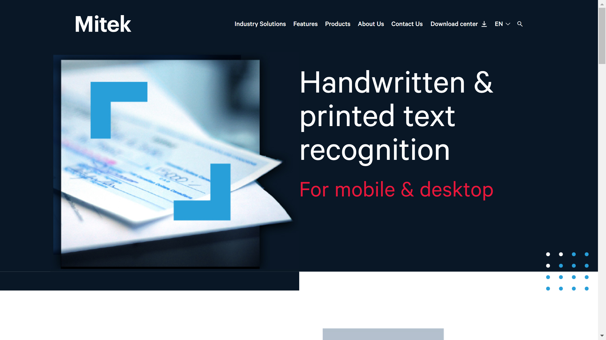

# A2iA

A2iA (now part of Mitek Systems) develops handwriting recognition and [OCR](../../capabilities/ocr/index.md) software toolkits for processing printed and cursive text in structured and unstructured documents.

## Overview

Founded in France and acquired by Mitek Systems in May 2018, A2iA specializes in handwriting recognition technology for document processing. The company developed Intelligent Word Recognition (IWR), which provides "double confirmation" by recognizing both individual characters and complete words simultaneously. A2iA operates in 9 languages across 42 countries, with particular strength in banking and financial services sectors.

## Key Features

- **CheckReader**: Check and payment document processing with Courtesy Amount Recognition (CAR) and Legal Amount Recognition (LAR), achieving 80-90% recognition rate with 60-75% check acceptance in production
- **TextReader**: Full-text transcription software for both printed and cursive handwritten documents without requiring dictionaries
- **DocumentReader**: [Document classification](../../capabilities/classification/index.md) and key-field extraction engine that automatically identifies document types and routes them to appropriate workflows
- **mNote**: Mobile solution with 100% client-side offline processing for cursive handwriting, handprinted text, and machine-printed text
- **Intelligent Word Recognition (IWR)**: Proprietary technology combining OCR and ICR for dual-level verification (character and word recognition)
- **Fraud Detection**: Built-in capabilities to detect check modifications, counterfeits, and image quality issues

## Use Cases

### Banking Check Processing

Financial institutions deploy A2iA CheckReader to automate check processing workflows. The system performs courtesy and legal amount recognition in parallel processes, compares payee names against issue files, and flags potential fraud through modification detection and image quality analysis. Banks report 60-75% straight-through processing rates with the solution.

### Mixed Document Workflow Automation

Organizations use DocumentReader to process document batches containing both printed and handwritten content. The system automatically identifies document types based on layout and content, extracts key fields including names, addresses, phone numbers, and account information from cursive handwriting, and routes documents to appropriate processing workflows without manual intervention.

## Technical Specifications

| Feature | Specification |
|---------|---------------|
| Core Products | CheckReader, TextReader, DocumentReader, mNote |
| Recognition Technology | IWR (Intelligent Word Recognition), ICR, OCR |
| Handwriting Support | Cursive handwriting, handprinted text, mixed documents |
| Check Recognition Rate | 80-90% (60-75% straight-through processing) |
| Language Support | 9 languages |
| Geographic Presence | 42 countries |
| Deployment | SDKs, APIs, on-premise integration |
| Mobile Capability | 100% client-side offline processing (mNote) |

## Resources

- [Website](https://www.a2ia.com/en)

## Company Information

Part of Mitek Systems (acquired May 2018)

Originally founded in France

Web: [https://www.a2ia.com/en](https://www.a2ia.com/en)

