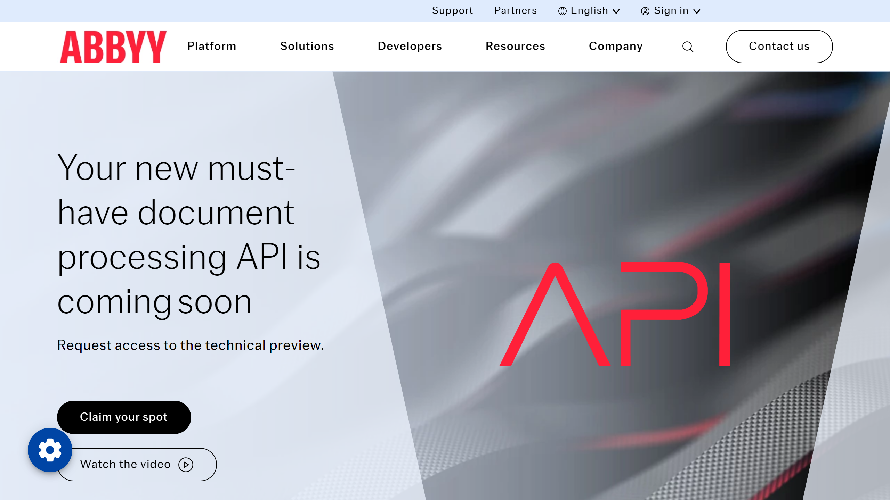

# ABBYY

ABBYY is a global provider of intelligent document processing, content AI, and language solutions. The company is known for its advanced OCR (Optical Character Recognition) technology and document capture solutions.

## Overview

ABBYY offers a comprehensive suite of AI-powered solutions for document processing, data extraction, and content intelligence. Their platforms help organizations transform documents into actionable data, automate document-intensive processes, and make more informed decisions. Recently, ABBYY announced major platform enhancements to enable better integration with AI agents and LLMs, including upgrades to Process AI for end-to-end process monitoring and Document AI with robust OCR, classification, and exception management capabilities designed specifically for [secure agentic automation at scale](https://www.abbyy.com/company/news/abbyy-ascend-2025-2-ai-enterprise-automation/).

Due to the latest changes published by UiPath it remains unclear if the [partnership with Abbyy](https://www.abbyy.com/de/solutions/technology/uipath/) will exist in the future. See the vendor listing vor [UiPath](../uipath/index.md).

## Key Features

- Advanced OCR and document recognition
- Intelligent document processing
- Process and content intelligence
- Natural language processing capabilities
- Machine learning-based classification
- Automated data extraction
- Multi-format document support
- Low-code/no-code capabilities

## Use Cases

- Automated invoice processing
- Customer onboarding
- Contract analytics
- Compliance documentation
- Mortgage processing
- Insurance claims processing
- Accounts payable automation
- Customer experience management

## Technical Specifications

ABBYY's solutions are available as cloud services, on-premises software, and through APIs and SDKs for integration with existing systems. Their technology supports documents in multiple languages and formats, from simple forms to complex unstructured documents.

## Resources

- [Website](https://www.abbyy.com)
- [Documentation](https://www.abbyy.com/support/)
- [Abbyy Fine Reader Review](https://www.youtube.com/watch?v=whMN41a_wuU)
- [Abbyy Flexicapture](https://www.abbyy.com/de/flexicapture-sdk/)
- [Abbyy Vantage](https://www.abbyy.com/vantage/)

## Company Information

600 Congress Ave., Suite 15015

78701 Texas, United States

Web: <https://www.abbyy.com/>

Email: office@abbyy.com

Tel: (408) 457-9777
