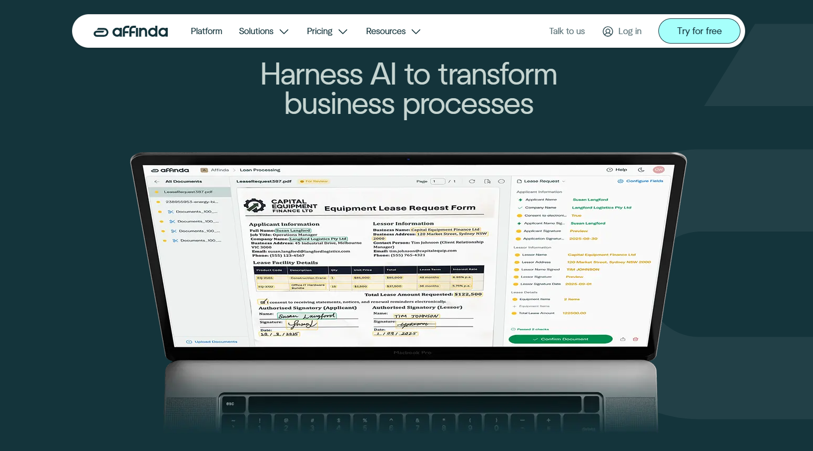

# Affinda

Affinda is an AI platform designed for intelligent document processing. It can be configured to process new document types, fast – requiring a few examples – so organizations don’t require weeks or months of lengthy model-training cycles. This enables teams to streamline document workflows, improve accuracy, reduce manual effort and achieve measurable productivity gains. Affinda provides practical, adoption-ready solutions for extraction, OCR, classification and validation across many industries, with clear paths to ROI.  Headquartered in Melbourne, Australia, Affinda serves customers in more than 80 countries in 56 languages, with teams across Asia Pacific, North America and Europe.

## Overview

With its new [platform](https://www.affinda.com/platform), Affinda addresses a core challenge in document processing: interpreting documents with the same contextual understanding humans apply. Instead of relying on static templates or long supervised-training cycles, the platform combines several advanced techniques to achieve this:

- **RAG model memory** to learn from new documents instantly
- **Grounded LLM extraction** that ties predictions back to the source document, reducing hallucinations
- **A proprietary OCR and reconstruction engine** that restores reading order, structure and context in complex layouts

This architecture allows Affinda’s agentic AI to split, classify, extract and validate data with 99%+ accuracy, enabling true straight-through processing across any [document type](https://www.affinda.com/documents), [industry](https://www.affinda.com/industries) or [use case](https://www.affinda.com/use-cases). 

## Key features

- End-to-end intelligent [document processing](https://docs.affinda.com/configuration/workflow ) pipeline (IDP)
- RAG [model memory](https://docs.affinda.com/configuration/extraction-models) for instant learning without retraining
- [Advanced OCR](https://docs.affinda.com/configuration/preprocessing) with proprietary layout reconstruction
- [LLM-powered extraction](https://docs.affinda.com/academy/improving-accuracy) grounded to the document (no hallucinations)
- Machine-learning [classification](https://docs.affinda.com/configuration/classification), [splitting](https://docs.affinda.com/configuration/splitting) and routing
- Agentic workflow [automation](https://docs.affinda.com/academy/getting-started) for multi-step document tasks
- Multi-format, multi-language extraction [across 50+ languages](https://docs.affinda.com/faqs)
- Built-in validation, transformations and rule logic for STP
- No-code (AI Integrations Agent) and API options for [rapid downstream connection](https://docs.affinda.com/academy/integration-agent)
- Type-safe [Client Libraries](https://docs.affinda.com/reference/client-libraries) with auto-generated Pydantic/TypeScript schemas
  
## Use cases

The Affinda Platform is built to handle any document automation use case, including:

- [Banking and financial services workflows](https://www.affinda.com/industries/banking-finance): KYC, onboarding, statements, checks, compliance documents
- [Insurance processing](https://www.affinda.com/industries/insurance): claims, underwriting packets, ACORD forms, proof-of-loss documents
- [Lending operations](https://www.affinda.com/use-cases/lending): loan applications, supporting documents, credit packages, decisioning file
- [Logistics and supply chain automation](https://www.affinda.com/industries/logistics): bills of lading, invoices, delivery notes, customs documents 
- [HR tech platforms and talent acquisition workflows](https://www.affinda.com/industries/recruitment): resume/CV parsing, job-matching data extraction, candidate summaries, identity documents 

## Technical specifications

| **Feature**                | **Specification**                                           |
|----------------------------|-------------------------------------------------------------|
| Deployment options         | Cloud (Saas), dedicated tenants (fully isolated enterprise environments), and self-hosted (for complete control)  |
| API                        | REST, ISO 27001:2022 certified and SOC 2 and GDPR compliant      |
| 50+ supported languages    | English, Spanish, French, German and more                        |
| Document formats           | PDF, JPG/JPEG, PNG, TIFF, DOCX, Excel/CSV, HTML and more         |

## Getting started

Affinda offers a [free trial](https://app.affinda.com/auth/register) for those who want to test its capabilities. Simply upload your documents and watch their AI agents get to work as part of a self-serve onboarding process. Or, [reach out](https://www.affinda.com/contact) to their team to request a demo for a more tailored solution. 

## Resources

- [Website](https://affinda.com)
- [Affinda Platform](https://www.affinda.com/platform)
- [Integrations](https://www.affinda.com/integrations)
- [Quick start guide](https://docs.affinda.com/reference/getting-started)
- [Enterprise-grade security](https://www.affinda.com/security)
- [Github](https://github.com/affinda)

## Contact information

180 Flinders Street
 Melbourne VIC 3000 Australia 
 [affinda.com](https://affinda.com)
 contact@affinda.com
 [LinkedIn](https://www.linkedin.com/company/affinda/)
