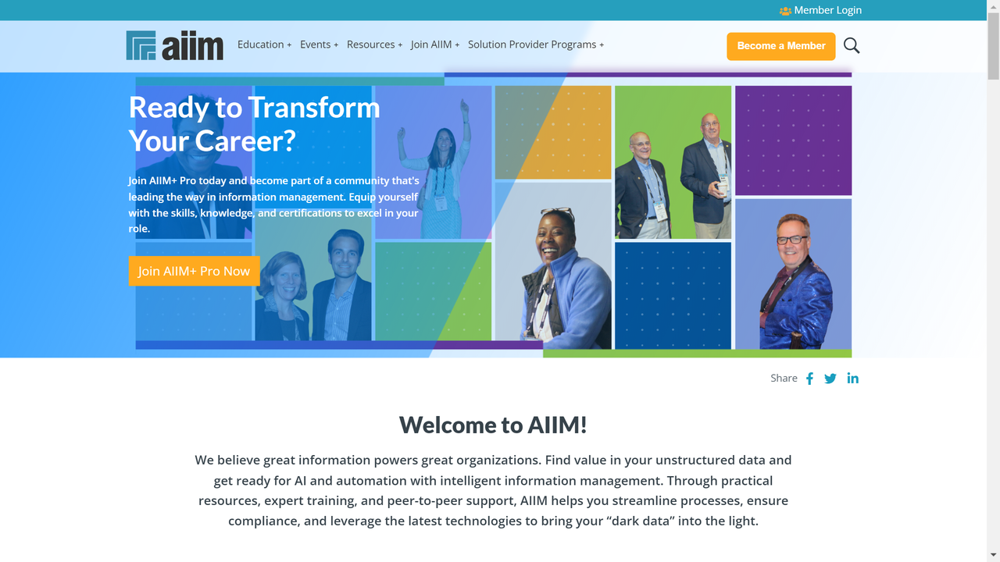

# AIIM (Association for Intelligent Information Management)

AIIM is a global non-profit organization that provides education, research, and certification programs to information professionals. While not a traditional IDP vendor, AIIM plays a crucial role in the IDP ecosystem by providing standards, best practices, and professional development for intelligent information management.

## Overview

Founded in 1943 as the National Microfilm Association, AIIM has evolved to become a leading authority in the field of information management. The organization focuses on helping businesses and professionals navigate the challenges of digital transformation, particularly in document and content management.

AIIM serves as an industry association that connects vendors, practitioners, and consultants in the information management space. Through research, education, and community building, AIIM helps organizations understand and implement effective strategies for managing documents and information.

## Key Offerings

- **Industry Research**: AIIM conducts and publishes research on trends, best practices, and technologies in intelligent information management.

- **Training and Certification**: Offers professional development programs, including the Certified Information Professional (CIP) designation, which validates expertise in information management.

- **Standards Development**: Contributes to the development of industry standards for document management, content services, and information governance.

- **Community and Events**: Hosts conferences, webinars, and networking opportunities that bring together professionals in the IDP and information management space.

- **Resources and Tools**: Provides guides, whitepapers, and tools to help organizations assess and improve their information management practices.

## Use Cases

### Information Governance Implementation

AIIM provides frameworks, best practices, and training that help organizations establish effective information governance programs. These resources guide organizations in developing policies for document retention, privacy compliance, and information lifecycle management, which are essential foundations for successful IDP implementations.

### Digital Transformation Strategy

AIIM offers research, case studies, and methodologies that assist organizations in planning and executing their digital transformation initiatives. Their resources help information professionals build the business case for IDP solutions, identify use cases with high ROI potential, and develop roadmaps for implementation.

## Technical Resources

| Resource Type | Description |
|--------------|-------------|
| Industry Standards | Participation in ISO standards for document management |
| Best Practice Guides | Implementation guidelines for information management |
| Maturity Models | Frameworks for assessing organizational capabilities |
| Vendor-Neutral Training | Educational programs covering various IDP technologies |
| Market Intelligence | Analysis of IDP vendor offerings and market trends |

## Getting Started with AIIM

1. **Explore Free Resources**: Access AIIM's blog, research previews, and community discussions to understand current trends in intelligent information management.

2. **Consider Membership**: Join AIIM to gain full access to their research library, online forums, and discounted training.

3. **Pursue Certification**: Enroll in the Certified Information Professional (CIP) program to validate your expertise in information management.

4. **Attend Events**: Participate in AIIM conferences, webinars, and local chapter meetings to network with peers and learn from industry experts.

5. **Leverage Research**: Use AIIM's research reports and best practice guides to inform your organization's IDP strategy and implementation.

## Resources

- [AIIM Website](https://www.aiim.org/)
- [Research Library](https://www.aiim.org/research)
- [Training Programs](https://www.aiim.org/education-section)
- [CIP Certification](https://www.aiim.org/cip)

## Contact Information

- Website: [aiim.org](https://www.aiim.org/)
- Email: info@aiim.org
- Phone: +1 301-587-8202
- Address: 8840 Stanford Blvd., Suite 4900, Columbia, MD 21045 USA
