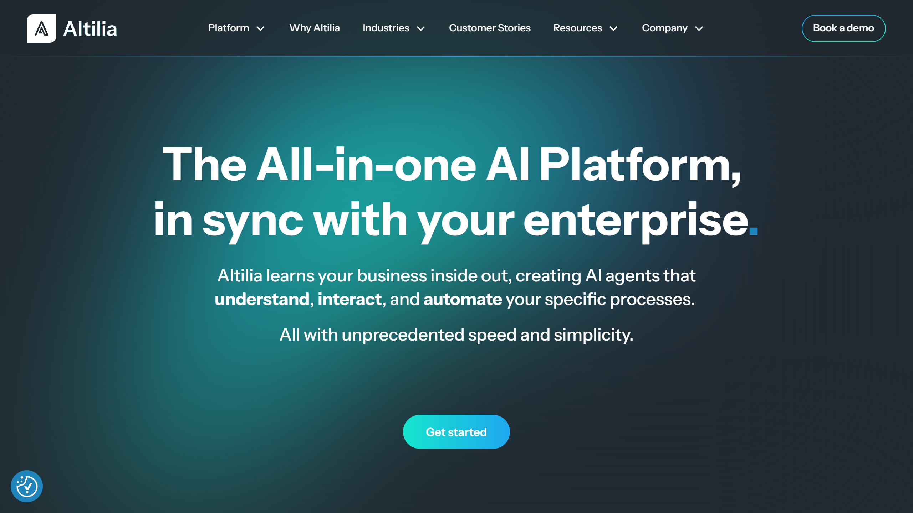

# Altilia

AI platform Altilia aggregates, organizes and unifies data into a cohesive database to provide unparalleled insights and maximum adaptability and scalability. 

## Overview

Altilia document automation can simplify numerous business processes with unparalleled adaptability and customized solutions designed to simplify complex workloads and streamline end-to-end processes. With tracking tools that can automate reporting, simplified document reviews, supply chain optimization, and comprehensive document processing, [IDP software vendor Altilia](https://www.altilia.ai/platform#ai-agents) offers a full suite of tools to process and support just about any kind of data.

The seamless nature of Altilia’s cloud IDP services makes it easy to integrate AI into businesses of all sizes and types, allowing for greater efficiency with results-driven data, targeted feedback, and [intelligent workflow](https://idp-software.com/capabilities/integration-workflow/). The most complex processes can be automated for maximum operating efficiency and fast ROI. Users will retain ownership of their data, models, and assets, never compromising on security with full data sovereignty on Altilia’s ISO-certified platform.

## Key Features

- **Agentic AI**: The customized AI agent is designed to extract, classify, manipulate, infer, and take action on complex data sets to understand business processes unique to an organization and automate context-specific results.
- **Semantic Search Engine**: Users easily access essential data through natural language, thanks to the semantic search engine. 
- **Diverse Data Integration**: By combining structured and unstructured sources, Altilia allows for seamless, comprehensive data analysis. 
- **No-Code Development**: Simplicity is the name of the game, allowing users to easily build, deploy, and manage AI agents.
- **Data Connections and Ownership**: Each organization’s data will remain its own proprietary intellectual property.
- **Document Generation**: Operational content creation is automated, allowing users to create reports, emails, and other documents with just a few clicks.

## Use Cases

### Manufacturing

Whether dealing with compliance issues or supporting quality control, Altilia cloud IDP services can help support day-to-day operations by automating document processes, reducing manual effort, ensuring regulatory compliance, and tracking products and operations in real time. 

### Public administration

Automated compliance monitoring keeps businesses on top of taxes, licensing, and operational activities. Documents can be easily digitized, improving the efficiency and accuracy of high-volume operations without the cost and labor of manual data entry.

### Utilities

AI-powered tools support regulatory compliance and allow for automated reporting, reducing the risk of human error and time-intensive logging processes. Network asset management allows for improved employee training tools and 24/7 technician support, as well as automated support that can handle high volumes of queries. Utility bills can be quickly and effectively analyzed, applications prepared, and documents centralized all through a single source.

## Technical Specifications

| **Feature**            | **Specification**                  |
|------------------------|------------------------------------|
| Deployment Options     | Cloud, On-premise, Hybrid          |
| Supported Languages    | English, Spanish, French, Farsi    |
| Document Formats       | PDF, DOCX, TIFF                    |
| Integrations           | Google Workspace, Microsoft        |

## Getting Started

The first step in getting started with Altilia AI is identifying the specific needs and goals of the business. Next, prepare the data and choose the appropriate AI agents for the task. Once the Altilia AI agents have been integrated, they can be monitored and optimized for maximum benefit.

## Resources

- [Vendor Website](https://www.altilia.ai/)
- [Documentation](https://www.altilia.ai/resources/blog)
- [GitHub](https://github.com/A9u/altilia)

## Contact Information

- Website: [Altilia.ai](https://www.altilia.ai/)
- Headquarters Address: Via Alessandro Volta, 4187036 Rende (CS), Italy
- Email: info@altiliagroup.com
- Phone: +39 984494277
