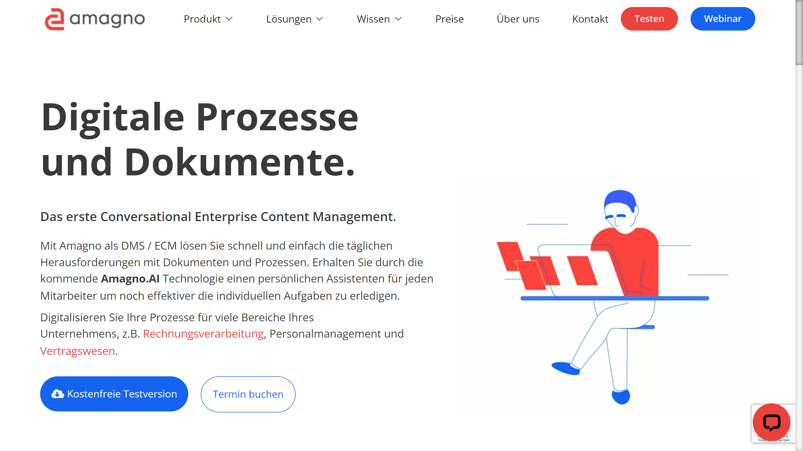

# Amagno

Amagno is a German enterprise content management and document management system provider offering cloud and on-premise solutions with workflow automation capabilities.

## Overview

Amagno, founded in 2010 and headquartered in Oldenburg, Germany, develops document management software combining traditional ECM/DMS functionality with conversational AI features. The company offers two deployment options: Amagno Business Cloud and Amagno On Premise, serving industries including healthcare, manufacturing, logistics, construction, real estate, automotive, and IT sectors.

The platform positions itself as "the first Conversational Enterprise Content Management" system, providing document management, workflow automation, and collaboration tools in a single solution. Amagno emphasizes German data protection standards, offering GDPR and GoBD compliant document handling with no restrictions on data volume or OCR page processing.

## Key Features

- **[Document Management](../../capabilities/document-understanding/index.md)**: Electronic storage, organization, and retrieval with full-text search capabilities
- **Metadata Magnetism**: Proprietary technology for automatic metadata capture and assignment
- **[OCR Processing](../../capabilities/ocr/index.md)**: Text recognition with no page number limitations
- **Workflow Automation**: Rule-based document routing and approval processes
- **Digital Signature Integration**: Electronic signature support for document execution
- **Compliance Management**: GDPR and GoBD compliance features with audit trails
- **Version Control**: Document versioning with change tracking
- **Cross-Platform Access**: Web and mobile application support
- **API Access**: Integration capabilities for third-party systems
- **Privacy by Design**: Built-in data protection following German privacy standards

## Use Cases

### Invoice Processing

Finance departments capture and process incoming invoices through automated [data extraction](../../capabilities/extraction/index.md) of vendor details, amounts, dates, and line items. The system matches invoices with purchase orders, routes documents through approval workflows based on configurable rules, and integrates with accounting systems for payment processing.

### Contract Lifecycle Management

Organizations manage contracts from creation through expiration by storing agreements with automated metadata extraction, tracking renewal dates with notification alerts, and maintaining version control throughout the negotiation process. Access permissions protect sensitive contractual information while enabling stakeholder collaboration.

## Technical Specifications

| Feature | Specification |
|---------|---------------|
| Deployment Options | Cloud (Business Cloud), On-premise |
| API | REST API, WebDAV |
| Supported Languages | German, English, multilingual document processing |
| Document Formats | PDF, Office formats, images, emails, 70+ file types |
| OCR Capabilities | Unlimited page processing |
| Integrations | Microsoft Office, Outlook, ERP systems, CRM platforms |
| Security | Role-based access control, encryption, audit logging |
| Compliance | GDPR, GoBD (German tax compliance) |
| Data Restrictions | No limits on data volume or OCR pages |
| Data Export | Independent export functionality |

## Getting Started

1. **Request Demo**: Contact Amagno for a platform demonstration
2. **Proof of Concept**: Test with specific document types and workflows
3. **Implementation**: Deploy with data import and configuration
4. **Training**: User onboarding and adoption support

## Resources

- [Website (Germany)](https://www.amagno.de/)
- [Website (UK)](https://amagno.co.uk/)

## Company Information

Headquarters: Oldenburg, Germany

Founded: 2010

Founder: Jens Büscher

Address: Fritz-Bock-Str. 5, 26133 Oldenburg, Germany

Email: info@amagno.de

Phone: +49 441 309 123 45
