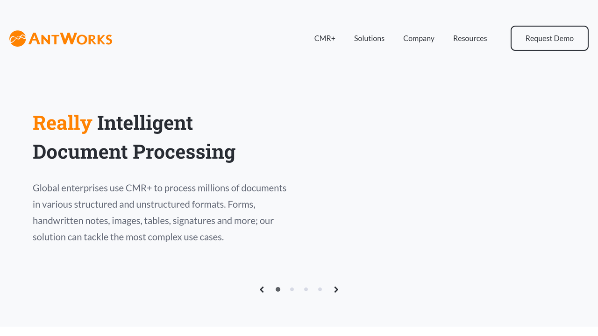

# AntWorks

AntWorks is a global intelligent document processing company that utilizes AI to classify vital data from a wide variety of documents.

## Overview

AntWorks' cognitive machine reading (CMR+) provides intelligent document processing. This process works by utilizing six main points: input, pre-processing, document classification, [data extraction](https://idp-software.com/capabilities/extraction/), data enrichment and confidence engine. The only step in this process that involves humans is input, although it does sometimes bring a human into the loop to provide supervised learning and enhancement for Gen-AI and machine learning.

The CMR+ from AntWorks offers tailored solutions for banking and financial services, insurance, manufacturing, retail and the supply chain. They also work with existing Pega cloud environments to provide enterprise scalability, drag and drop, end-to-end automation and centralized decision making. Their CMR+ is HIPAA compliant and GDPR compliant.

AntWorks was founded in 2015 in London. Since then, they've spread out across Europe, North America and Asia, and they have a [team of more than 200 people] (https://www.ant.works/about/). Their CMR+ can scan through unstructured content such as tables, handwriting and emails. AntWorks' major tech partners include AWS, Google Cloud and Azure. AntWorks has won nine notable awards to date, including Best Intelligent Document Processing (IDP) Solution for Insurance 2022 and Leader in NelsonHall NEAT - Intelligent Automation Platforms 2019.

## Key Features

- **Insurants**: Insurants is a proprietary solution for faster insurance document processing.
- **CMR+**: A global AI-powered IDP to extract insights, streamline business operations and improve data-driven decisions.
- **Results Driven Data Automation**: CMR+ relies on AntWorks' IDP to improve hard-to-read content.
- **Tailored CMR+**: Flexibility is built into the CMR+, from choosing a company's specific elements to easy integration with other systems.
- **Fast Document Turnaround Times**: CMR+ enables companies to [reduce their processing times by 75%] (https://www.ant.works/).

## Use Cases

### Improves efficiency

When Spark 44/Accenture Interactive needed to improve their efficiency, they turned to AntWorks. It was their goal to not only capture data but also to ensure the data was correct. By choosing CMR+ from AntWorks, they [boosted their efficiency rates by almost 50%] (https://www.ant.works/case-study/).

### Greater accuracy

A leading East Asia low-cost airline needed a better way to process their 2,000 monthly invoices. AntWorks provided their CMR+, which includes pattern recognition, machine learning and AI. The company was able to [boost their accuracy by 85%] (https://www.ant.works/case-study/airline-company-slashes-invoice-processing-time/). Additionally, their overall processing time per invoice dropped by 33%.

## Technical Specifications

| **Feature**            | **Specification**                                                                              |
|------------------------|------------------------------------------------------------------------------------------------|
| Gen-AI Technologies    | Machine learning, natural language processing and pattern recognition                          |
| Security               | Advanced Encryption Standard (AES) 256, Transport Layer Security (TLS) 1.2 and SOC 2 Type 2 compliance |
| Supported Languages    | Supports several languages, including English, French, Spanish and German                      |
| Document Formats       | PDF, TIFF, JPEG, MS Word, Excel, images, etc.                                                  |
| SDK                    | Supports integration with .NET                                                                 |
| Integrations           | CRM, CMS, ERP, Pega, etc.                                                                      |

## Getting Started

AntWorks offers a free demo. After that, it's time to download the app, modify the build, add the necessary antlets and complete the build. They have a uniquely quick onboarding process that cut City Union Bank's time from [eight days to one hour] (https://www.ant.works/case-study/city-union-bank-reduces-onboarding-time-from-8-days-to-1-hour/).

## Resources

- [Vendor Website] (https://www.ant.works/)
- [Case Studies] (https://www.ant.works/case-study/)
- [Content Hub] (https://www.ant.works/content-hub/)

## Contact Information

- Website: [ant.works/] (https://www.ant.works/)
- Headquarters Address: Acre House, 11-15 William Road, London, United Kingdom NW1 3ER, GB
- Email: hello@ant.works
- Phone Number: 800-507-8011