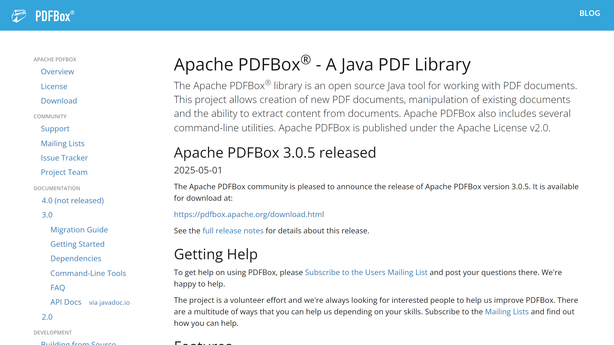

# Apache PDFBox

Apache PDFBox is an open-source Java library for working with PDF documents. While not a traditional IDP vendor, it provides essential functionality for PDF manipulation and text extraction that serves as a foundation for many document processing solutions.




## Overview

Apache PDFBox is a project of the Apache Software Foundation that enables developers to create, manipulate, and extract content from PDF documents. As an open-source library, it offers a free and flexible foundation for building PDF-related applications, including those for document processing and data extraction.

First released in 2008, PDFBox has evolved into a mature and reliable toolkit used in various enterprise applications, commercial products, and open-source projects. It provides a comprehensive set of features for PDF handling, from basic operations like merging and splitting documents to more advanced capabilities such as text extraction and form filling.

## Key Features

- **PDF Document Creation**: Create new PDF documents from scratch programmatically
- **Content Extraction**: Extract text, images, and metadata from existing PDF files
- **Document Manipulation**: Merge, split, and modify PDF documents
- **Form Handling**: Fill in, extract data from, and flatten PDF forms
- **Text Searching**: Search for specific text content within PDF documents
- **Digital Signatures**: Add and verify digital signatures in PDF files
- **PDF/A Support**: Create and validate PDF/A compliant documents for archiving
- **Printing**: Print PDF documents with various options and settings

## Use Cases

### Document Data Extraction

PDFBox enables the extraction of text, metadata, and form data from PDF documents, forming the foundational layer of many IDP solutions. Developers use PDFBox's content extraction capabilities to pull structured and unstructured data from PDF files for further processing, analysis, or storage in databases.

### PDF Document Transformation

Organizations leverage PDFBox to convert PDF documents into other formats, merge multiple PDFs into a single document, split large PDFs into smaller ones, or apply other transformations to optimize document processing workflows. This capability is particularly useful in document management systems and archiving solutions.

## Technical Specifications

| Feature | Specification |
|---------|---------------|
| Programming Language | Java |
| License | Apache License 2.0 |
| PDF Specification Support | Up to PDF 1.7 |
| Platform Compatibility | Cross-platform (Java-based) |
| Integration Options | Direct Java library, Command-line tools |
| Font Support | TrueType, Type1, and CFF/Type2 fonts |
| Memory Management | Streaming capability for large documents |

## Getting Started

1. **Add Dependency**: Include PDFBox in your Java project using Maven, Gradle, or direct JAR download
   ```xml
   <dependency>
     <groupId>org.apache.pdfbox</groupId>
     <artifactId>pdfbox</artifactId>
     <version>2.0.27</version> <!-- Use the latest version -->
   </dependency>
   ```

2. **Basic Text Extraction**:
   ```java
   try (PDDocument document = PDDocument.load(new File("document.pdf"))) {
       PDFTextStripper stripper = new PDFTextStripper();
       String text = stripper.getText(document);
       System.out.println(text);
   }
   ```

3. **Document Creation**:
   ```java
   try (PDDocument document = new PDDocument()) {
       PDPage page = new PDPage();
       document.addPage(page);
       // Add content to page
       document.save("new-document.pdf");
   }
   ```

## Resources

- [Apache PDFBox Website](https://pdfbox.apache.org/)
- [GitHub Repository](https://github.com/apache/pdfbox)
- [User Documentation](https://pdfbox.apache.org/2.0/documentation.html)
- [API Documentation](https://pdfbox.apache.org/2.0/javadocs.html)
- [Mailing Lists](https://pdfbox.apache.org/3.0/support.html#mailing-lists)

## Contact Information

- Website: [pdfbox.apache.org](https://pdfbox.apache.org/)
- Mailing List: [users@pdfbox.apache.org](mailto:users@pdfbox.apache.org)
- Bug Reporting: [Apache JIRA](https://issues.apache.org/jira/browse/PDFBOX)
- Source Code: [GitHub](https://github.com/apache/pdfbox)
