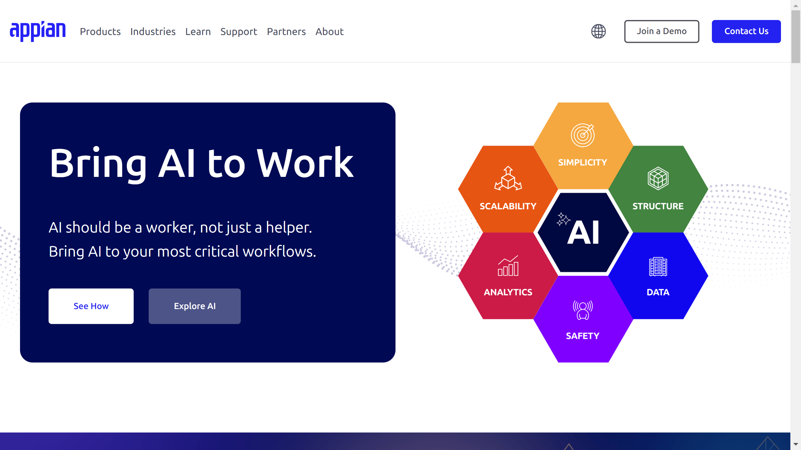

# Appian

Appian is a low-code automation platform provider offering [intelligent document processing](../../capabilities/document-understanding/index.md) integrated with process automation and workflow management.

## Overview

Founded in 1999 by Matt Calkins, Michael Beckley, Robert Kramer, and Marc Wilson, Appian is headquartered in McLean, Virginia with offices in London and Sydney. The company employs approximately 1,400 people and provides a unified platform combining low-code development, process automation, AI, and document processing. Named a Leader in the 2025 Gartner Magic Quadrant for Enterprise Low-Code Application Platforms, Appian serves financial services, insurance, public sector, life sciences, telecommunications, and manufacturing industries.

## Key Features

- **No-code IDP**: Configure document extraction and [classification](../../capabilities/classification/index.md) models without coding
- **AI Document Center**: Workspace for document processing with AI skills integration
- **Multi-page table extraction**: PDF splitting with AI-driven extraction and post-processing
- **Generative AI integration**: Uses large language models for document analysis
- **Process automation**: RPA integration for end-to-end workflow automation
- **Data Fabric**: Unified data layer connecting multiple enterprise systems
- **Process mining**: Analytics and intelligence for workflow optimization
- **Private AI architecture**: Built-in compliance, auditability, and security controls

## Use Cases

### Healthcare Patient Intake Automation

Acclaim Autism implemented Appian's IDP to process patient intake documents, achieving 95% accuracy while reducing processing time from 6 months to under 30 days. The system handles forms, applications, and handwritten notes, automatically extracting data and routing it to appropriate workflows.

### Financial Services Document Processing

Financial institutions use Appian to process loan applications, account opening forms, and compliance documentation. The platform extracts data from structured and unstructured documents, validates information against business rules, and integrates with core banking systems for straight-through processing.

### Insurance Claims Processing

Insurance companies deploy Appian's IDP for claims documentation, processing invoices, medical records, and policy forms. The system classifies document types, extracts key data fields, and routes claims to AI agents or human adjusters based on complexity and validation results.

## Technical Specifications

| Feature | Specification |
|---------|---------------|
| Platform Type | Low-code automation with embedded IDP |
| Document Types | Structured, semi-structured, unstructured |
| Supported Formats | Invoices, forms, contracts, emails, handwritten notes, scanned images |
| AI Technology | OCR, ML, NLP, deep learning, computer vision, LLMs |
| Deployment | Cloud, on-premises, hybrid |
| Integration | APIs, RPA, enterprise system connectors, Data Fabric |

## Resources

- [Website](https://www.appian.com)
- [Documentation](https://www.appian.com/resources/resource-library/)

## Company Information

McLean, Virginia, United States

Founded: 1999

Email: sales@appian.com

Tel: +1 703 442 8844
