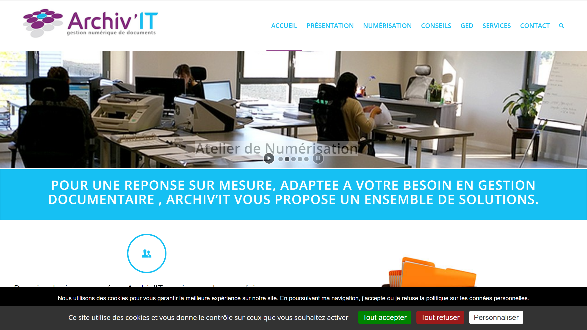

# Archiv-IT

Archiv-IT is a specialized provider of document digitization, archiving, and management solutions, with a focus on secure and compliant document processing.

## Overview

Archiv-IT offers comprehensive solutions for digitizing, processing, and managing documents and records. They help organizations transition from paper-based to digital document management while ensuring compliance with relevant regulations and standards. Their services include both physical and digital archiving solutions.

## Key Features

- Document scanning and digitization
- Intelligent data extraction
- Electronic document management
- Physical document archiving
- Secure destruction services
- Compliance and regulatory support
- Workflow automation
- Hybrid archiving solutions

## Use Cases

- Healthcare record management
- Legal document archiving
- Financial services document processing
- Government and public sector records management
- HR document digitization and management
- Historical archive preservation
- Regulatory compliance documentation
- Secure document destruction

## Technical Specifications

Archiv-IT provides both software solutions and physical services for document management. Their digital solutions include secure cloud-based platforms for document storage and retrieval, with appropriate security measures and access controls. They also offer customized solutions based on specific industry requirements and compliance needs.

## Resources

- [Website](https://www.archiv-it.fr/)
