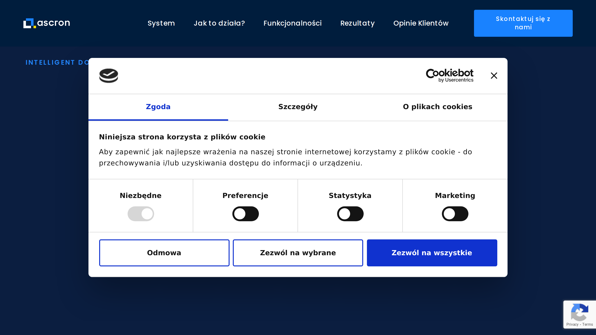

# Ascron

Ascron is a Polish [intelligent document processing](../../capabilities/document-understanding/index.md) provider specializing in legal services and debt collection management automation.

## Overview

Based in Warsaw, Poland, Ascron develops IDP solutions using NLP and machine learning algorithms with particular expertise in debt collection management. The company's software focuses on automating internal document management processes and optimizing mass debt collection workflows for the legal industry. Ascron's solutions have completed initial machine learning phases, achieving document categorization accuracy of up to 99%.

## Key Features

- **Automated document classification**: [Classification](../../capabilities/classification/index.md) system achieving up to 99% accuracy for categorizing documents
- **NLP and ML technology**: Natural language processing and machine learning algorithms for document analysis
- **Correspondence automation**: Automated generation of complex enforcement applications and legal correspondence
- **Information extraction**: [Data extraction](../../capabilities/extraction/index.md) from partially structured and unstructured documents
- **AI-powered learning**: Continuous improvement in precision with each processed document
- **Legal document specialization**: Optimized for legal services and debt collection workflows

## Use Cases

### Legal Services Document Automation

Law firms and legal departments use Ascron to process contracts, court documents, and legal correspondence. The system categorizes document types with 99% accuracy, extracts key information from legal filings, and automates routine correspondence generation for enforcement actions and client communications.

### Debt Collection Management

Debt collection agencies deploy Ascron to handle high-volume document processing for mass debt collection campaigns. The platform processes debtor correspondence, automatically generates enforcement applications, and extracts payment information from unstructured documents, reducing operational costs and processing time.

## Technical Specifications

| Feature | Specification |
|---------|---------------|
| Technology | NLP, machine learning algorithms |
| Document Types | Partially structured and unstructured documents |
| Classification Accuracy | Up to 99% |
| Automation Capabilities | Document classification, correspondence generation, data extraction |

## Resources

- [Website](https://ascron.com)

## Company Information

Warsaw, Poland
