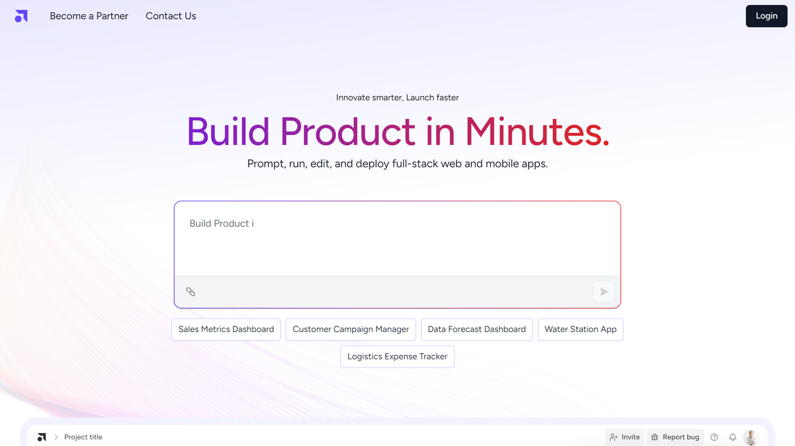

# Attri.AI

Attri.AI is an AI agent platform provider based in Austin, Texas, offering workflow automation solutions through autonomous agents for document processing and business operations.

## Overview

Attri.AI, founded in 2021 and headquartered in Austin, Texas, develops an AI agent platform that enables teams to design, deploy, and scale specialized agents for workflow automation. The platform combines drag-and-drop tools for non-technical users with SDK capabilities for developers, supporting applications including customer support, project management, and document processing.

The company employs 11-50 people and positions its technology as "quiet AI" that works in the background to elevate workflows while keeping human expertise central. Attri.AI agents use natural language processing and machine learning to understand context, make decisions, and execute tasks across multiple business systems.

## Key Features

- **AI Agent Platform**: Design and deploy specialized agents through visual interface or code
- **Drag-and-Drop Studio**: No-code agent creation for non-technical users
- **SDK Access**: Full code control for developers building custom agents
- **Real-Time Voice Integration**: Voice-enabled agent interactions
- **Multi-System Integration**: Connections across business applications through secure data integrations
- **[Document Processing](../../capabilities/document-understanding/index.md)**: Agent-based document understanding and workflow automation
- **Contextual Intelligence**: Agents understand business context and process requirements
- **[Natural Language Processing](../../capabilities/extraction/index.md)**: Advanced NLP for document semantics and data extraction

## Use Cases

### Automated Document Workflows

Organizations deploy Attri.AI agents to process incoming documents including invoices, contracts, and forms. Agents extract relevant information, understand document content and context, and route documents to appropriate systems or personnel for handling. The platform integrates with existing business applications to automate multi-step document workflows.

### Customer Support Automation

Companies use AI agents to handle customer inquiries, process support tickets, and manage service requests. Agents understand natural language queries, access relevant information across systems, and provide responses or escalate to human agents when needed.

## Technical Specifications

| Feature | Specification |
|---------|---------------|
| Deployment Options | Cloud, Private Cloud |
| Integration Methods | API, Webhooks, Native Integrations |
| Supported Document Types | Structured, semi-structured, unstructured |
| AI Technologies | NLP, Machine Learning, Large Language Models |
| Development Tools | Drag-and-drop studio, SDK |
| Voice Capabilities | Real-time voice integration |
| Target Users | Non-technical business users, developers |

## Getting Started

1. **Platform Access**: Sign up for Attri.AI platform access
2. **Agent Design**: Configure agents using drag-and-drop tools or SDK
3. **Integration Setup**: Connect with existing systems and data sources
4. **Testing**: Validate agent performance with sample workflows
5. **Deployment**: Deploy agents to production environments

## Resources

- [Website](https://attri.ai/)
- [Contact Page](https://attri.ai/contact-us)

## Company Information

Headquarters: Austin, Texas, United States

Founded: 2021

Founder: Ayush Patel (CTO)

Employees: 11-50

Address: 5900 Balcones Dr, Austin, Texas
