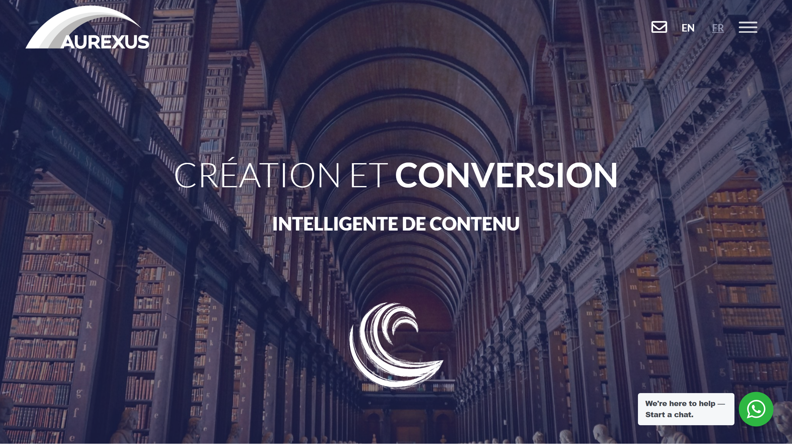

# Aurexus

Aurexus is a French digital transformation provider specializing in content digitization, [document processing](../../capabilities/document-understanding/index.md), and 3D content creation for libraries, archives, museums, and enterprises.

## Overview

Founded in France with over 10 years of experience, Aurexus provides dematerialization and data processing services for cultural institutions and businesses worldwide. The company serves notable clients including the United Nations, NATO, French National Library (BnF), Renault, and Sorbonne University. Aurexus operates its proprietary Medusa® cloud platform for managing and distributing digitized content.

## Key Features

- **Medusa® Platform**: Interactive cloud platform for managing, distributing, and controlling digitized content
- **Document digitization**: 2D and 3D scanning with metadata creation and [OCR](../../capabilities/ocr/index.md) processing
- **Remote cataloging**: Automated and expert-assisted cataloging solution combining technology and human expertise
- **XML encoding**: Document encoding in XML-EAD, INTERMARC, and UNIMARC formats
- **3D solutions**: 3D scanning, rendering, modeling, and content viewing/distribution
- **E-learning content**: Interactive online training with simulation, gamification, and smart storyboarding
- **Retroconversion**: Conversion of legacy catalogs and archives to digital formats
- **Data enrichment**: Linking to web of data and semantic web technologies

## Use Cases

### Library and Archive Digitization

Cultural institutions deploy Aurexus to digitize historical collections and manage digital archives. The French National Library uses Aurexus services for its Gallica digital library, processing documents with OCR, creating metadata, and encoding in standardized formats. The Medusa® platform enables remote access and collaborative work on digitized materials.

### Museum 3D Content Creation

Museums use Aurexus's 3D scanning and modeling services to create virtual galleries and digital replicas of artifacts. The system captures 3D object data, produces high-quality models, and hosts virtual galleries for online exhibitions, enabling remote access to cultural heritage.

## Technical Specifications

| Feature | Specification |
|---------|---------------|
| Platform | Medusa® (cloud-based) |
| Digitization | 2D and 3D scanning, OCR, metadata creation |
| Document Formats | XML-EAD, INTERMARC, UNIMARC, ALTO |
| Services | Cataloging, retroconversion, indexing, e-learning creation |
| 3D Capabilities | Scanning, rendering, modeling, virtual gallery hosting |

## Resources

- [Website](https://www.aurexus.com)