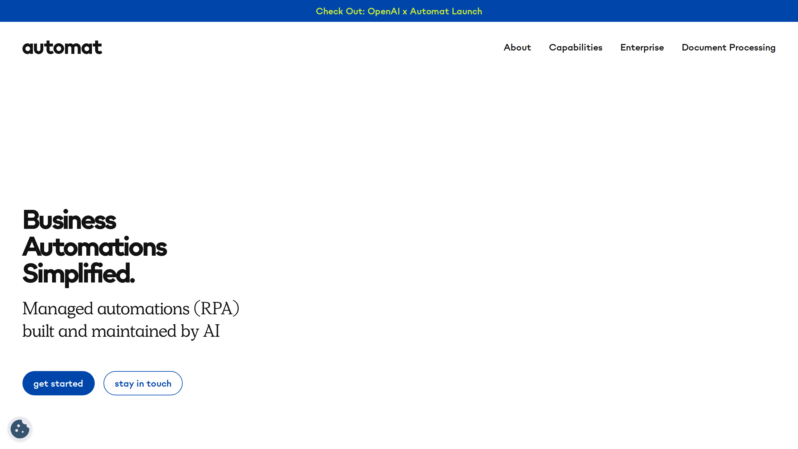

# Automat

Automat is an AI-driven RPA platform using generative AI and computer vision for [workflow automation](../../capabilities/document-understanding/index.md) across Windows, Citrix, and web portals.

## Overview

Founded in 2023 by Gautam Bose and Lucas Ochoa in San Francisco, Automat (formerly Lasso) provides rapid automation deployment for mid-market and enterprise customers. The company raised $3.75M in seed funding led by Initialized with participation from Khosla Ventures, Y Combinator, Schox, and Goodwater. Automat was named Deep Analysis IDP Startup of the Year and uses a proprietary transformer-based RPA engine built with generative AI technology.

## Key Features

- **AI-powered automation creation**: Build automations using video demonstrations or natural language descriptions
- **Transformer-based RPA engine**: Proprietary engine that mimics human behavior on user interfaces
- **Multi-environment deployment**: Works on Windows, Citrix, web portals, and challenging legacy systems
- **Integrated AI capabilities**: NLP, text generation, PDF extraction, image recognition, and chatbot interfaces
- **API and UI triggers**: Launch automations via API endpoints or custom UI in Automat Sandbox
- **Rapid deployment**: Creates custom automations in hours or days versus traditional RPA timelines

## Use Cases

### Insurance Claims Processing

Insurance companies use Automat to automate claims document processing across multiple legacy systems. The platform extracts data from claim forms and PDFs, populates information into Citrix-based claims systems, and routes documents through approval workflows. Automations are built from video demonstrations of the manual process, with deployment in days.

### Healthcare Patient Data Entry

Healthcare providers deploy Automat to automate patient intake and EHR data entry. The system processes patient forms, extracts information using AI, and enters data into Windows-based health information systems. HIPAA compliance controls ensure patient data security throughout the automation workflow.

### E-Commerce Order Processing

E-commerce businesses implement Automat to handle order fulfillment automation. The platform scrapes order data from web portals, extracts product information from documents, and populates shipping and inventory systems, reducing manual order processing time.

## Technical Specifications

| Feature | Specification |
|---------|---------------|
| Technology | Transformer-based RPA engine, generative AI |
| AI Capabilities | NLP, text generation, PDF extraction, image recognition |
| Deployment Environments | Windows, Citrix, web portals |
| Triggers | API endpoints, custom UI |
| Compliance | GDPR, HIPAA, audit trails, data controls |
| Target Industries | Insurance, healthcare, e-commerce, financial services, legal |
| Support | Slack support, 24-hour ticket response, regular maintenance |

## Resources

- [Website](https://www.runautomat.com)

## Company Information

San Francisco, California, United States

Founded: 2023

Founders: Gautam Bose, Lucas Ochoa

Funding: $3.75M seed round (Initialized, Khosla Ventures, Y Combinator)
