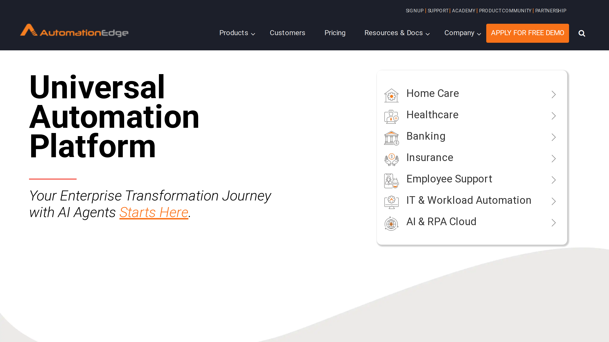

# AutomationEdge

AutomationEdge is a hyperautomation platform provider combining RPA, IT automation, conversational AI, and [intelligent document processing](../../capabilities/document-understanding/index.md) in a unified solution.

## Overview

Founded in 2003 by Prasad Patwa and Uday Birajdar in Pune, India, with US headquarters in Houston, Texas, AutomationEdge delivers hyperautomation solutions for banking, insurance, financial services, and healthcare sectors. The company serves multinational clients including American Express, Capita, Coty, ICICI Lombard, HDFC Life, Smart Dubai Government, Mashreq Bank, and Genpact. AutomationEdge was among the first automation vendors to offer integrated hyperautomation capabilities combining RPA, AI, ML, NLP, iPaaS, and data ingestion in a single platform.

## Key Features

- **Intelligent RPA**: Advanced RPA with AI, machine learning, and natural language processing integration
- **IT Automation**: Virtual IT operations automation for infrastructure and service management
- **IDP capabilities**: [Document processing](../../capabilities/extraction/index.md) for unstructured data extraction and classification
- **Conversational AI**: Chatbot and virtual agent platform for customer and employee interactions
- **iPaaS integration**: Built-in integration platform for connecting enterprise applications
- **End-to-end hyperautomation**: Combines multiple automation technologies in unified workflows
- **Ready API integrations**: Pre-built connectors for enterprise systems

## Use Cases

### Banking Operations Automation

Financial institutions like Mashreq Bank and HDFC Life deploy AutomationEdge to automate loan processing, account opening, and compliance reporting. The platform combines RPA for data entry, IDP for document extraction from applications and identity documents, and AI for risk assessment, creating end-to-end automated workflows across core banking systems.

### Insurance Claims Processing

Insurance companies including ICICI Lombard use AutomationEdge to process claims documentation. The IDP component extracts policy details and claim information from forms and supporting documents, RPA bots validate data against policy databases, and conversational AI provides status updates to customers through chatbot interfaces.

### IT Service Management

Enterprises implement AutomationEdge for IT automation, combining service desk ticket processing with infrastructure automation. The platform extracts information from support tickets, uses RPA to execute routine IT tasks, and employs chatbots for user self-service, reducing manual IT operations workload.

## Technical Specifications

| Feature | Specification |
|---------|---------------|
| Platform Type | Hyperautomation with integrated RPA, AI, IDP |
| Core Technologies | RPA, AI, ML, NLP, iPaaS, conversational AI |
| IDP Capabilities | Unstructured data processing, document extraction |
| IT Automation | Virtual IT operations automation |
| Deployment | Cloud, on-premise |
| Integration | Ready API integrations, iPaaS |
| Target Industries | Banking, insurance, financial services, healthcare |

## Resources

- [Website](https://automationedge.com)

## Company Information

Pune, India (Founded) | Houston, Texas, United States (HQ)

Founded: 2003

Founders: Prasad Patwa, Uday Birajdar

Notable Clients: American Express, Capita, ICICI Lombard, HDFC Life, Mashreq Bank, Genpact
