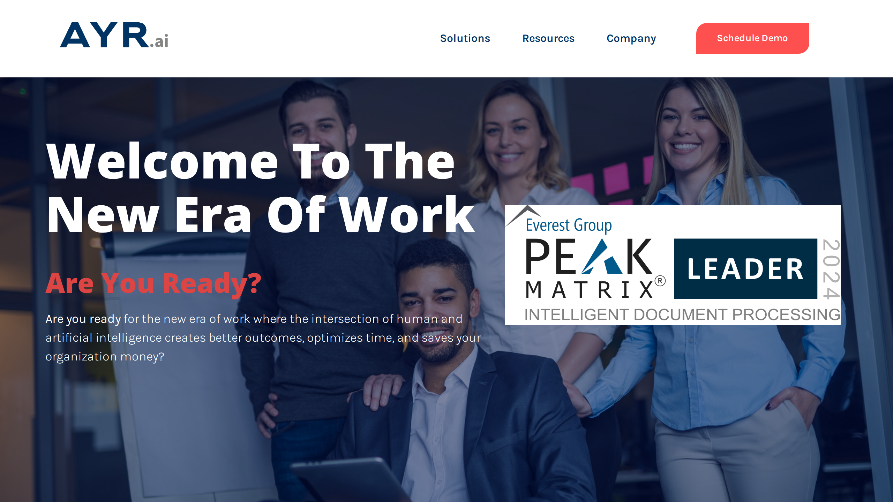

# AYR

AYR is an intelligent document processing provider that develops the SingularityAI platform and patent-pending Intelligent Document Simulator for automated [document data extraction](../../capabilities/extraction/index.md).

## Overview

Founded in 2018 and headquartered in Princeton, New Jersey, AYR (formerly Singularity Systems) develops the SingularityAI platform for intelligent document processing. The company's primary innovation is the Intelligent Document Simulator (IDS), a synthetic training data generation tool designed to address the scarcity of labeled training data in enterprise IDP implementations.

AYR employs a "2-2-4 deployment approach" focused on accelerating time-to-value for document processing projects. The company was recognized as "Hottest of the Hot Vendors" at Super Summit and named a market leader by HFS Research, though it was removed from the Everest Group IDP leaders list in 2025.

## Key Features

- **Intelligent Document Simulator (IDS) v3.0**: Patent-pending synthetic training data generator that creates document variations with altered layouts (column swapping, section shuffling) and content using proprietary language models
- **AI Pathfinder Technology**: Patented rapid model training methodology that reduces training time from months to days
- **SingularityAI Platform**: Machine learning-based platform for document [classification](../../capabilities/document-understanding/index.md), data extraction, and workflow automation
- **Layout Adaptation**: Generates document variations with horizontal and vertical section rearrangement to handle format evolution
- **Content Variation**: Produces similar phrases and values using proprietary language models to simulate real-world document diversity

## Use Cases

### Financial Services Document Processing

Organizations use AYR to process financial documents where providing real training data is restricted due to confidentiality requirements. The Intelligent Document Simulator generates synthetic versions of invoices, statements, and contracts with varied layouts and content, enabling model training without exposing sensitive customer data. Customer reports indicate achieving 95% accuracy within one week and 99.9% straight-through processing after two weeks of deployment.

### Rapid Model Deployment for Evolving Document Formats

Companies facing constantly changing document layouts implement AYR's IDS to continuously generate training variations. When suppliers or partners modify invoice formats, form structures, or document templates, the simulator produces synthetic examples of potential layout changes, allowing models to adapt without waiting for real-world samples to accumulate. This addresses the problem of model degradation when document formats evolve.

## Technical Specifications

| Feature | Specification |
|---------|---------------|
| Training Data Generation | Synthetic document creation with layout and content variations |
| Model Training Time | Days (vs. industry standard of months) |
| Reported Accuracy | Customer claims of 95% in 1 week, 99.9% STP in 2 weeks |
| Core Technology | Machine learning, proprietary language models, computer vision |
| Key Differentiator | Patent-pending document simulation for training data scarcity |

## Resources

- [Website](https://ayr.ai)
- [Intelligent Document Processing Solutions](https://ayr.ai/intelligent-document-processing)
- [Blog](https://ayr.ai/blog)

## Company Information

Headquarters: Princeton, New Jersey, United States

Web: https://ayr.ai/

## Recognition

- Awarded "Hottest of the Hot Vendors" at Super Summit
- Named one of the Top 30 Fastest Growing Companies in 2023
- Former Leader in Everest Group IDP rankings
