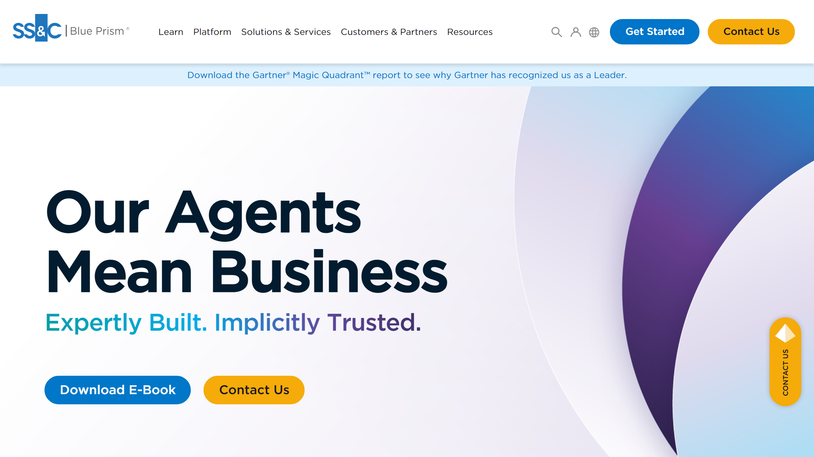

# Blue Prism

SS&C Blue Prism is an enterprise RPA and intelligent automation platform provider offering [document processing](../../capabilities/document-understanding/index.md) through its Decipher IDP product.

## Overview

Founded in 2001 by Alastair Bathgate and David Moss, Blue Prism launched its first commercial product, Automate, in 2003 and coined the term "robotic process automation (RPA)" in 2012. Acquired by SS&C Technologies in March 2022 for $1.6 billion after a competitive bidding process, the company operates as SS&C Blue Prism, serving financial services and healthcare sectors. Headquartered in Windsor, Connecticut, SS&C Blue Prism combines RPA, BPM, low-code/no-code capabilities, and intelligent automation into a unified platform.

## Key Features

- **Decipher IDP**: Document processing with computer vision, AI, ML, and NLP for structured, unstructured, and semi-structured documents
- **Document Automation**: Handles handwritten documents and low-quality machine print, images, and PDFs
- **Blue Prism Next Generation**: Cloud-native intelligent automation platform
- **Blue Prism Enterprise**: On-premise scalable automation with enterprise-grade security
- **Blue Prism Cloud**: Fully managed SaaS-delivered platform
- **SS&C AI Gateway**: Enterprise AI governance platform
- **Agentic AI**: Autonomous work execution with minimal human intervention
- **Visual business object design**: Low-code development environment

## Use Cases

### Financial Services Invoice Processing

Banks and financial institutions deploy Decipher IDP to process invoices and purchase orders at scale. The system uses OCR and machine learning to [classify](../../capabilities/classification/index.md) document types, [extract](../../capabilities/extraction/index.md) line items and payment details, and validate data through multiple validation layers. Native integration with Blue Prism RPA enables automated data entry into accounting systems with customizable validation rules.

### Healthcare Claims Documentation

Healthcare providers use Blue Prism Document Automation to process insurance claims with handwritten forms and low-quality scanned documents. The platform digitizes patient information, extracts diagnosis codes and treatment details, validates data against healthcare databases, and routes exceptions for human review, reducing manual claims processing time.

### Banking Customer Onboarding

Financial institutions implement Blue Prism to automate KYC and customer onboarding processes. Decipher IDP extracts data from passports, driver's licenses, and identity documents, validates information across multiple data sources, and triggers RPA workflows for account creation, processing documents in hours rather than days.

## Technical Specifications

| Feature | Specification |
|---------|---------------|
| Core Platform | RPA, BPM, low-code/no-code, agentic AI |
| IDP Product | Decipher IDP, Document Automation |
| Technology | Computer vision, AI, ML, NLP, OCR |
| Document Types | Structured, unstructured, semi-structured, handwritten |
| Deployment | Cloud-native, on-premise, hybrid, SaaS |
| Processing Pipeline | Ingestion, classification, extraction, validation, integration |
| Integration | Native RPA integration, quick setup (hours) |
| Scale Metrics | 2,700+ active agents, 150M transactions, $170M+ savings delivered |

## Resources

- [Website](https://www.blueprism.com)
- [Decipher IDP Product](https://www.blueprism.com/products/decipheridp/)
- [Documentation](https://www.blueprism.com/resources)

## Company Information

Windsor, Connecticut, United States

Founded: 2001 (Blue Prism) | Acquired: March 2022 by SS&C Technologies ($1.6B)

Founders: Alastair Bathgate, David Moss

Email: support@blueprism.com

Tel: +1 888 757 7476
