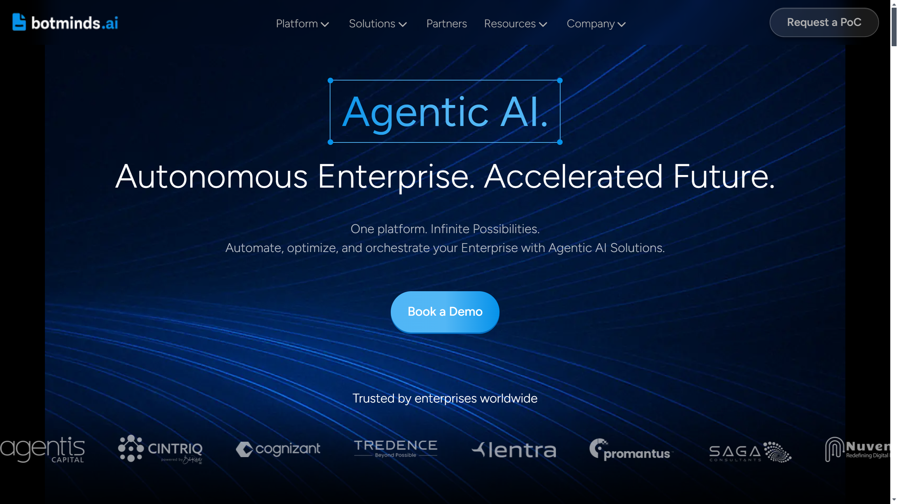

# Botminds AI

Botminds AI is a no-code agentic AI platform provider offering [intelligent document processing](../../capabilities/document-understanding/index.md) with proprietary AI algorithms and integrated document automation.

## Overview

Founded in 2015 and based in Bellevue, Washington, Botminds Inc. positions itself as providing the world's first integrated platform for document understanding and IDP. The company built its proprietary technology stack including custom AI algorithms, leveraging deep learning and NLP for document processing. Botminds serves finance and accounting, legal and compliance, operations, life sciences, research, risk and governance, and sales support sectors with its no-code enterprise automation platform.

## Key Features

- **Agentic Document Extraction**: Autonomous document data capture with 98%+ accuracy
- **Agentic AI Workflow**: Context-aware workflows with autonomous decision-making
- **AI Analytics**: Real-time reporting and visualization dashboards with cross-data linking
- **Document Discovery**: Custom search engine for querying documents with high-precision data search
- **Conversational AI**: Natural language interface for document interaction
- **Virtual AI Assistant**: AI-powered assistant for document-based tasks
- **No-code platform**: Deep learning and NLP without coding requirements

## Use Cases

### Finance Invoice Processing

Finance departments deploy Botminds for accounts payable automation, achieving 70% reduction in processing time. The platform [extracts](../../capabilities/extraction/index.md) invoice data including line items, vendor information, and payment terms with 98%+ accuracy, automatically [classifies](../../capabilities/classification/index.md) document types, and normalizes data across multiple formats for integration with accounting systems.

### Legal Contract Analysis

Law firms and legal departments use Botminds to process contracts and legal documents. The AI Search capability enables querying across document repositories using natural language, while agentic extraction pulls key contract clauses, dates, and obligations. The platform achieves 99% batch traceability for compliance auditing and document versioning.

### Life Sciences Research Documentation

Life sciences companies implement Botminds for clinical trial documentation and research paper analysis. The platform processes scientific documents, extracts data tables and experimental results, and provides AI analytics for pattern recognition across research datasets. Conversational AI enables researchers to query document collections naturally, accelerating literature review workflows.

## Technical Specifications

| Feature | Specification |
|---------|---------------|
| Platform Type | No-code agentic AI with integrated IDP |
| Proprietary Technology | Custom AI algorithms, deep learning, NLP |
| Accuracy | 98%+ across document processing |
| Processing Performance | 70% reduction in processing time, 5x faster issue resolution |
| Traceability | 99% batch traceability |
| Core Capabilities | Document extraction, AI workflow, analytics, search, conversational AI |
| Deployment | Enterprise-grade security, scalable, modular |
| Customization | SDKs and APIs |

## Resources

- [Website](https://www.botminds.ai)
- [IDP Overview](https://www.botminds.ai/idp/what-is-idp)

## Company Information

Bellevue, Washington, United States

Founded: 2015
