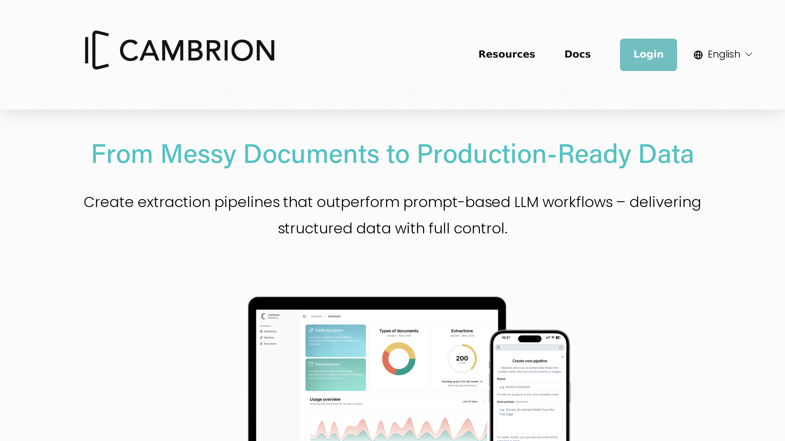

# Cambrion

Cambrion is an agentic AI platform for [document workflow automation](../../capabilities/document-understanding/index.md), converting unstructured documents into structured JSON data via API.

## Overview

Founded in 2024 in Munich, Germany, Cambrion GmbH provides an agentic API-based infrastructure using vision-language models for document processing without prior training. The platform enables users to set up production-ready extraction pipelines in minutes through natural language configuration. Cambrion serves logistics, automotive, and manufacturing industries with EU cloud deployments for data privacy compliance.

## Key Features

- **Agentic data extraction**: AI agents automatically transform unstructured documents into structured data
- **Pipeline Agent**: Natural language pipeline configuration with production-ready setup in minutes
- **Multi-modal ingestion**: Processes DOCX, XLSX, PDF, JPG, and email formats
- **Model flexibility**: Routes between Claude, OpenAI, Gemini, Mistral AI, and Qwen models
- **Built-in OCR**: High-precision optical character recognition for document processing
- **Data enrichment**: Integrates internal and external data sources for validation
- **Zero-training setup**: Instant deployment without model training requirements
- **EU cloud deployment**: European data residency for GDPR compliance

## Use Cases

### Logistics Invoice Processing

Logistics companies use Cambrion to process commercial invoices and delivery documents, achieving 80% faster processing and 98% error reduction. The Pipeline Agent [extracts](../../capabilities/extraction/index.md) shipping details, costs, and tracking information from varied formats, outputs structured JSON via API, and integrates with ERP systems with 70% less integration effort compared to traditional solutions.

### Automotive Supplier Reporting

Automotive manufacturers deploy Cambrion to process supplier reports and quality documentation. The platform handles multi-format documents including PDFs and Excel files, enriches data with internal supplier databases, and routes processing across multiple AI models for optimal accuracy. The agentic approach adapts to varying report formats without retraining.

### Manufacturing HR Records

Manufacturing firms implement Cambrion for HR document processing including employee records, contracts, and compliance documentation. The system extracts personnel data, validates against HR systems, and maintains GDPR compliance through EU cloud deployment. Natural language pipeline configuration enables HR teams to modify extraction rules without technical expertise.

## Technical Specifications

| Feature | Specification |
|---------|---------------|
| Platform Type | Agentic AI with API-based infrastructure |
| AI Models | Claude, OpenAI, Gemini, Mistral AI, Qwen |
| Document Formats | DOCX, XLSX, PDF, JPG, email |
| Output Format | Structured JSON via API |
| OCR | Built-in high-precision OCR |
| Setup Time | Minutes (no training required) |
| Deployment | EU cloud for GDPR compliance |
| Performance Claims | 80% faster processing, 98% error reduction, 70% less integration effort |

## Resources

- [Website](https://www.cambrion.ai)
- [FAQ](https://www.cambrion.ai/faq)

## Company Information

Munich, Germany

Founded: 2024
