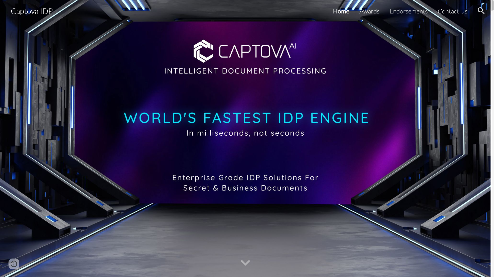

# Captova Technologies

Captova Technologies provides high-speed [intelligent document processing](../../capabilities/document-understanding/index.md) for secure and business environments with processing speeds exceeding 100 pages per second.

## Overview

Founded in Vancouver, British Columbia, Canada, by CEO Mohamed Talib, Captova Technologies delivers IDP solutions for secret, classified, and business documents with focus on privacy, accuracy, speed, and security (PASS criteria). The company offers the Captova IDP Engine processing 6,000 pages per minute (360,000 pages/hour) and Scanov, a QuickBooks Online data capture integration. Captova's unique pricing model eliminates per-page fees, charging based on server size with maintenance fees.

## Key Features

- **Ultra-fast processing**: 100+ pages per second, approximately 10 milliseconds per page
- **Rapid AI training**: Single high-quality document sample trains AI models for immediate processing
- **Captova IDP Engine**: Core processing engine with real-time error detection at ~95% accuracy
- **Captova ETL**: Data transformation and integration component
- **Captova GPT**: AI-powered document understanding layer
- **Scanov**: QuickBooks Online integration for receipts, invoices, bills, and purchase orders
- **Multi-format output**: Generates structured data in JSON, CSV, and XML
- **No-code solution**: Out-of-the-box deployment without coding requirements
- **Offline operation**: Functions without network connectivity for secure environments

## Use Cases

### Government Secure Document Processing

Government agencies deploy Captova in SCIFs (Sensitive Compartmented Information Facilities) and SAPFs (Special Access Program Facilities) to process classified documents offline. The system operates on on-premise bare-metal servers without internet connectivity, processes intelligence documents and reports at 6,000 pages per minute, and trains AI models on-site using single document samples for immediate deployment.

### Accounting Automation with QuickBooks

Accounting firms and businesses use Scanov to automate expense management and accounts payable. The system captures data from supplier invoices, receipts, bills, and purchase orders, [extracts](../../capabilities/extraction/index.md) line items and payment details, exports both data and source document images directly to QuickBooks Online, and processes documents in milliseconds for real-time bookkeeping.

### High-Volume Enterprise Document Processing

Enterprises with large document volumes implement Captova IDP Engine for invoice processing, contract analysis, and regulatory documentation. The platform handles structured and semi-structured documents, generates JSON/CSV/XML output for ERP integration, detects errors in real-time with 95% accuracy, and scales to process 360,000 pages per hour on single server deployments.

## Technical Specifications

| Feature | Specification |
|---------|---------------|
| Processing Speed | 100+ pages/second, ~10ms per page |
| Throughput | 6,000 pages/minute, 360,000 pages/hour |
| AI Training | Single document sample for model training |
| Document Types | Structured, semi-structured |
| Output Formats | JSON, CSV, XML |
| Error Detection | Real-time with ~95% accuracy |
| Deployment | On-premise, bare-metal cloud, offline-capable |
| Integration | E-invoicing protocols, QuickBooks Online (Scanov) |
| Pricing Model | Server-based with maintenance fees (no per-page fees) |

## Resources

- [Website](https://www.captova.com)

## Company Information

Vancouver, British Columbia, Canada

Founder & CEO: Mohamed Talib
