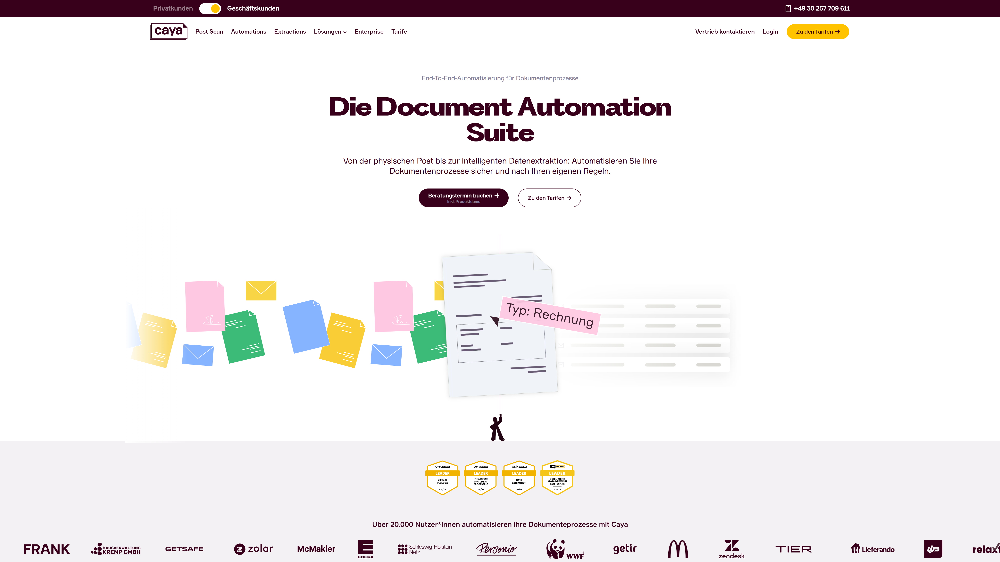

# Caya

Caya provides end-to-end document automation for German businesses, handling physical mail digitization, document classification, data extraction, and system integration.

## Overview

Caya operates a cloud-based document automation suite that manages the complete lifecycle from physical mail capture through intelligent data extraction and system integration. Based in Berlin, the company serves over 20,000 users including legal guardians, franchises, banks, agencies, tax consultants, insurance brokers, property managers, and coworking spaces across Germany. The platform consists of three integrated products: Post Scan for physical mail digitization with automatic [classification](../../capabilities/classification/index.md), Document Automations for rule-based routing and distribution, and Document Extractions using [OCR](../../capabilities/ocr/index.md) and AI to extract structured data from documents. All processing occurs on German servers with ISO 27001, DSGVO (GDPR), and DORA compliance. Caya integrates with over 100 systems and provides web platform access with iOS and Android mobile apps for document management.

## Key Features

- **Post Scan**: Captures and digitizes physical mail with automatic document classification and routing
- **Document Automations**: Rule-based routing to folders, recipients, and workflows based on document type and content
- **Document Extractions**: OCR and AI-powered [data extraction](../../capabilities/extraction/index.md) for structured data capture from invoices, contracts, letters, and forms
- **PDF Toolbox**: Text highlighting, page splitting/merging, form filling, and signature capabilities for document editing
- **System Integrations**: Over 100 integration connectors for accounting, CRM, ERP, and business management systems
- **Multi-Tenant Architecture**: Location and subsidiary management with role-based permissions for organizational hierarchies

## Use Cases

### Tax Consultant Document Processing

Tax consulting firms digitize client mail by forwarding physical correspondence to Caya's scanning service. The Post Scan system captures incoming documents, classifies them by type (invoices, receipts, bank statements, tax forms), and routes items to appropriate client folders based on sender and document content. Document Extractions pulls invoice amounts, dates, vendor details, and expense categories for export to accounting software like DATEV. The system handles receipts by extracting transaction details for expense categorization, while contracts and official correspondence route to review queues. Mobile apps enable consultants to photograph on-site documents for immediate processing.

### Property Management Mail Automation

Property management companies process tenant correspondence, vendor invoices, and maintenance requests through automated routing workflows. Caya classifies incoming mail by property address and document type, distributing items to location-specific workspaces for regional managers. The platform extracts utility bill amounts and due dates for payment scheduling, routes maintenance quotes to approval workflows, and captures lease agreements for archive storage. Integration with property management software enables automatic invoice posting and tenant account updates. Multi-tenant architecture supports organizational hierarchies with permissions controlling document access by region, property, or user role.

## Technical Specifications

| Feature | Specification |
|---------|---------------|
| Core Products | Post Scan, Document Automations, Document Extractions |
| Technology | OCR, AI-based document recognition |
| Document Types | Invoices, contracts, letters, forms, receipts |
| Deployment | Cloud-based (German servers) |
| Access | Web platform, iOS app, Android app |
| Integrations | 100+ system connectors |
| Compliance | ISO 27001, DSGVO (GDPR), DORA |
| Multi-Tenancy | Location/subsidiary management with role-based permissions |
| Target Users | Legal guardians, franchises, banks, agencies, tax consultants, insurance brokers, property management, coworking spaces |

## Resources

- [Website](https://www.caya.com)
- [Post Scan](https://www.caya.com/post-scan)
- [Document Automations](https://www.caya.com/automation)
- [Integrations](https://www.caya.com/integrationen)
- [Help Center](https://helpcenter.caya.com/)
- [Capterra Reviews](https://www.capterra.com.de/reviews/1020889/caya)

## Company Information

Headquarters: Berlin, Germany

Phone: +49 30 257 709 611

Email: business@getcaya.com, hello@getcaya.com

Contact: [Sales Contact](https://www.caya.com/vertrieb-kontaktieren)

Users: 20,000+
