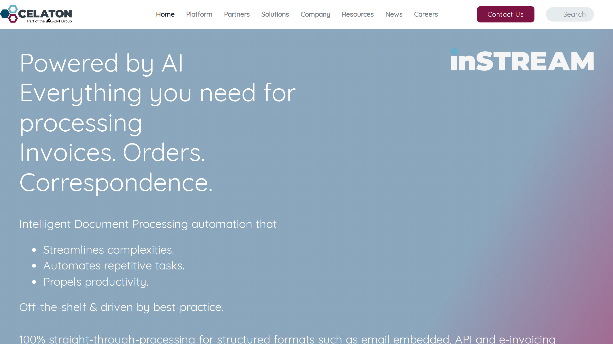

# Celaton

Celaton is an intelligent document processing provider offering the inSTREAM platform for automated data capture, classification, and extraction from business documents.

## Overview

Founded in the UK, Celaton was acquired by AdvancedAdvT Ltd (ADVT) in May 2024. The company is ISO 27001:2013 certified and delivers its inSTREAM platform as a fully managed SaaS solution. Celaton serves organizations across finance, manufacturing, insurance, and other sectors requiring document processing automation.

## Key Features

- **inSTREAM Platform**: SaaS-based document processing platform with 24/7 managed support
- **Multi-Format Processing**: Handles paper, email attachments, fax, and EDI inputs across structured, semi-structured, and unstructured formats
- **Self-Learning AI**: Machine learning algorithms that improve accuracy without requiring template creation for new document types
- **Human-in-the-Loop Learning**: Graphical interface for operators to teach the system through collaborative feedback
- **128 Language Support**: Processes documents in 128 languages globally
- **Straight-Through Processing**: Achieves automated processing without manual intervention as confidence improves

## Use Cases

### Invoice Processing
Finance departments deploy inSTREAM to automate accounts payable workflows. The platform captures invoices from multiple channels, extracts line items and totals, validates against purchase orders, and routes for approval. Organizations achieve an average 75% reduction in manual processing effort.

### Sales Order Processing
Customer service teams use inSTREAM to process incoming orders from various formats. The system recognizes customer details, product codes, quantities, and delivery instructions, then integrates directly with ERP systems. Deployments report an average 83% efficiency improvement.

### Claims Processing
Insurance companies apply inSTREAM to automate claims intake and data extraction. The platform processes claim forms, supporting documentation, and correspondence, reducing manual handling by approximately 85%.

## Technical Specifications

| Feature | Specification |
|---------|---------------|
| Core Technologies | AI, ML, RPA, OCR, ICR, NLP, cognitive computing |
| Deployment | SaaS, fully managed, 24/7 support |
| Document Formats | Structured, semi-structured, unstructured |
| Input Channels | Paper, email, fax, EDI |
| Language Support | 128 languages |
| Integration Methods | Web Services, REST API, email, file import/export |
| Security & Compliance | ISO 27001:2013 certified, GDPR compliant |
| Processing Mode | Straight-through processing with human-in-the-loop learning |

## Resources

- [Website](https://celaton.com)
- [inSTREAM Product Page](https://celaton.com/instream)
- [UiPath Marketplace Integration](https://marketplace.uipath.com/listings/celaton-instream)

## Company Information

Headquarters: Milton Keynes, United Kingdom

Acquired: May 2024 by AdvancedAdvT Ltd (ADVT)

Certification: ISO 27001:2013
