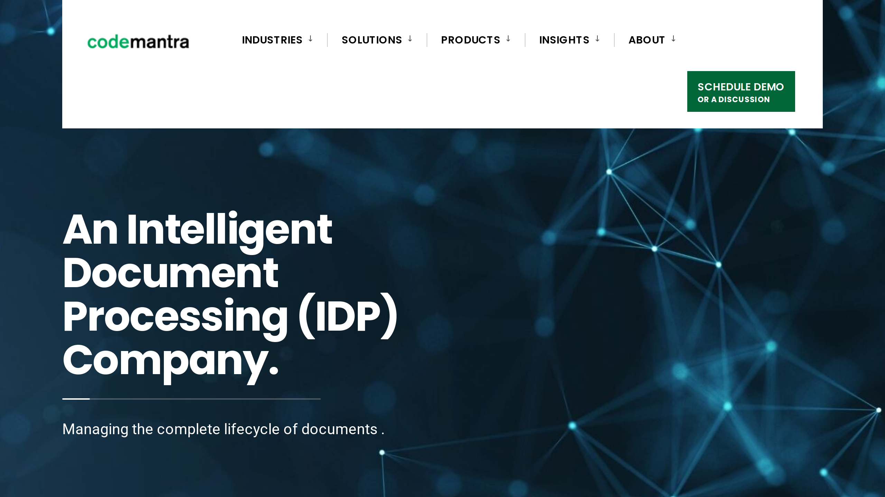

# codemantra

codemantra is an intelligent document processing company offering AI-powered solutions for document accessibility compliance, transformation, and lifecycle management.

## Overview

Founded in 2002 and based in Burlington, codemantra develops software that automates document accessibility remediation, format conversion, and lifecycle management for large content collections. Its tools apply machine learning to identify document structures, generate accessibility tags, and validate compliance with standards such as WCAG 2.1 AA, PDF/UA, and Section 508. The company’s platforms support integration with enterprise systems and handle multiple file formats, including PDF, Word, and EPUB.

## Key Features

- **accessibilityInsight**: AI-powered platform with three modules (accessibilityFix, accessibilityReview, accessibilityCheck) for automated PDF remediation and compliance testing
- **collectionPoint**: SaaS-based intelligent document processing platform for end-to-end document lifecycle management
- **AI-Powered Auto-Tagging**: Machine learning algorithms automatically tag document elements, identify reading order, retain bookmarks, and encrypt metadata
- **100+ Compliance Tests**: Automated testing against WCAG 2.1 AA, PDF/UA, ADA, and Section 508 standards
- **Multi-Format Support**: Processes PDF, Word, Excel, PowerPoint, EPUB, audio, and video files
- **Modular Architecture**: Cloud-based platform on AWS with scalable, modular design allowing standalone or combined licensing

## Use Cases

### Document Accessibility Remediation
Government agencies and educational institutions deploy accessibilityInsight to make PDF documents compliant with WCAG 2.1 AA standards. The platform auto-tags elements, allows custom alt text for images and charts, and performs automated compliance checks. Users can license individual modules or the complete platform.

### Intelligent Document Lifecycle Management
Publishing houses and financial institutions use collectionPoint to manage documents from creation to delivery. The platform integrates with LMS, ERP, and CRM systems, applies machine learning for data extraction, and provides business intelligence dashboards for lifecycle visibility.

### Contract Processing
Organizations process contracts through collectionPoint's automated workflow engine. The system applies intelligent decision-making logic, generates business rules, and distributes documents to downstream channels with annotation and redaction capabilities.

## Technical Specifications

| Feature | Specification |
|---------|---------------|
| Core Products | accessibilityInsight, collectionPoint |
| AI Technologies | Machine learning, automated document tagging |
| Compliance Standards | WCAG 2.1 AA, PDF/UA, ADA, Section 508 |
| Supported Formats | PDF, Word, Excel, PowerPoint, EPUB, audio, video |
| Deployment | Cloud (AWS), on-premises |
| Architecture | Modular, scalable SaaS |
| Integration | LMS, ERP, CRM systems |
| Accessibility Features | Auto-tagging, alt text, reading order, 100+ tests |
| Licensing | Modular (standalone or combined components) |

## Resources

- [Website](https://codemantra.com)
- [collectionPoint Platform](https://codemantra.com/collectionpoint-en/)
- [accessibilityCheck](https://codemantra.com/accessibilityplatform/accessibilitycheck/)

## Company Information

Headquarters: Burlington, Massachusetts, United States

Global Offices: Chennai (India), UK, Europe

Founded: 2002

Employees: 287-566

Funding: $5.7M Series A (Banyan Mezzanine Funds)
