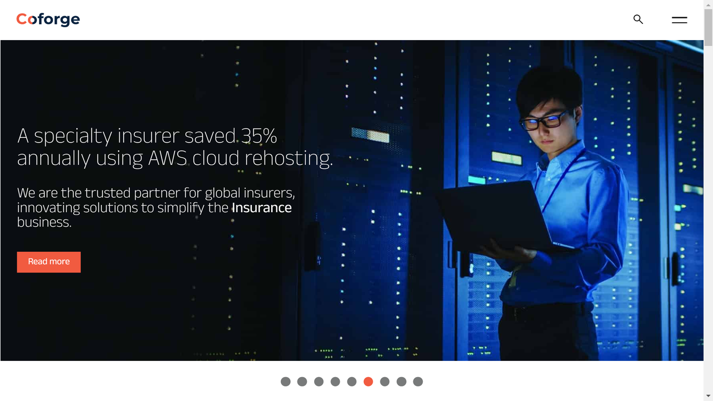

# Coforge

Coforge is a global IT services and consulting organization that provides document processing solutions as part of its broader digital transformation and business process management offerings.

## Overview

Coforge (formerly NIIT Technologies) delivers technology-led business solutions to enterprises across various industries. As part of their digital transformation services, Coforge offers document processing solutions that help organizations automate and optimize document-intensive business processes.

The company combines domain expertise, technology capabilities, and process excellence to provide end-to-end solutions for managing document lifecycles. Coforge's approach integrates intelligent document processing with broader digital transformation initiatives, focusing on creating business value through process optimization and automation.

Coforge serves multiple sectors including insurance, banking, travel, transportation, and healthcare, where document processing is often a critical component of business operations. Their solutions aim to reduce manual effort, improve accuracy, and accelerate processing times for document-centric workflows.

## Key Features

- **Intelligent Document Processing**: AI-powered extraction and classification of information
- **Process Automation**: End-to-end automation of document workflows
- **Digital Mailroom Solutions**: Centralized capture and distribution of incoming documents
- **Claims Processing**: Specialized solutions for insurance document handling
- **Custom Workflow Development**: Tailored document processes for specific business needs
- **System Integration**: Connecting document processing with enterprise applications
- **Document Management Consulting**: Strategic advisory on document handling optimization
- **Quality Assurance**: Validation and verification services for document processing
- **Analytics and Reporting**: Insights into document processing performance
- **Managed Services**: Ongoing operation and optimization of document solutions

## Use Cases

### Insurance Claims Processing

Insurance companies work with Coforge to transform their claims processing operations. Coforge implements intelligent document processing solutions that can capture, classify, and extract data from claims forms, medical records, and supporting documentation. These solutions integrate with claims management systems to accelerate processing, improve accuracy, and enhance the customer experience while reducing operational costs.

### Banking Document Automation

Financial institutions partner with Coforge to automate document-intensive processes such as loan origination, account opening, and KYC verification. Coforge designs and implements solutions that can handle diverse document types, extract relevant information, and integrate with banking systems to streamline operations, ensure compliance, and improve service delivery timelines.

## Technical Specifications

| Feature | Specification |
|---------|---------------|
| Technology Stack | OCR, Machine Learning, RPA, BPM platforms |
| Integration Capabilities | APIs, Web Services, Enterprise Application Connectors |
| Deployment Options | On-premise, Cloud, Hybrid |
| AI/ML Components | Document Classification, Data Extraction, Natural Language Processing |
| Supported Document Types | Structured, Semi-structured, Unstructured |
| Process Management | Workflow Design, Business Rules, Exception Handling |
| Security Framework | Role-based Access, Encryption, Audit Trails |
| Scalability | Enterprise-grade for High-volume Processing |
| Analytics | Performance Dashboards, Process Mining |

## Getting Started

1. **Assessment**: Evaluate current document processes and improvement opportunities
2. **Solution Design**: Develop tailored approach for document processing needs
3. **Implementation**: Deploy and integrate document processing capabilities
4. **Change Management**: Facilitate organizational adoption of new processes
5. **Continuous Improvement**: Ongoing optimization and enhancement

## Resources

- [Company Website](https://www.coforge.com/)
