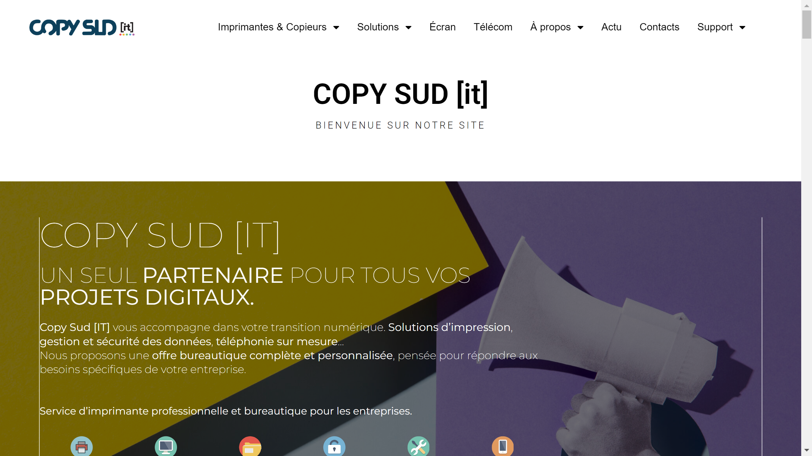

# Copysud

Copysud is a French document management and office technology provider offering Doc In Time, a document management platform with automatic classification, archiving, and secure sharing capabilities.

## Overview

Founded in 1978 and based in Toulouse, France, Copysud specializes in office technologies, professional printing services, and document management solutions. With over 100 employees across 8 locations, the company provides digital transformation services including document digitization, workflow automation, and data protection through its In Time platform suite of six integrated solutions.

## Key Features

- **Doc In Time**: Document management software with automatic [classification](../../capabilities/classification/index.md), 24/7 access, and secure sharing on a single platform
- **Automatic Classification**: Organizes documents automatically for rapid processing and retrieval
- **Central Archiving**: Stores all documents in a single location with easy access and distribution
- **Protect In Time**: Data protection solution with encrypted backups, virus prevention monitoring, and complete restoration capabilities
- **In Time Platform Suite**: Six integrated solutions (Work In Time, View In Time, Doc In Time, Com In Time, Protect In Time, Secure In Time)
- **Print Management**: Managed print services and office equipment optimization

## Use Cases

### Enterprise Document Management
Organizations deploy Doc In Time to centralize document storage and enable automated [classification](../../capabilities/classification/index.md). The platform provides 24/7 access to archived documents across multiple locations with secure sharing capabilities for distributed teams.

### Business Continuity and Data Protection
Companies use Protect In Time for encrypted data backup and document recovery. The solution monitors for viruses, performs automated backups, and ensures business continuity with complete document restoration in case of data loss.

### Digital Transformation
Businesses leverage Copysud's digitization services to transition from paper-based workflows to digital processes. The platform combines scanning equipment, document management software, and cloud storage for comprehensive workflow automation.

## Technical Specifications

| Feature | Specification |
|---------|---------------|
| Core Platform | In Time Suite (6 solutions) |
| Key Products | Doc In Time (GED), Protect In Time (data protection) |
| Document Processing | Automatic classification, archiving, secure sharing |
| Access | 24/7 availability |
| Data Protection | Encrypted backups, virus monitoring, restoration |
| Deployment | Cloud and on-premises options |
| Integration | Enterprise system compatibility |
| Services | Print management, digitization, workflow automation |

## Resources

- [Website](https://copysud.fr)
- [Solutions](https://copysud.fr/solutions/)
- [About](https://copysud.fr/a-propos/)

## Company Information

Headquarters: Toulouse, France

Founded: 1978

Locations: 8 physical locations across France
