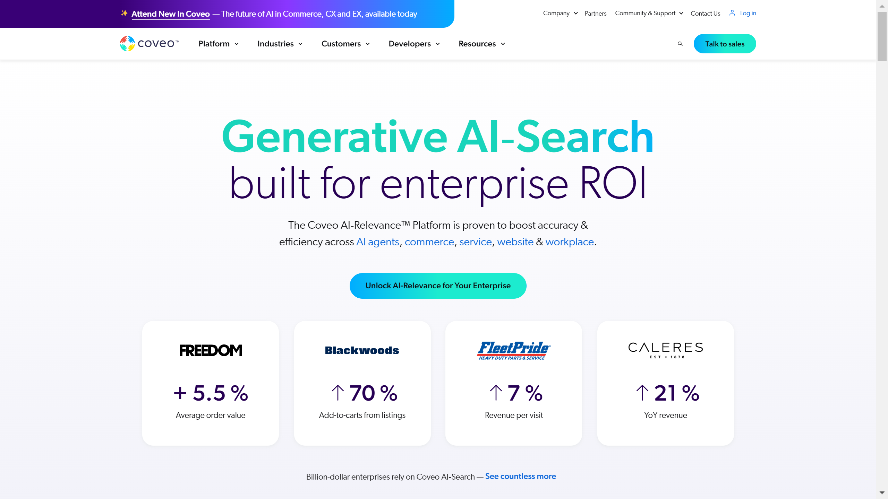

# Coveo

Coveo is an AI-powered enterprise search platform provider offering unified content indexing, intelligent search, and generative experiences across commerce, service, websites, and workplaces.

## Overview

Founded in 2005 as a spin-off of Copernic Technologies by Laurent Simoneau, Richard Tessier, and Marc Sanfaçon, Coveo develops SaaS-based enterprise search solutions. The publicly-traded company operates from Montreal and Quebec City, serving organizations with AI-driven search, recommendations, and content discovery across multiple enterprise platforms including Salesforce, ServiceNow, and SAP.

## Key Features

- **AI-Relevance Platform**: Unified platform delivering intelligent search, recommendations, and generative AI experiences across enterprise touchpoints
- **Unified Index**: Consolidates content from 55+ sources into single AI-enriched index without data migration
- **Coveo ML**: Machine learning with Intelligent Term Detection (ITD) and automatic relevance tuning based on user behavior and intent
- **Document-Level Security**: ISO 27001, HIPAA compliant with NIST and ISM3 alignment, enforcing granular access controls
- **99.9%+ Uptime**: Multi-tenant, highly scalable platform with continuous AI algorithm adaptation
- **Flexible Deployment**: No-code Hosted Search Page Builder to custom UIs with full API and SDK access

## Use Cases

### Enterprise Content Discovery
Organizations deploy Coveo for unified search across document repositories, knowledge bases, and databases. The platform uses [AI-powered search](../../capabilities/advanced-ai-capabilities/index.md) with Intelligent Term Detection to understand user intent and deliver personalized results from 55+ integrated sources.

### E-Commerce Search and Recommendations
Retailers leverage Coveo for product search and personalized recommendations. Machine learning analyzes user context and behavior to automatically surface relevant products, improving conversion rates through adaptive relevance tuning.

### Customer Service Knowledge Management
Support teams use Coveo to search across case histories, documentation, and knowledge articles. The platform integrates with ServiceNow and Salesforce, applying machine learning to understand context and recommend relevant solutions based on similar resolved cases.

## Technical Specifications

| Feature | Specification |
|---------|---------------|
| Platform | AI-Relevance Platform (SaaS) |
| Content Sources | 55+ indexable sources |
| Index | Single AI-enriched unified index |
| Machine Learning | Coveo ML with ITD, automatic relevance tuning |
| Security & Compliance | ISO 27001, HIPAA, NIST, ISM3, document-level access controls |
| Uptime | 99.9%+ |
| Deployment | Cloud (multi-tenant) |
| Integration | Salesforce, ServiceNow, SAP, native connectors |
| Development | No-code builder, full API/SDK access |
| Personalization | Context, behavior, and intent-based ML |

## Resources

- [Website](https://www.coveo.com/en)
- [AI Search Platform](https://www.coveo.com/en/platform/intelligent-search)
- [Technology Overview](https://www.coveo.com/en/platform/technology)

## Company Information

Headquarters: Montreal, Quebec, Canada

Founded: 2005

Founders: Laurent Simoneau, Richard Tessier, Marc Sanfaçon

Status: Publicly traded (NYSE: CVO)
