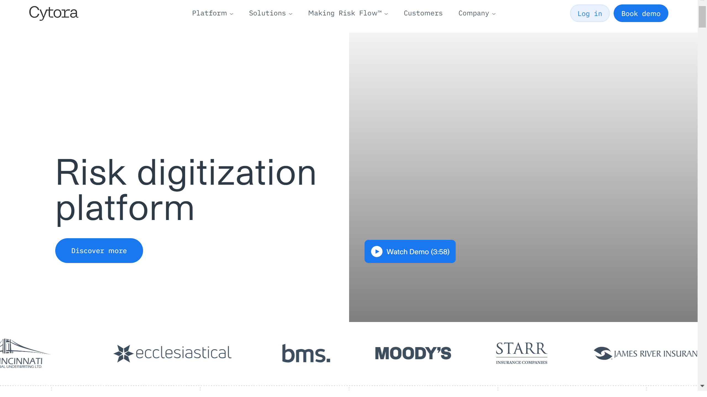

# Cytora

Cytora is a digital risk processing platform for commercial insurance offering AI-powered submission digitization, risk evaluation, and underwriting automation through its risk flow engine.

## Overview

Founded in 2012 as a University of Cambridge spinout, Cytora develops generative and agentic AI solutions for commercial insurance underwriting. The London-based company raised $41.43M before being acquired by Applied Systems in September 2025. Cytora's platform digitizes the full policy lifecycle from submission to claims, transforming unstructured risk data into structured insights for automated decision-making across the insurance workflow.

## Key Features

- **Risk Flow Engine**: Low-code platform for defining and executing multi-step, human-in-the-loop risk processing workflows
- **Document-to-Data Platform**: Transforms structured (ACORD forms) and unstructured data (PDFs, Excel, emails, images) into decision-ready transactions
- **LLM-Enhanced Capabilities**: Generative AI features including Field Builder, Field Management, and Chain of Risk Thought for faster line of business onboarding
- **Verify API**: Corrects and enriches submission information using external data for comprehensive risk profiles
- **Risk Scoring**: AI analyzes billions of data points to learn risk patterns, combining digital footprints with internal insurer data
- **Human-in-the-Loop Console**: Manages low-confidence outputs with underwriter validation and decision support

## Use Cases

### Commercial P&C Submission Processing
Insurers deploy Cytora to automate submission intake for commercial property and casualty risks. The platform [digitizes](../../capabilities/extraction/index.md) incoming submissions, augments with external data sources, evaluates against appetite and priority rules, and routes to downstream systems. Risk assessment time reduces from days to minutes.

### Underwriting Workflow Automation
Carriers use Cytora's risk flow engine for automated underwriting decisions. The system processes structured and unstructured documents, performs [risk scoring](../../capabilities/document-understanding/index.md), applies business rules, and enables straight-through processing with human-in-the-loop oversight for low-confidence cases.

### Broker and Agency Integration
Agencies leverage Cytora's APIs to verify submissions and prioritize risks. The document-to-data platform consolidates information from multiple sources into each participant's risk view, enabling automated data exchange between brokers and carriers through API integrations.

## Technical Specifications

| Feature | Specification |
|---------|---------------|
| Core Platform | Risk Flow Engine, Document-to-Data Platform |
| AI Technology | Generative AI, agentic AI, LLMs |
| Data Sources | Structured (ACORD forms), unstructured (PDFs, Excel, CSV, emails, images) |
| APIs | Verify API, risk processing APIs |
| Workflow | Multi-step, human-in-the-loop, low-code configuration |
| Analytics | Real-time business analytics with BigQuery |
| Processing Modules | Digitize, evaluate, decide |
| Risk Analysis | Billions of data points, pattern learning |
| Integration | API-based automated data exchange |
| Lifecycle Coverage | Submission to claims, endorsements, renewals |

## Resources

- [Website](https://www.cytora.com/)
- [Blog](https://www.cytora.com/blog/)
- [Risk Flow Center](https://www.cytora.com/risk-flow-center/)

## Company Information

Headquarters: London, United Kingdom

Founded: 2012 (Cambridge spinout)

Funding: $41.43M total

Acquired: September 2025 by Applied Systems
