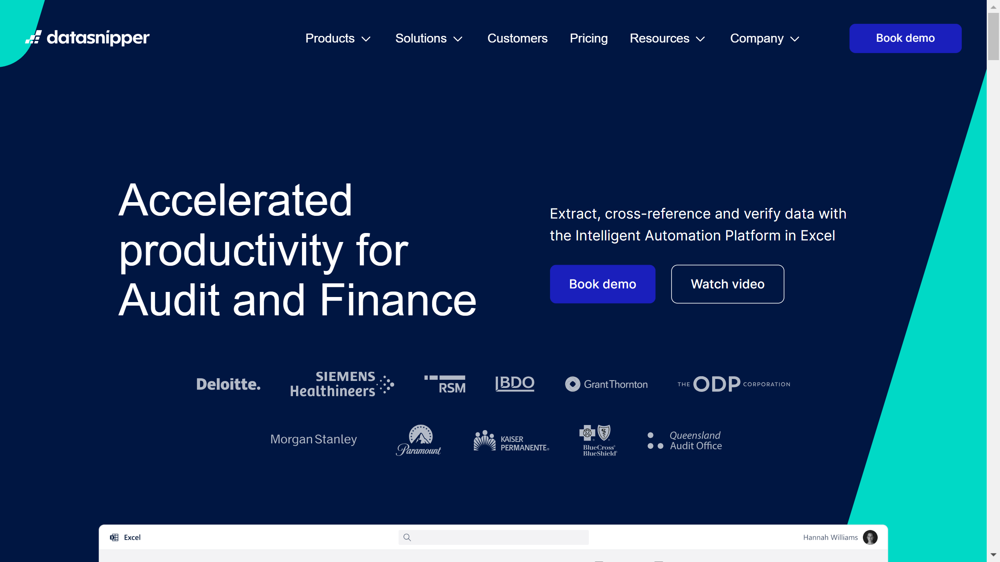

# DataSnipper

DataSnipper is a provider of intelligent document extraction and analysis tools, particularly focused on improving efficiency in accounting, audit, and financial document processing.

## Overview

DataSnipper offers AI-powered solutions for extracting and analyzing information from financial and business documents. Their technology helps auditors, accountants, and financial professionals automate data extraction and verification processes, reducing manual effort and improving accuracy in document review and analysis.

## Key Features

- Automated data extraction
- Document comparison and verification
- Excel integration
- AI-powered document analysis
- Template-based extraction
- Audit trail and documentation
- Collaboration features
- Financial document specialization

## Use Cases

- Financial audit automation
- Accounting document verification
- Financial statement analysis
- Contract review and analysis
- Due diligence processes
- Financial reporting
- Compliance documentation
- Tax document processing

## Technical Specifications

DataSnipper's technology integrates with Microsoft Excel and other common financial and business applications. Their solutions can process various document formats, with special emphasis on financial documents, contracts, and structured business documents. The platform offers both cloud-based and on-premises deployment options.

## Resources

- [Website](https://www.datasnipper.com)
- [Documentation](https://www.datasnipper.com/resources)
