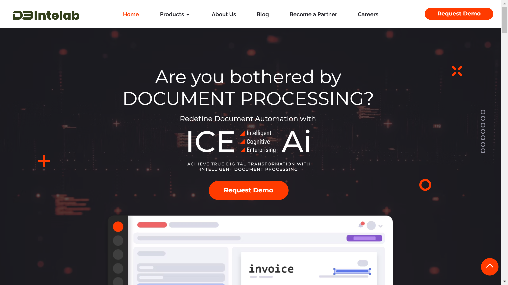

# DB Intelab

DB Intelab is a Malaysian enterprise solutions company providing intelligent document processing through its ICE-Ai platform.

## Overview

DB Intelab Sdn Bhd, formerly known as Equatd, develops ICE-Ai, an intelligent document processing solution that automates document workflows using artificial intelligence and machine learning. Founded in 2020 and based in Petaling Jaya, Malaysia, the company targets enterprises struggling with manual document processing. ICE-Ai processes documents of any type or format by classifying and extracting data with continuous learning capabilities.

## Key Features

- **ICE-Ai Platform**: AI-powered IDP solution with [classification](../../capabilities/classification/index.md) and [extraction](../../capabilities/extraction/index.md) capabilities
- **Multi-Format Support**: Processes documents with tables, logos, signatures, and stamps
- **Automatic Classification**: Classifies documents by type before extraction
- **Rule-Based Validation**: Compares extracted data against multiple sources for verification
- **Continuous Learning**: Adapts to new document formats and layouts through machine learning
- **Automated Indexing**: Organizes and indexes processed documents for search and retrieval
- **End-to-End Automation**: Streamlines workflows with minimal manual intervention
- **Natural Language Processing**: Combines NLP with OCR for enhanced text understanding

## Use Cases

### Unstructured Document Processing
Enterprises deploy ICE-Ai to handle complex documents with varied layouts. The platform recognizes tables, logos, signatures, and stamps, extracting relevant information regardless of document structure.

### Automated Document Classification
Organizations use ICE-Ai to automatically sort incoming documents by type. The system classifies documents before extraction, routing them to appropriate workflows based on category.

### Data Validation and Decision Support
Companies leverage the rule-based validation system to verify extracted data against source systems. ICE-Ai compares information across databases and expedites decision-making through automated validation.

## Technical Specifications

| Feature | Specification |
|---------|---------------|
| Core Product | ICE-Ai |
| Technology | AI, Machine Learning, OCR, NLP |
| Document Support | Structured, semi-structured, unstructured documents |
| Recognition | Tables, logos, signatures, stamps |
| Processing | Classification, extraction, validation, indexing |
| Learning | Continuous adaptation to new formats |
| Automation | End-to-end workflow automation |
| Validation | Rule-based data verification system |

## Resources

- [Website](https://www.dbintelab.com)
- [ICE-Ai on LinkedIn](https://www.linkedin.com/products/equatd-iceai-intelligent-document-processing/)

## Company Information

Headquarters: Petaling Jaya, Selangor, Malaysia

Founded: 2020

Registration: 1369026D (DB INTELAB SDN. BHD.) 