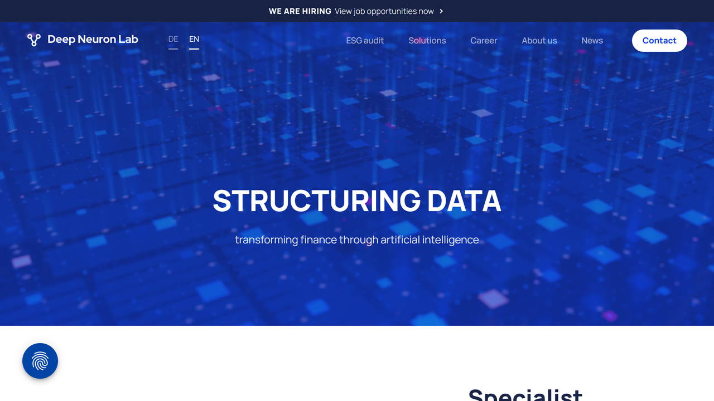

# Deep Neuron Lab GmbH

Deep Neuron Lab is Germany's leading specialist in AI-based analysis of financial and non-financial reports, leveraging advanced machine learning technologies to transform complex financial data into accessible, actionable insights for the financial industry.

## Overview

Deep Neuron Lab (DNL) offers specialized artificial intelligence solutions focused on the financial sector, particularly in the automated analysis and extraction of data from financial reports and documents. The company utilizes state-of-the-art machine learning technologies to process complex financial information, making it more accessible and useful for financial professionals [[1]](https://en.dnl.ai/).

Founded in Germany, DNL has established itself as a prominent player in the financial AI space, with offices at the AI Campus in Berlin since June 2021, positioning itself at the heart of the German and European AI ecosystem [[2]](https://en.dnl.ai/post/deep-neuron-lab-ist-teil-des-ai-campus-berlin). The company's mission centers on freeing financial professionals from tedious manual processes through intelligent automation of data extraction and analysis tasks.

Deep Neuron Lab serves various stakeholders in the financial industry including banks, investment firms, accounting companies, and regulatory bodies. Their technology is particularly valuable for organizations dealing with large volumes of financial reports that require consistent, accurate data extraction to support investment decisions, compliance requirements, and financial analysis.

## Key Features

- **AI-Powered Financial Analysis**: Advanced processing of financial documents
- **Automated Data Extraction**: Intelligent capture of financial metrics and information
- **Machine Learning Core**: Continuously improving financial document understanding
- **Financial Report Processing**: Comprehensive analysis of annual reports and statements
- **ESG Data Extraction**: Capture of environmental, social, and governance metrics
- **Compliance Automation**: Support for regulatory reporting requirements
- **Investment Intelligence**: Data extraction for investment decision-making
- **Integration Capabilities**: Connection with financial systems and platforms
- **High-Precision Analytics**: Accurate extraction of complex financial information
- **Multilingual Processing**: Support for reports in various languages
- **Customizable Solutions**: Tailored approaches for specific financial needs
- **Digital Transformation Tools**: Enablement of financial process automation

## Products

### Notes Auditor

Notes Auditor is Deep Neuron Lab's specialized solution for processing and analyzing the notes sections of financial statements and reports. The system uses advanced AI to automatically extract critical information from these often complex and unstructured portions of financial documents. The solution identifies and captures key financial indicators, accounting policies, risk disclosures, and other important notes information that traditional data extraction methods might miss. Machine learning algorithms understand the context and relationships between different notes sections, ensuring comprehensive data capture regardless of varying report formats or structures. Multi-language capabilities enable processing of financial statements in different languages, maintaining consistent extraction quality across international reports. Integration with audit workflows allows for seamless incorporation of extracted data into existing audit processes and documentation. By implementing Notes Auditor, financial professionals can significantly reduce the time spent manually reviewing notes sections, improve data accuracy through consistent extraction methodology, enhance audit quality by ensuring complete coverage of notes information, and enable more comprehensive financial analysis through better utilization of notes data [[3]](https://en.dnl.ai/loesungen).

### Financial Data Platform

Deep Neuron Lab's Financial Data Platform provides comprehensive capabilities for extracting, structuring, and analyzing data from diverse financial documents to create standardized, usable financial datasets. The solution processes various financial document types including annual reports, quarterly statements, regulatory filings, and investor presentations across different formats such as PDFs, scanned documents, and web-based reports. Extraction models capture a wide range of financial metrics including income statement data, balance sheet information, cash flow figures, ratios, and segment reporting. The platform standardizes extracted information into consistent formats regardless of source document structure, enabling comparative analysis across different companies or time periods. Advanced entity recognition identifies and normalizes company names, subsidiaries, and related entities to create accurate company hierarchies and relationships. Historical processing capabilities allow for building longitudinal financial datasets spanning multiple reporting periods for trend analysis. By implementing the Financial Data Platform, organizations can create comprehensive financial databases without manual data entry, enable sophisticated financial analysis through standardized data structures, ensure data consistency across different financial sources, and accelerate research and decision-making processes through immediate access to structured financial information.

### ESG Data Engine

Deep Neuron Lab's ESG Data Engine leverages artificial intelligence to automate the extraction and analysis of environmental, social, and governance data from corporate reports and disclosures. The solution identifies and captures ESG metrics, targets, policies, and narrative information from sustainability reports, annual reports, and other corporate disclosures regardless of document structure or reporting framework. Standardization capabilities align extracted ESG data to major reporting frameworks including GRI, SASB, TCFD, and emerging standards like ESRS, enabling consistent comparison across different reporting approaches. Sentiment and context analysis evaluates qualitative ESG disclosures to provide insights beyond simple metric extraction. Completeness assessment identifies gaps in reporting compared to relevant frameworks, helping organizations understand disclosure quality and compliance status. Integration with financial analysis connects ESG performance with financial outcomes to support impact investment decisions. By implementing the ESG Data Engine, organizations can dramatically reduce the manual effort required for ESG data collection, create more comprehensive ESG datasets encompassing both quantitative metrics and qualitative information, enable sophisticated ESG performance benchmarking through standardized data, and support regulatory compliance with emerging sustainability disclosure requirements.

## Use Cases

### Investment Research Automation

Investment firms implement Deep Neuron Lab's technology to transform how they analyze financial reports and extract investment-relevant data. The system automatically processes quarterly and annual reports from target companies, extracting key financial metrics, performance indicators, risk factors, and management commentary without requiring analysts to manually review hundreds of pages. Extraction models capture both standardized financial data and company-specific KPIs that might be buried in report narratives or supplementary sections. Comparative analysis capabilities automatically identify significant changes in financial metrics or disclosures compared to previous reporting periods, highlighting potential areas for analyst attention. Integration with investment research platforms enables extracted data to flow directly into valuation models, screening tools, and investment recommendation frameworks. This implementation dramatically reduces the time analysts spend on data gathering, allowing more focus on value-added analysis and insight generation. It improves the comprehensiveness of financial data capture by ensuring consistent extraction across the entire report rather than focusing only on headline numbers. The approach enables wider coverage of investment universes by allowing analysts to process more companies in less time, and it enhances decision quality through more thorough and consistent data incorporation into investment processes.

### Audit Process Enhancement

Accounting and audit firms leverage Deep Neuron Lab's solutions to streamline financial statement audit processes and improve audit quality. The system automatically analyzes client financial reports, extracting detailed information from primary statements, notes, and disclosures that auditors would traditionally need to manually review and document. Consistency checking capabilities identify potential discrepancies between different sections of financial reports, automatically flagging areas that might require additional auditor scrutiny. Extraction of comparative information enables year-over-year variance analysis to highlight significant changes requiring audit attention. Integration with audit software platforms allows extracted information to automatically populate audit workpapers and testing templates. Risk identification features analyze disclosures and notes to highlight areas of potential audit risk based on the nature and complexity of transactions or accounting treatments. This implementation significantly reduces the time auditors spend on document review and data extraction, allowing more focus on judgment-intensive audit procedures. It improves audit quality by ensuring comprehensive coverage of financial report content, reduces the risk of oversight by systematically processing entire documents, and enhances audit efficiency through automation of routine information gathering and preliminary analysis tasks.

### Regulatory Compliance Monitoring

Financial regulators and compliance departments implement Deep Neuron Lab's technology to enhance monitoring of financial disclosures and regulatory compliance. The system processes regulatory filings and financial reports from regulated entities, automatically extracting information relevant to specific regulatory requirements or compliance frameworks. Classification capabilities categorize disclosures according to regulatory categories, identifying whether submissions contain all required elements and information. Comparative analysis identifies changes in regulatory disclosures over time, highlighting potential shifts in compliance approaches or emerging risk areas. Integration with compliance management systems enables automated assessment of disclosure completeness and quality against regulatory expectations. Alert mechanisms flag potential compliance issues including missing disclosures, significant changes in risk reporting, or unusual financial patterns requiring further investigation. This implementation dramatically improves the efficiency of regulatory review processes by automating routine document analysis. It enables more comprehensive compliance oversight by ensuring consistent review of complete filings rather than sampling approaches. The approach supports risk-based supervision by identifying potential compliance issues for prioritized attention, and it improves regulatory intelligence through systematic analysis of disclosure trends across regulated entities.

## Technical Specifications

| Feature | Specification |
|---------|---------------|
| Deployment Options | Cloud-based SaaS, on-premises options |
| Document Processing | PDFs, scanned documents, HTML, Excel |
| Languages Supported | Multiple European languages |
| Machine Learning | Deep learning, NLP, computer vision |
| Extraction Accuracy | High precision for financial data |
| Processing Speed | Rapid document analysis |
| Integration Methods | APIs, direct connectors, data exports |
| Security Features | Enterprise-grade data protection |
| Customization | Industry and company-specific models |
| Scalability | Enterprise-level document processing |
| Data Export | Structured formats (CSV, JSON, XML) |
| Compliance | GDPR compliant data handling |

## Getting Started

1. **Needs Assessment**: Evaluation of financial document processing requirements
2. **Solution Design**: Customization of AI models for specific financial use cases
3. **Integration Planning**: Connection with existing financial systems
4. **Implementation**: Deployment and configuration of selected solutions
5. **Ongoing Optimization**: Continuous improvement of extraction accuracy

## Resources

- [Company Website](https://en.dnl.ai/)
- [Solutions Information](https://en.dnl.ai/loesungen)
- [News and Updates](https://en.dnl.ai/news)

## Contact Information

- Website: [dnl.ai](https://en.dnl.ai/) or [www.dnl.ai](https://www.dnl.ai/)
- Headquarters: Berlin, Germany
- Location: AI Campus Berlin (since June 2021)
