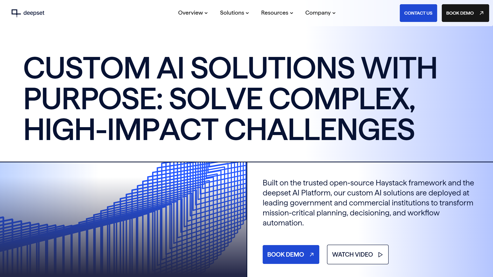

# deepset

deepset is a Berlin-based AI company providing the open-source Haystack framework for building production-ready AI applications, including RAG systems, semantic search, and intelligent document processing.

## Overview

deepset develops Haystack, an open-source AI orchestration framework that enables developers to build customizable LLM applications. Founded in 2018 by Milos Rusic, Malte Pietsch, and Timo Möller, deepset serves enterprises across financial services, media, legal, manufacturing, government, healthcare, and retail sectors. The company was named a Gartner Cool Vendor in AI Engineering in 2024. With over 4,000 Discord community members and 300+ GitHub contributors, Haystack is used by Global 500 companies including Airbus, Intel, Netflix, and Apple. deepset also offers the deepset AI Platform for enterprise deployments and recently launched Haystack Enterprise with private engineering support.

## Key Features

- **Haystack Framework**: Open-source AI orchestration framework with modular pipeline architecture
- **RAG Pipelines**: Retrieval-augmented generation with vector database integration and custom LLM interaction
- **AI Agents**: Custom agents that reason, plan, and execute actions autonomously
- **80+ Integrations**: Connects to Hugging Face, Elasticsearch, OpenSearch, OpenAI, Cohere, Anthropic, and other providers
- **[Document Understanding](../../capabilities/document-understanding/index.md)**: Intelligent document processing with text extraction and analysis
- **Semantic Search**: Document retrieval based on meaning rather than keywords
- **Production-Ready Deployment**: Fully serializable pipelines for Kubernetes, Docker, Ray, and serverless environments
- **Query Expansion**: Generates similar queries and synonyms for improved retrieval accuracy
- **Text-to-SQL**: Natural language database querying capabilities
- **Monitoring and Observability**: Built-in tracing, logging, and evaluation tools

## Use Cases

### Enterprise Question Answering and Knowledge Management
Organizations deploy Haystack to build question-answering systems that retrieve granular answers from internal documents. Financial services firms use RAG pipelines to query policies, contracts, and regulatory documents. The system grounds LLM responses in verified organizational data, reducing hallucinations and improving accuracy without training models on private data.

### Intelligent Document Processing
Companies implement Haystack for document analysis, [extraction](../../capabilities/extraction/index.md), and summarization workflows. Media and publishing organizations process articles and reports using custom pipelines with document converters, splitters, and LLM generators. Legal firms extract information from contracts and case files, while healthcare providers analyze medical literature from PubMed for clinical decision support.

### Agentic RAG with Fallback Search
Enterprises build intelligent systems that answer complex queries using internal knowledge bases with web search fallback. When retrieved documents lack sufficient information, the agent automatically searches external sources for additional context. Manufacturing companies use this approach for technical support, querying product documentation first and falling back to vendor websites when needed.

### Custom AI Applications Across Industries
Developers create specialized solutions using Haystack's modular components. Movie streaming platforms build content recommendation systems, government agencies develop secure on-premise search tools compliant with data regulations, and retail companies implement customer service chatbots that resolve complex queries by searching disconnected resources across multiple systems.

## Technical Specifications

| Feature | Specification |
|---------|---------------|
| Core Product | Haystack (open-source framework) |
| Enterprise Product | deepset AI Platform, Haystack Enterprise |
| Architecture | Modular pipeline with serializable components |
| Primary Use Cases | RAG, semantic search, question answering, IDP, AI agents |
| Integrations | 80+ providers (Hugging Face, Elasticsearch, OpenSearch, OpenAI, Cohere, Anthropic) |
| Deployment | Docker, Kubernetes, Ray, serverless, REST APIs, MCP Server (Hayhooks) |
| Environment Support | Cloud, VPC, on-premise |
| Compliance | SOC 2 Type II, ISO 27001, GDPR, HIPAA |
| Community | 4,000+ Discord members, 300+ GitHub contributors |
| Programming Language | Python |
| Notable Clients | Airbus, Intel, Netflix, Apple, Zeit Online, OakNorth Bank |

## Getting Started

1. **Install Framework**: Install Haystack via pip for Python projects
2. **Choose Components**: Select retrievers, generators, embedders, and other pipeline components
3. **Build Pipeline**: Connect components to create custom RAG, search, or agent workflows
4. **Configure Integrations**: Connect to preferred vector databases and LLM providers
5. **Deploy**: Export serialized pipelines to Kubernetes, Docker, or serverless platforms
6. **Enterprise Support**: Upgrade to Haystack Enterprise for private engineering support and deployment templates

## Resources

- [Website](https://www.deepset.ai)
- [Haystack Framework](https://haystack.deepset.ai)
- [GitHub Repository](https://github.com/deepset-ai/haystack)
- [Haystack Documentation](https://docs.haystack.deepset.ai)
- [Integrations](https://haystack.deepset.ai/integrations)
- [RAG Solutions](https://www.deepset.ai/solutions/retrieval-augmented-generation-rag)

## Company Information

Headquarters: Berlin, Germany

Founded: 2018

Founders: Milos Rusic, Malte Pietsch, Timo Möller

Employees: 51-200 