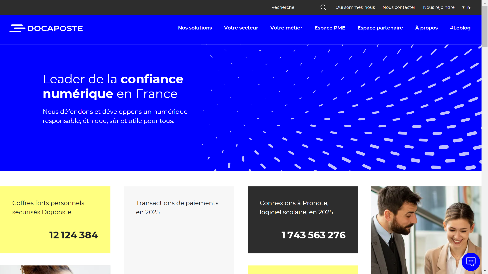

# Docaposte

Docaposte is a digital trust provider and subsidiary of La Poste Group, offering electronic signature, digital archiving, and identity verification solutions across France.

## Overview

Founded in 2007 as part of La Poste Group, Docaposte operates as France's leading digital trust provider. The company specializes in managing sensitive data for enterprises and public institutions, with data centers located and operated exclusively in France. Docaposte serves banking, insurance, healthcare, and public sector organizations, processing over 45 million patient records as France's primary health data operator. The company holds eIDAS certification across its entire digital trust service portfolio, making it the only French provider with this comprehensive qualification.

## Key Features

- **L'Identité Numérique La Poste**: First electronic identification service in France meeting eIDAS "substantial" level, certified by ANSSI, combining user ID, mobile app, and PIN code authentication with Thales security technology
- **AR24 Electronic Registered Mail**: ANSSI-qualified electronic registered mail service featuring data encryption, qualified time-stamping, and 10-year secure evidence storage
- **Digiposte**: Personal digital safe accessible via web and mobile for secure document storage and administrative management
- **Arkhineo**: Digital [archiving](../../capabilities/archiving/index.md) platform with HDS certification for health data hosting across six activity levels
- **Certinomis**: eIDAS-qualified services including electronic signatures, electronic seals, website authentication certificates, and time stamping
- **Document Processing**: Industrial-scale document digitization, [OCR](../../capabilities/ocr/index.md), electronic distribution, and video-coding services

## Use Cases

### Healthcare Data Management
Healthcare providers use Arkhineo for compliant storage and management of patient records. The HDS-certified platform handles 45 million patient records across France, providing secure archiving with electronic time-stamping and validation. The system ensures compliance with French health data regulations while enabling efficient access to medical documentation.

### Electronic Voting Systems
Public institutions and private organizations deploy Docaposte's electronic voting platform for secure digital elections. The system processes electronic votes with cryptographic security, audit trails, and identity verification. France recognizes Docaposte as the leading electronic voting provider, handling large-scale democratic processes with end-to-end security.

### Financial Institution Identity Verification
Banks and insurance companies integrate L'Identité Numérique La Poste for customer onboarding and authentication. The ANSSI-certified substantial-level eIDAS service provides multi-factor authentication combining biometric verification through mobile apps with PIN codes. Financial institutions process customer identification remotely while meeting regulatory compliance requirements.

## Technical Specifications

| Feature | Specification |
|---------|---------------|
| Core Products | L'Identité Numérique La Poste, AR24, Digiposte, Arkhineo, Certinomis |
| Compliance | eIDAS qualified (all services), ANSSI certified, ISO 27001, HDS certification |
| Authentication | Multi-factor (user ID, mobile app, PIN code), Thales security integration |
| Data Centers | France-based, independently operated |
| Encryption | Data encryption in transit and at rest |
| Evidence Storage | 10-year secure retention with time-stamping |
| Industries | Banking, insurance, healthcare, public sector |
| Language Support | French (primary) |

## Getting Started

1. **Contact Sales**: Request consultation at [docaposte.com](https://www.docaposte.com/en/)
2. **Solution Selection**: Choose from identity verification, electronic signature, archiving, or integrated services
3. **Integration Planning**: Work with Docaposte teams to design integration with existing systems
4. **Certification Review**: Review compliance certifications relevant to your industry (eIDAS, HDS, ISO 27001)
5. **Deployment**: Deploy on-premises or cloud-based infrastructure hosted in France

## Resources

- [Website](https://www.docaposte.com)

## Company Information

Headquarters: Paris, France

Founded: 2007

Parent Company: La Poste Group
