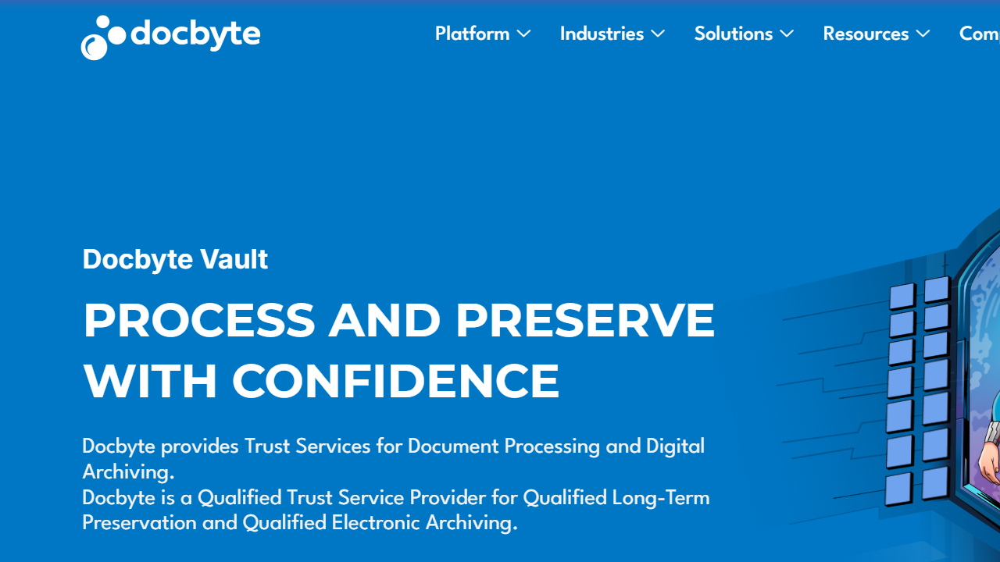

# Docbyte

Docbyte is an intelligent document processing and digital archiving provider offering the Docbyte Vault platform with qualified trust services certification.

## Overview

Docbyte specializes in secure document processing and long-term digital preservation for regulated industries. Headquartered in Gent, Belgium, the company combines IDP capabilities with eIDAS-certified trust services for document validation, signature preservation, and compliant archiving. Docbyte serves financial services, pharmaceutical, public sector, and healthcare organizations requiring secure document collection, processing, and preservation with regulatory compliance. The company holds ISO 27001 and ISO 14721 certifications for information security and long-term preservation standards.

## Key Features

- **Docbyte Vault**: Core platform for document processing and digital archiving
- **Intelligent Document Processing**: Machine learning-based [classification](../../capabilities/classification/index.md) and data [extraction](../../capabilities/extraction/index.md)
- **Digital Mailroom**: Automated secure document collection and routing
- **Long-Term Preservation**: ISO 14721-compliant archival for regulatory retention requirements
- **Digital Signature Preservation**: Validation and preservation of electronic signatures
- **Qualified Trust Services**: eIDAS-certified document verification and signature validation
- **Application Retirement**: Secure archiving of data from decommissioned systems
- **API Integration**: REST APIs for embedding trust services in third-party applications

## Use Cases

### Financial Services Document Archiving

Banks archive customer account documentation, loan files, and compliance records for regulatory retention periods. Docbyte Vault processes incoming documents through the digital mailroom, classifies content by document type and retention schedule, and stores files in ISO 14721-compliant archives. Qualified trust services validate document authenticity and preserve signature validity throughout multi-decade retention periods.

### Insurance Claims Processing

Insurance carriers receive claims documentation via email, portal uploads, and scanned mail. Docbyte's digital mailroom ingests documents from all channels, extracts claim numbers and policy information, and routes files to claims adjusters. Machine learning classification identifies document types including medical records, police reports, and repair estimates without manual sorting.

### Pharmaceutical Quality Documentation

Life sciences companies maintain batch records, quality control documentation, and validation reports for FDA compliance. Docbyte processes manufacturing documents, extracts batch identifiers and test results, and archives records with tamper-evident preservation. The platform maintains audit trails demonstrating document integrity from creation through the required retention period.

## Technical Specifications

| Feature | Specification |
|---------|---------------|
| Core Product | Docbyte Vault |
| Deployment | Cloud-based infrastructure |
| Security Certifications | ISO 27001, eIDAS qualified trust service provider |
| Preservation Standards | ISO 14721 (OAIS) compliant |
| API | REST APIs for trust services integration |
| AI Capabilities | Machine learning for document classification and extraction |
| Target Industries | Financial services, pharmaceutical, public sector, healthcare, insurance |

## Resources

- [Website](https://www.docbyte.com)
- [Intelligent Document Processing Solution](https://www.docbyte.com/intelligent-document-processing/)
- [Industry Overview](https://www.docbyte.com/industries/ )

## Company Information

Headquarters: Kortrijksesteenweg 1144 B, 9051 Gent, Belgium

Phone: +32 9 242 87 30

Email: hello@docbyte.com

Contact: [Contact Page](https://www.docbyte.com/contact/)
