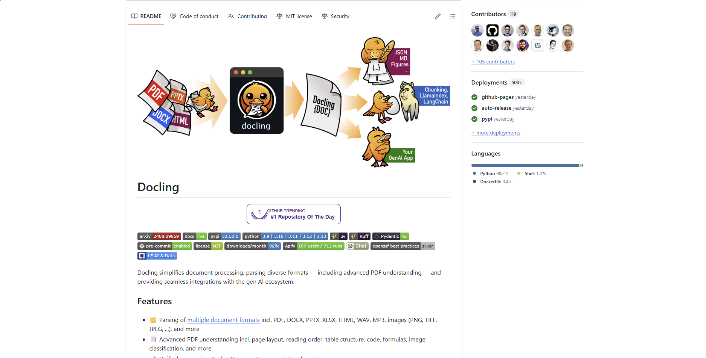

# Docling

Docling is an open-source document processing library designed to simplify document conversion and preparation for generative AI applications. Developed by the AI for knowledge team at IBM Research Zurich and hosted by the LF AI & Data Foundation, Docling represents a new generation of open-source tools for intelligent document processing.



## Overview

Docling provides advanced document understanding capabilities through a unified library that can parse multiple document formats, extract meaningful structure, and prepare content for AI applications. As an open-source project, it offers a free alternative to commercial document processing solutions while maintaining enterprise-grade functionality.

The library was created to bridge the gap between raw document formats and AI-ready content, making it easier for developers to build document-centric AI applications. Docling's architecture emphasizes local processing capabilities, ensuring sensitive data never leaves your environment while providing comprehensive document analysis.

## Key Features

- **Multi-format Document Parsing**: Support for PDF, DOCX, PPTX, XLSX, HTML, audio files, and images
- **Advanced PDF Understanding**: Intelligent page layout analysis, reading order detection, and table structure recognition
- **Unified Document Representation**: Consistent data structure across all supported document types
- **Multiple Export Formats**: Convert to Markdown, HTML, JSON, and other formats
- **Local Execution**: Process sensitive documents entirely offline for enhanced security
- **AI Framework Integration**: Native support for LangChain, LlamaIndex, and other popular AI frameworks
- **OCR Support**: Extensive optical character recognition capabilities for image-based content
- **Visual Language Model Ready**: Optimized for use with modern AI vision models
- **Cross-platform Compatibility**: Runs on macOS, Linux, and Windows with x86_64 and arm64 support

## Use Cases

### AI Document Preprocessing

Docling excels at preparing documents for generative AI applications by extracting structured content and maintaining document semantics. This makes it ideal for building AI-powered document analysis systems, chatbots that work with documents, and automated content generation pipelines.

### Document Format Conversion

Organizations use Docling to convert between different document formats while preserving structure and meaning. This capability is particularly valuable for content migration projects, document standardization initiatives, and creating unified document repositories.

### Research Document Analysis

Academic and research institutions leverage Docling to process large collections of papers, reports, and other research materials, extracting key information and preparing content for analysis and knowledge discovery.

## Technical Specifications

| Feature | Specification |
|---------|---------------|
| Programming Language | Python (98.2% of codebase) |
| License | MIT License |
| Supported Formats | PDF, DOCX, PPTX, XLSX, HTML, audio, images |
| Platform Compatibility | macOS, Linux, Windows |
| Architecture Support | x86_64, arm64 |
| Acceleration | MLX acceleration on Apple Silicon |
| Integration Options | CLI, Python library, API |
| AI Framework Support | LangChain, LlamaIndex |
| Data Processing | Local execution for privacy |

## Getting Started

1. **Installation**: Install Docling using pip
   ```bash
   pip install docling
   ```

2. **Basic Document Conversion**:
   ```python
   from docling.document_converter import DocumentConverter
   
   source = "path/to/document.pdf"
   converter = DocumentConverter()
   result = converter.convert(source)
   print(result.document.export_to_markdown())
   ```

3. **Convert from URL**:
   ```python
   from docling.document_converter import DocumentConverter
   
   source = "https://arxiv.org/pdf/2408.09869"
   converter = DocumentConverter()
   result = converter.convert(source)
   markdown_content = result.document.export_to_markdown()
   ```

4. **Export to Different Formats**:
   ```python
   # Export to HTML
   html_content = result.document.export_to_html()
   
   # Export to JSON
   json_data = result.document.export_to_json()
   ```

## Upcoming Features

- **Enhanced Metadata Extraction**: Automatic extraction of document metadata and properties
- **Chart Understanding**: Advanced analysis and interpretation of charts and graphs
- **Chemistry Structure Analysis**: Specialized processing for complex chemical structures and formulas

## Resources

- [GitHub Repository](https://github.com/docling-project/docling)
- [Documentation](https://github.com/docling-project/docling/blob/main/README.md)
- [LF AI & Data Foundation](https://lfaidata.foundation/)

## Contact Information

- GitHub: [docling-project](https://github.com/docling-project)
- License: MIT License
- Developed by: IBM Research Zurich AI for Knowledge Team
- Hosted by: LF AI & Data Foundation