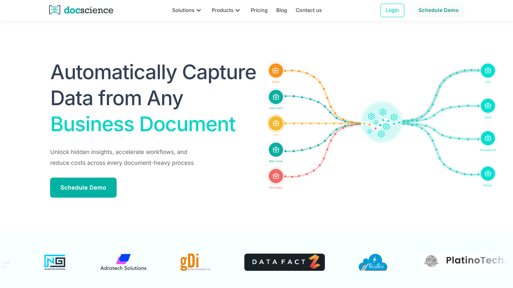

# DocScience

DocScience is an AI-powered document automation platform from Nexyom that accelerates workflows, reduces operational costs, and extracts insights from business documents.

## Overview

Developed by Nexyom in Folsom, California, DocScience provides intelligent document processing for organizations seeking to automate document-based workflows. Nexyom operates offices in both Folsom and Noida, India, focusing on AI/ML SaaS solutions, digital transformation, and automation. DocScience applies machine learning to extract structured data from unstructured business documents, enabling automated routing, analysis, and integration with downstream business systems.

## Key Features

- **AI-Powered Automation**: Machine learning models process business documents to accelerate workflow execution and reduce manual handling
- **Data Extraction**: Converts unstructured document content into structured data for integration with business applications
- **Insight Discovery**: Analyzes document content to surface business insights and patterns across document collections
- **Cost Reduction**: Automates document processing tasks to lower operational expenses associated with manual document handling

## Use Cases

Organizations deploy DocScience to automate repetitive document processing tasks across departments. The platform processes contracts, invoices, forms, and reports, extracting relevant information and routing it to appropriate systems. Companies use the extracted data for analytics, compliance reporting, and business intelligence applications.

## Technical Specifications

DocScience provides AI-powered document automation with data extraction and workflow acceleration capabilities. The platform is developed by Nexyom, which specializes in AI/ML SaaS solutions with development operations spanning California and India.

## Resources

- [Website](https://www.docscience.ai)

## Company Information

Headquarters: Folsom, California, United States

Development Center: Noida, India

Parent Company: Nexyom 