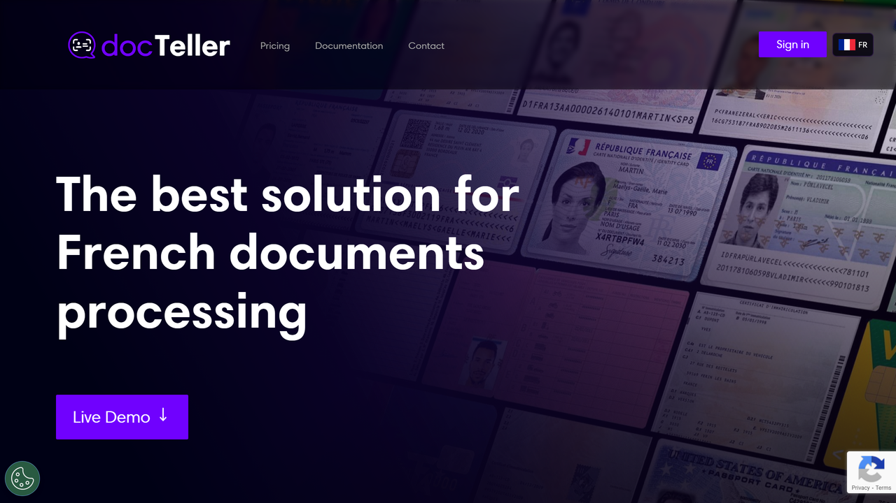

# DocTeller

DocTeller is a French document processing solution analyzing and verifying client documents in real-time with claimed 92% automation rate for compliance and business validation.

## Overview

DocTeller specializes in French document processing for subscription and onboarding workflows. The platform performs real-time analysis and verification of client documents, processing submissions in under 2 seconds during customer enrollment. DocTeller automates regulatory and business compliance checks, enabling claimed 92% straight-through processing while reducing back-office control requirements. The system provides clients with self-service document updates, maintaining compliance while accelerating onboarding cycles for French-speaking markets.

## Key Features

- **Real-Time Processing**: Analyzes and verifies documents in under 2 seconds during client subscription flows
- **Compliance Automation**: Validates documents against regulatory and business rules with claimed 92% automatic processing rate
- **French Document Specialization**: Optimized for French identity documents, contracts, and verification requirements
- **Client Self-Service**: Enables customers to update documentation instantly through self-service interfaces
- **Back-Office Efficiency**: Reduces manual control effort by automating routine compliance checks

## Use Cases

### Banking Customer Onboarding
French banks deploy DocTeller for account opening and KYC verification. The platform processes identity documents, proof of residence, and supporting paperwork in real-time as customers submit applications. Documents meeting compliance requirements flow through automatically with claimed 92% automation, while exceptions route to compliance officers for review. Customers receive instant feedback on document acceptance.

### Insurance Policy Enrollment
Insurance providers use DocTeller to verify documents during policy subscription. The system validates identity cards, driver's licenses, and other French documents against regulatory requirements within 2 seconds. Automated compliance checks reduce underwriter workload, enabling faster policy issuance while maintaining regulatory compliance with French insurance regulations.

### Financial Services Compliance
Financial institutions process client documentation through DocTeller for ongoing compliance monitoring. When customers update personal information, the platform verifies new documents against business rules and regulatory requirements. The self-service capability allows clients to maintain accurate records while automated validation ensures continued compliance with minimal back-office intervention.

## Technical Specifications

| Feature | Specification |
|---------|---------------|
| Processing Speed | Under 2 seconds per document |
| Automation Rate | Claimed 92% straight-through processing |
| Primary Market | French documents and compliance |
| Compliance Types | Regulatory and business validation |
| Use Cases | Client subscription, onboarding, KYC verification |
| Client Interface | Self-service document updates |
| Back-Office Impact | Reduced manual control requirements |

## Resources

- [Website](https://www.docteller.com)
