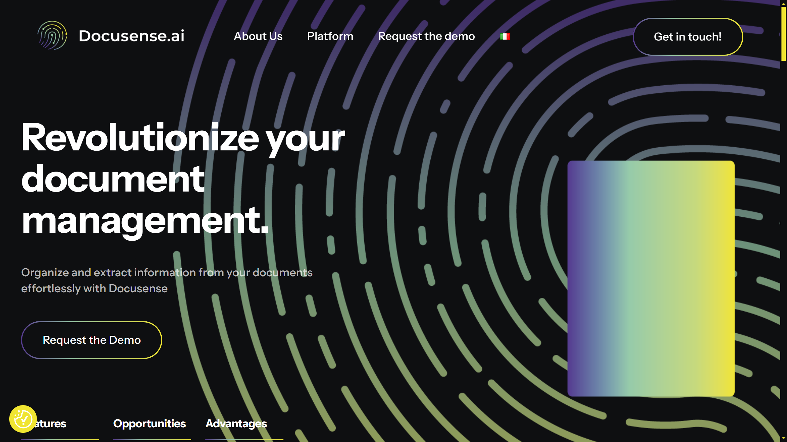

# Docusense

Docusense is a generative AI-powered IDP solution on AWS that transforms unstructured documents into structured data with real-time and batch processing capabilities.

## Overview

Docusense provides intelligent document processing powered by Generative AI, delivered through AWS Marketplace by Strata Analytics. The platform processes unstructured document content and transforms it into structured, actionable data by combining machine learning with human oversight for speed and accuracy. Docusense adapts to diverse processing needs through AWS Lambda, S3, and Kinesis for real-time and batch document workflows. The solution eliminates manual document review, enhances document analysis for business purposes, ensures compliance through validation and critical data extraction, and converts unstructured documents into formats for business system integration.

## Key Features

- **Generative AI Processing**: Applies large language models to extract and structure information from unstructured business documents
- **Real-Time and Batch Processing**: Supports immediate document processing via AWS Lambda and high-volume batch operations through S3 and Kinesis
- **Human-in-the-Loop**: Combines machine learning with human oversight to deliver exceptional accuracy for critical document workflows
- **Compliance Validation**: Validates document fulfillment requirements and extracts critical data for audit and legal compliance
- **AWS Integration**: Native deployment on AWS infrastructure with Lambda, S3, and Kinesis integration

## Use Cases

### Document Review Automation
Organizations deploy Docusense to eliminate time-consuming manual document review. The platform automatically extracts key information from contracts, reports, and correspondence, routing structured data to reviewers and business systems. Human oversight validates uncertain extractions while machine learning handles routine processing.

### Compliance Document Processing
Regulated industries use Docusense for compliance documentation workflows. The system validates document completeness against regulatory requirements, extracts critical fields for audit trails, and converts unstructured compliance reports into structured formats for regulatory submissions. AWS-based processing ensures scalable handling of compliance document volumes.

### Business Intelligence Extraction
Enterprises process unstructured documents to feed business intelligence systems. Docusense converts invoices, purchase orders, customer communications, and reports into structured data tables, enabling analytics and reporting. Real-time processing via AWS Lambda delivers immediate insights from incoming documents while batch processing handles historical document collections.

## Technical Specifications

| Feature | Specification |
|---------|---------------|
| Core Technology | Generative AI, machine learning, human-in-the-loop |
| Processing Modes | Real-time (AWS Lambda), batch (S3, Kinesis) |
| AWS Services | Lambda, S3, Kinesis |
| Document Handling | Unstructured to structured data conversion |
| Validation | Human oversight combined with ML |
| Use Cases | Document review, compliance validation, business intelligence |
| Deployment | AWS Marketplace |
| Provider | Strata Analytics |
| Pricing | Custom quotes based on requirements |
| Support | Industry best practices, incident management, SLA-based |

## Resources

- [Website](https://docusense.ai)
- [AWS Marketplace](https://aws.amazon.com/marketplace/pp/prodview-hgllvdgcmbxjk)

## Company Information

Provider: Strata Analytics

Location: Italy

Deployment: AWS cloud infrastructure 