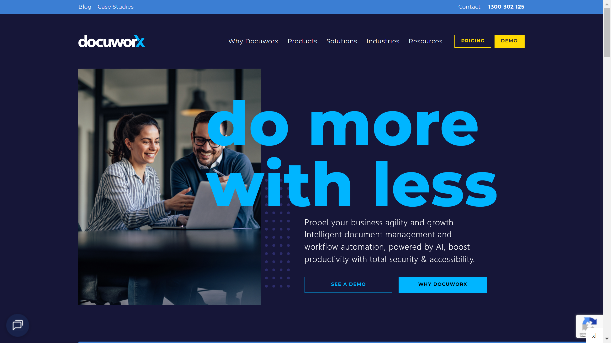

# Docuworx

Docuworx is an Australian document management provider offering data capture, OCR, and workflow automation solutions through the DocuWare platform.

## Overview

Docuworx operates as a DocuWare Platinum Partner providing document management and intelligent document processing solutions across Australia. With over 20 years in the market, the company serves more than 100 businesses across education, healthcare, manufacturing, government, retail, transport and logistics sectors. They maintain offices in Adelaide, Brisbane, Melbourne, and Sydney, delivering both cloud and on-premise deployment options.

## Key Features

- **DocuWare Platform Integration**: Enterprise content management and workflow automation through certified DocuWare partnership
- **AI-Powered Data Capture**: [OCR](../../capabilities/ocr/index.md), ICR, and machine learning for document recognition with claimed 94%+ accuracy
- **Intelligent Document Processing**: Automated [classification](../../capabilities/classification/index.md) and [data extraction](../../capabilities/extraction/index.md) with human-in-the-loop validation
- **Business Process Automation**: Workflow solutions for accounts payable, receivable, purchase orders, HR, and contract management
- **System Integration**: Connectivity with Microsoft Office, SharePoint, ERP systems, and accounting software

## Use Cases

### Invoice Processing

Organizations automate accounts payable workflows by capturing invoice data, validating against purchase orders, and routing for approval. The system extracts vendor names, amounts, and line items while flagging exceptions for review. Integration with ERP systems enables straight-through processing for matched invoices.

### HR Document Management

Human resources departments digitize employee records, onboarding documents, and performance reviews into searchable archives. Automated classification organizes documents by type and employee, while retention policies manage lifecycle compliance. Secure access controls protect sensitive personnel information.

### Healthcare Records Management

Medical practices and healthcare providers manage patient records, referrals, and administrative documents through centralized repositories. The platform converts paper and faxed documents into digital formats, automatically indexes by patient ID, and maintains audit trails for regulatory compliance.

## Technical Specifications

| Feature | Specification |
|---------|---------------|
| Core Platform | DocuWare ECM and workflow automation |
| Recognition Technology | OCR, ICR, AI/ML document recognition |
| Claimed Accuracy | 94%+ recognition rate |
| Processing Speed | Up to 70% reduction in document processing time |
| Document Formats | PDF, Excel, JPEG, PowerPoint, DOCX |
| Deployment | Cloud SaaS, on-premise, hybrid |
| Integration | Microsoft Office, SharePoint, ERP, accounting systems |
| Compliance | GDPR, HIPAA |
| Security | Encryption, audit trails, access controls |

## Resources

- [Website](https://docuworx.com.au)

## Company Information

Headquarters: North Adelaide, Australia

Additional Offices: Brisbane, Melbourne, Sydney

Founded: Over 20 years of operation (specific year not disclosed)

Clients: 100+ businesses including Trinity College, Travelex, Foodland
