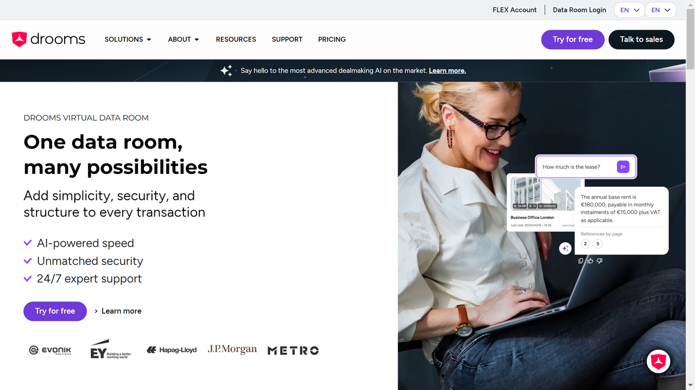

# Drooms

Drooms is a provider of secure virtual data room solutions with document processing capabilities, specializing in M&A, due diligence, and real estate transactions.

## Overview

Drooms offers cloud-based virtual data rooms for managing confidential business transactions across mergers and acquisitions, real estate deals, and corporate restructuring. The platform combines secure document sharing with AI-powered document processing features including OCR, machine learning-based search, and automated document organization. Operating primarily in European markets, Drooms processes documents with contractual data storage exclusively in Germany or Switzerland to meet GDPR requirements.

## Key Features

- **AI-Powered Document Processing**: OCR scanning with machine learning for context-sensitive search across document repositories
- **Multi-Language Translation**: Built-in translation tool supporting English, German, Italian, Spanish, French, and Dutch
- **Findings Manager**: AI-driven document analysis tool for extracting insights from transaction documents
- **Bulk Upload Support**: Drag-and-drop functionality for PDF, Excel, JPEG, PowerPoint, and DOCX formats
- **Granular Access Controls**: Role-based permissions with detailed audit trails tracking all document access and modifications
- **Q&A Management**: Integrated question-and-answer workflows for due diligence processes
- **Mobile Access**: iOS applications for iPhone and iPad with real-time document synchronization

## Use Cases

### M&A Due Diligence

Investment banks and private equity firms conduct acquisition due diligence by uploading financial statements, contracts, and corporate records to secure data rooms. Buyers review documents with OCR-enabled search, add annotations and questions, and track all access through audit logs. The platform maintains document version control and provides activity reports for transaction teams.

### Real Estate Transactions

Real estate investment firms manage property sales and acquisitions by organizing site plans, leases, inspection reports, and title documents in structured folders. The AI search capabilities help investors quickly locate specific clauses across hundreds of lease agreements. Translation features enable cross-border transactions with international buyers.

### Corporate Restructuring

Companies undergoing restructuring share confidential financial data, organizational charts, and legal documents with advisors and stakeholders. Administrators control document visibility by user group, watermark sensitive files, and generate compliance reports showing who accessed which documents and when.

## Technical Specifications

| Feature | Specification |
|---------|---------------|
| Deployment | Cloud SaaS (Germany/Switzerland data centers) |
| Document Formats | PDF, Excel, JPEG, PowerPoint, DOCX |
| OCR Technology | AI-powered optical character recognition |
| Search | Machine learning context-sensitive search |
| Translation | 6 languages (EN, DE, IT, ES, FR, NL) |
| Platforms | Windows, Mac desktop; iOS mobile |
| Security | ISO 27001:2022, ISO 27001:2013, ISO 27018 |
| Compliance | GDPR, data processing in Germany/Switzerland |
| Access Features | Real-time access, page preview, split-screen |
| Support | 24/7 multilingual support |

## Resources

- [Website](https://www.drooms.com)
- [Documentation](https://www.drooms.com/resources)

## Company Information

Headquarters: Germany

Certifications: ISO 27001:2022, ISO 27001:2013, ISO 27018

Data Processing: Germany and Switzerland exclusively
