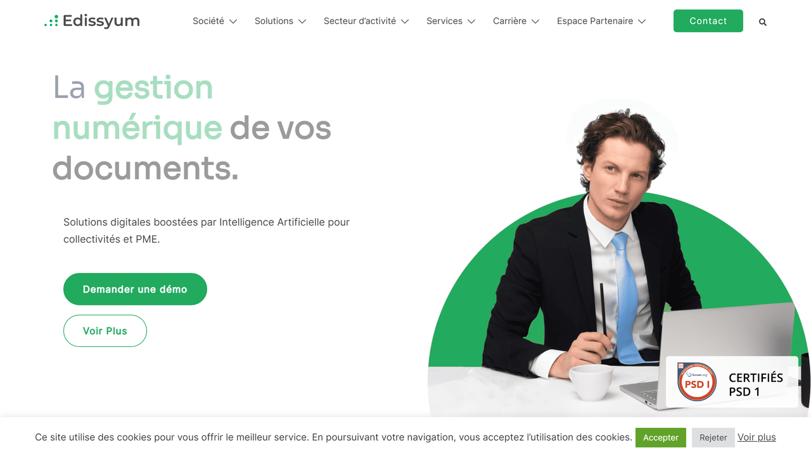

# Edissyum

Edissyum is a French provider of open-source document management and intelligent capture solutions, specializing in electronic document workflows for public sector and enterprises.

## Overview

Edissyum operates as a specialist in electronic document management and digitalization with a team of 20 technical experts serving local governments, public administrations, and businesses across France. The company develops Open-Capture, an open-source intelligent document capture platform available on GitHub, which integrates with the Maarch ECM system. Their focus areas include incoming and outgoing mail processing, document acquisition, content capture, and automated distribution workflows with in-house trained AI models.

## Key Features

- **Open-Capture Platform**: 100% open-source intelligent document capture solution with [OCR](../../capabilities/ocr/index.md), LAD-RAD (document and data recognition), and AI-powered content extraction
- **Maarch Integration**: Seamless connectivity with Maarch electronic document management system for complete workflow automation
- **AI Model Training**: In-house development and training of AI models for document recognition and classification
- **Email Recognition**: Automated email processing and [classification](../../capabilities/classification/index.md) capabilities
- **Document Digitization**: High-volume scanning and OCR indexing services with quality control processes
- **Workflow Automation**: Automated routing and processing of incoming, outgoing, and internal document flows

## Use Cases

### Public Sector Mail Management

Local governments and administrations automate incoming mail processing by scanning paper correspondence, applying OCR for text recognition, and using AI to classify documents by department and type. The system automatically routes mail to appropriate officials, tracks response deadlines, and maintains audit trails for accountability. Integration with Maarch provides document lifecycle management from receipt through archiving.

### Administrative Document Registration

Government agencies streamline document registration workflows by capturing metadata through automated form recognition and validation. Open-Capture extracts key fields from applications, permits, and official forms, validates data completeness, and indexes documents for retrieval. The platform achieves 30-40% productivity improvement for document registration tasks when integrated with Maarch.

### Automated Invoice Processing

Organizations process vendor invoices by extracting header information, line items, and payment terms through LAD-RAD technology. The system validates extracted data against master records, flags exceptions for review, and exports approved invoices to financial systems for payment processing.

## Technical Specifications

| Feature | Specification |
|---------|---------------|
| Core Product | Open-Capture (open-source IDP platform) |
| Recognition Technology | OCR, LAD-RAD, AI/ML models |
| Training | In-house AI model development |
| Integrations | Maarch ECM, business systems |
| Email Recognition Rate | Up to 80% automation |
| Document Registration | 30-40% productivity improvement with Maarch |
| Source Code | GitHub (github.com/edissyum/opencapture) |
| Deployment | On-premise, self-hosted |
| Target Sectors | Local government, public administration, enterprise |
| Language | French primary market |

## Resources

- [Website](https://www.edissyum.com)
- [GitHub Repository](https://github.com/edissyum/opencapture)

## Company Information

Headquarters: France

Team Size: 20 specialized collaborators

Focus: Electronic document management and digitalization

Primary Market: French public sector and enterprises
