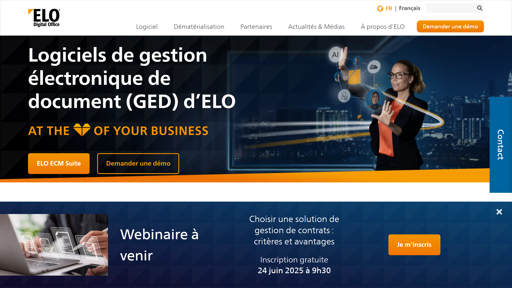

# ELO Digital Office

ELO Digital Office is a German provider of enterprise content management software, offering document management, workflow automation, and archiving solutions for organizations of all sizes.

## Overview

ELO Digital Office GmbH develops the ELO ECM Suite, an enterprise content management platform designed and manufactured in Germany. The software supports companies, administrations, and organizations in managing business-critical documents including invoices, contracts, personnel files, and records. The platform combines low-code customization with AI capabilities, offering deployment flexibility across cloud, on-premise, and managed service models. ELO integrates with Microsoft, SAP, Salesforce, and Datev applications, serving enterprises that require audit-proof archiving and automated business processes.

## Key Features

- **ELO ECM Suite**: Comprehensive platform for document capture, indexing, [classification](../../capabilities/classification/index.md), audit-proof archiving, and workflow management
- **AI and Low-Code**: AI-powered automation with low-code configuration for adapting to specific business requirements
- **Elasticsearch Integration**: Advanced search functionality powered by Elasticsearch for rapid document retrieval
- **Multi-Client Architecture**: Java-based platforms, web server solutions, and direct ECM functionality within email systems
- **Email Archiving**: Server and client-based email archiving for Microsoft Exchange/Outlook and IBM Domino/Notes
- **Format Conversion**: Automated document format conversion with check-out/check-in and version control

## Use Cases

### Contract Lifecycle Management

Legal and procurement teams manage contracts from creation through renewal by storing signed agreements in the ELO repository with automated metadata extraction. The system tracks contract milestones, sends renewal reminders, and maintains version histories. Role-based access ensures only authorized personnel view sensitive contract terms while audit trails track all document access.

### Invoice and AP Automation

Accounting departments process vendor invoices by capturing documents via email, scan, or portal upload. ELO's AI extracts invoice data, validates against purchase orders, routes for approval workflows, and archives processed invoices with retention policies. Integration with SAP or Datev systems enables automatic posting to financial ledgers.

### HR Records Management

Human resources departments digitize and manage employee files including applications, contracts, performance reviews, and benefits documentation. The platform enforces access restrictions based on HR roles, manages retention schedules according to labor regulations, and provides audit-proof archiving for compliance requirements.

## Technical Specifications

| Feature | Specification |
|---------|---------------|
| Core Product | ELO ECM Suite |
| Technology | AI, low-code, Elasticsearch search |
| Client Platforms | Java-based clients, web browsers, email integration |
| Deployment | Cloud subscription, managed services, on-premise, private cloud |
| Archiving | Audit-proof with deletion period management |
| Email Support | MS Exchange/Outlook, IBM Domino/Notes |
| Integration | Microsoft, SAP, Salesforce, Datev |
| Document Functions | Format conversion, versioning, check-out/check-in |
| Access Control | Role-based permissions, audit trails |
| Origin | Made in Germany |

## Resources

- [Website](https://www.elo-digital.fr)
- [Technical Documentation](https://www.elo.com/en-us/software/elo-ecm-suite/technology-clients.html)

## Company Information

Headquarters: Germany

Product: ELO ECM Suite

Manufacturing: Developed and produced in Germany

Target Users: Companies, government administrations, organizations of all sizes
