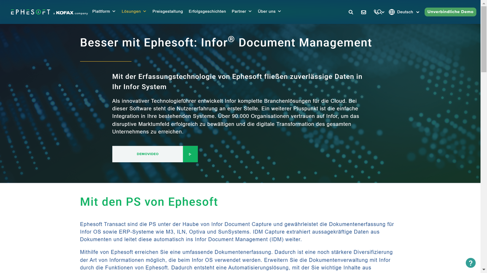

# Ephesoft (acquired by Tungsten Automation, former "Kofax")

Ephesoft provides intelligent document processing solutions that help organizations transform unstructured content into actionable data through advanced capture and analytics technologies.

## Overview

Ephesoft specializes in intelligent document capture and data extraction technologies that enable organizations to convert unstructured documents into structured, usable data. The company was acquired by Tungsten Automation (formerly known as Kofax) in a strategic move that combined Ephesoft's document processing capabilities with Kofax's broader intelligent automation platform.

Founded in 2010, Ephesoft developed a reputation for innovative approaches to document capture, particularly through its early adoption of cloud-native architecture and machine learning technologies. Their solutions are designed to automatically classify, separate, extract, and validate information from various document types, regardless of format or complexity.

Ephesoft serves organizations across multiple industries including financial services, healthcare, government, insurance, and manufacturing. Their solutions help reduce manual data entry, improve process efficiency, enhance data accuracy, and accelerate document-driven business operations.

## Key Features

- **Intelligent Document Capture**: Automated digitization and processing of paper and electronic documents
- **Smart Document Classification**: AI-powered categorization of documents by type
- **Data Extraction**: Automated retrieval of key information from unstructured content
- **Machine Learning Technology**: Self-learning capabilities for continuous improvement
- **Cloud-Native Architecture**: Scalable deployment in cloud environments
- **Hybrid and On-Premises Options**: Flexible implementation approaches
- **Supervised and Unsupervised Learning**: Multiple AI training methods
- **Multi-Channel Capture**: Processing documents from various input sources
- **Integration Capabilities**: Connection with ERP, ECM, and other business systems
- **Mobile Capture**: Document processing via mobile devices

## Use Cases

### Mortgage Loan Processing Automation

Financial institutions implement Ephesoft to transform their mortgage loan processing operations. The solution captures loan applications and supporting documents from multiple channels including branch scanners, email attachments, and web portals. Intelligent classification automatically identifies more than 50 different document types common in mortgage packages, such as applications, tax returns, bank statements, and property appraisals. Advanced extraction technology retrieves key loan data including borrower information, property details, income verification, and credit history. The system validates extracted data against business rules and integrates with loan origination systems to populate applicant records without manual entry. This comprehensive approach reduces processing time from days to hours, improves data accuracy, ensures compliance through consistent processing, and enhances customer experience through faster loan decisions.

### Healthcare Records Management

Healthcare providers utilize Ephesoft to streamline the processing of patient medical records and administrative documents. The platform captures various healthcare documents including registration forms, insurance cards, referrals, lab results, and clinical notes. Machine learning algorithms classify these documents by type and extract critical patient information such as demographics, insurance details, medical record numbers, and diagnostic codes. The solution integrates with Electronic Health Record (EHR) systems and practice management applications to automatically update patient records with the captured information. This approach significantly reduces administrative workload for healthcare staff, minimizes data entry errors, improves records accessibility for clinicians, and enhances billing accuracy. The solution also supports healthcare compliance requirements by ensuring consistent processing and maintaining detailed audit trails.

## Technical Specifications

| Feature | Specification |
|---------|---------------|
| Deployment Options | Cloud, Hybrid, On-premises |
| OCR Technologies | Multiple OCR engines for optimal recognition |
| AI Capabilities | Supervised and unsupervised machine learning |
| Extraction Accuracy | Up to 99% for structured documents |
| Supported Languages | 100+ languages for document processing |
| Integration Methods | REST APIs, CMIS, Web Services |
| Processing Speed | Up to thousands of pages per minute |
| Document Types | Invoices, contracts, forms, correspondence, etc. |
| Security Features | Encryption, role-based access, audit trails |
| Scalability | Enterprise-grade for high-volume processing |

## Getting Started

1. **Requirements Assessment**: Analysis of document processing needs
2. **Solution Design**: Configuration aligned with business requirements
3. **Implementation**: Deployment and integration with existing systems
4. **Training**: User education and machine learning model training
5. **Optimization**: Continuous improvement of extraction accuracy

## Resources

- [Company Website](https://ephesoft.com/de/loesungen/infor/)

## Acquisition Information

In 2022, Ephesoft was acquired by Tungsten Automation (formerly known as Kofax), a leading provider of intelligent automation software. This acquisition integrated Ephesoft's document intelligence capabilities into Tungsten's broader intelligent automation platform, expanding the combined company's ability to deliver end-to-end process automation solutions. The acquisition represented a significant consolidation within the Intelligent Document Processing market.
