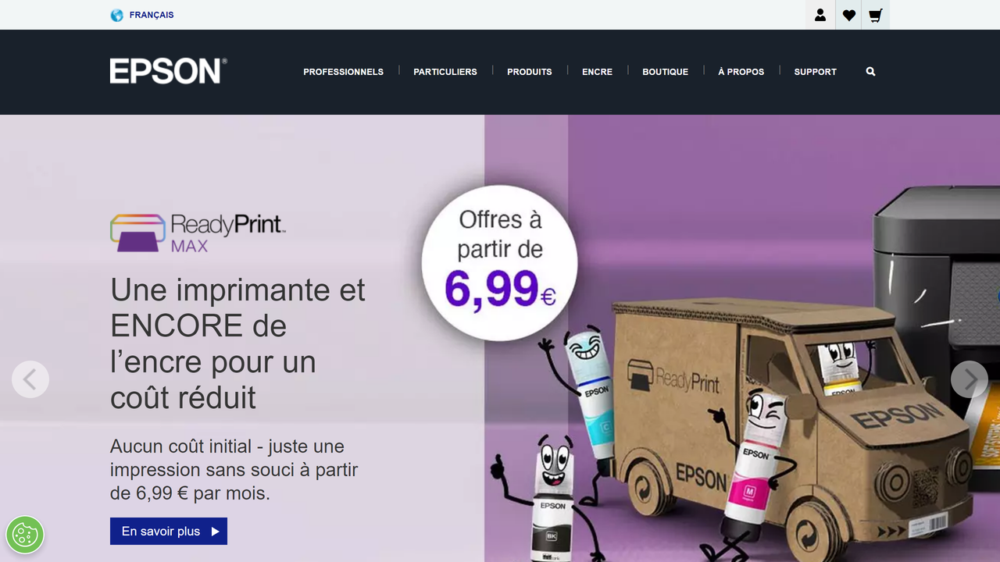

# Epson

Epson is a global technology company that offers document scanning and processing solutions as part of its broader hardware and software portfolio.(./assets/Epson](./assets/epson.png)

## Overview

Epson provides a range of document scanning hardware and software solutions that enable organizations to digitize, process, and manage their documents efficiently. Their offerings include high-performance scanners and document management software designed to streamline document-centric workflows and facilitate digital transformation initiatives.

## Key Features

- Document scanning hardware
- Document capture software
- Optical Character Recognition (OCR)
- Document management
- Workflow automation
- Cloud integration
- Mobile scanning capabilities
- Integration with business applications

## Use Cases

- Office document digitization
- Digital mailroom automation
- Records digitization and management
- Form processing
- Receipt and invoice scanning
- Healthcare document management
- Financial document processing
- Educational institution document management

## Technical Specifications

Epson's document processing solutions combine hardware scanning devices with software for document capture and management. Their scanners offer various speed and volume capabilities to meet different organizational needs, while their software provides features for document processing, OCR, and integration with document management systems and business applications.

## Resources

- [Website](https://www.epson.fr)
- [Documentation](https://www.epson.fr/products/scanners)
