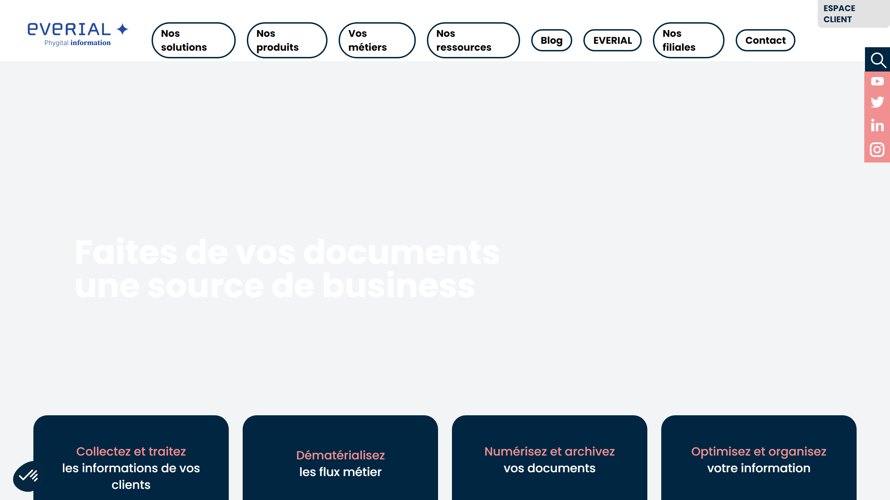

# Everial

Everial is a provider of document management, archiving, and digitization services, offering comprehensive solutions for managing physical and digital documents.

## Overview

Everial provides a range of services and solutions for document management, including physical and digital archiving, document digitization, and secure destruction. Their offerings help organizations manage their document lifecycles efficiently while ensuring compliance with regulatory requirements and facilitating access to information.

## Key Features

- Physical document archiving
- Document digitization services
- Electronic document management
- Secure document destruction
- Document workflow automation
- Compliance and governance solutions
- Hybrid archiving solutions
- Consultation and advisory services

## Use Cases

- Corporate archives management
- Historical document preservation
- HR document management
- Legal document archiving
- Healthcare record management
- Financial document archiving
- Public sector document management
- Secure document destruction

## Technical Specifications

Everial offers both physical facilities for document storage and software platforms for digital document management. Their digital solutions include secure cloud-based storage, access control features, and tools for document organization and retrieval. They provide services for large-scale document digitization with quality control processes to ensure accuracy.

## Resources

- [Website](https://www.everial.com)
- [Documentation](https://www.everial.com/resources)
