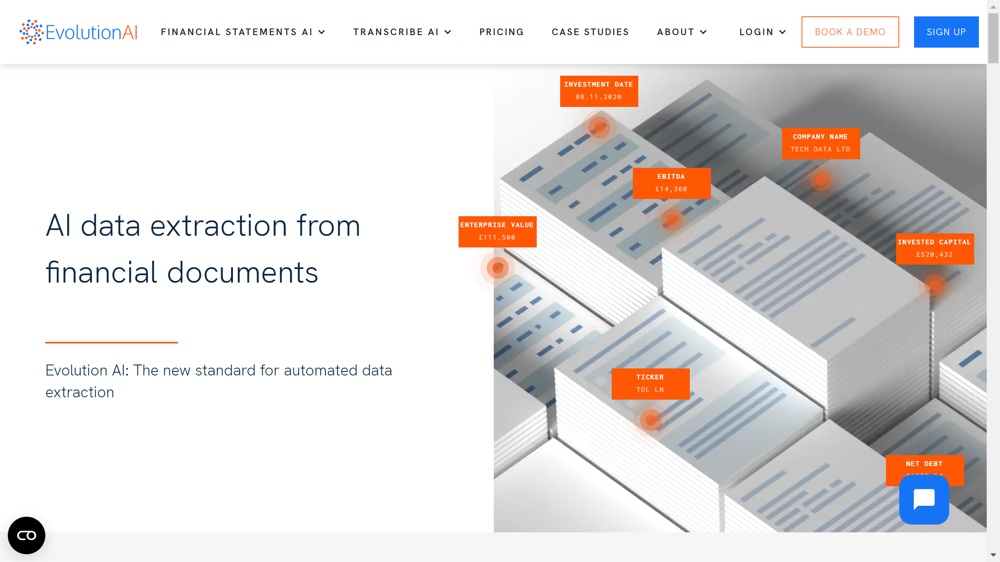

# Evolution AI

Evolution AI is a London-based provider of NLP-powered data extraction solutions specializing in contract analysis and financial document processing for enterprises.

## Overview

Evolution AI develops natural language processing systems for extracting structured data from unstructured text, with particular focus on legal contracts and financial documents. Founded in 2015, the company processes over 1.5 million pages daily for clients including NatWest, Deutsche Bank, and Dun & Bradstreet. Their platform combines visual reasoning with NLP to interpret document layouts, tables, and semantic context similar to human comprehension. The technology handles complex document formats such as quarterly reports, balance sheets, profit and loss statements, account statements, and invoices.

## Key Features

- **Visual Reasoning and NLP**: Combined computer vision and natural language processing for understanding document layout, tables, and text semantics
- **Contract Data Extraction**: Specialized NLP for detecting legal terms, obligations, permissions, and references to external documents within contracts
- **Financial Document Processing**: Automated [extraction](../../capabilities/extraction/index.md) from quarterly reports, financial statements, and banking documents
- **Lexical Nuance Detection**: Recognition of subtle differences in contract language such as obligations versus permissions
- **High-Volume Processing**: Capability to process 1.5+ million pages per day
- **Structured Output**: Extracted data available as CSV or Excel for integration with downstream systems

## Use Cases

### Contract Portfolio Analysis

Legal departments and contract management teams analyze large contract repositories by uploading hundreds or thousands of agreements for batch processing. Evolution AI extracts key terms including parties, dates, obligations, payment terms, and renewal clauses. The system identifies cross-references between contracts and flags non-standard language. Extracted data exports to contract management systems or spreadsheets for portfolio risk analysis.

### Banking Document Processing

Financial institutions automate extraction from account statements, transaction reports, and regulatory filings submitted by corporate clients. The platform interprets varied document layouts from different banking systems, extracts transaction details and account balances, and structures data for credit analysis. Deutsche Bank and NatWest use the system to reduce manual data entry for corporate banking operations.

### Investment Document Analysis

Asset managers process quarterly reports and financial disclosures from portfolio companies by extracting performance metrics, fund holdings, and risk disclosures. Swiss asset manager Unigestion reduced data extraction costs by 75% using Evolution AI to process quarterly reports, enabling faster investment decisions based on structured portfolio data.

## Technical Specifications

| Feature | Specification |
|---------|---------------|
| Core Technology | NLP, visual reasoning, computer vision |
| Processing Capacity | 1.5+ million pages per day |
| Document Types | Contracts, quarterly reports, financial statements, invoices, account statements |
| Output Formats | CSV, Excel |
| Language Capabilities | Legal and financial terminology processing |
| Contract Features | Obligations, permissions, external references, clause extraction |
| Integration | Bulk upload, API access (details not publicly specified) |
| Notable Clients | NatWest, Deutsche Bank, Dun & Bradstreet, Unigestion |

## Resources

- [Website](https://www.evolution.ai)
- [Contract Solutions](https://www.evolution.ai/solutions/contracts)

## Company Information

Headquarters: London, United Kingdom

Founded: 2015

Investors: Firstminute Capital (seed round)

Case Study: 75% cost reduction for Unigestion on quarterly report extraction
