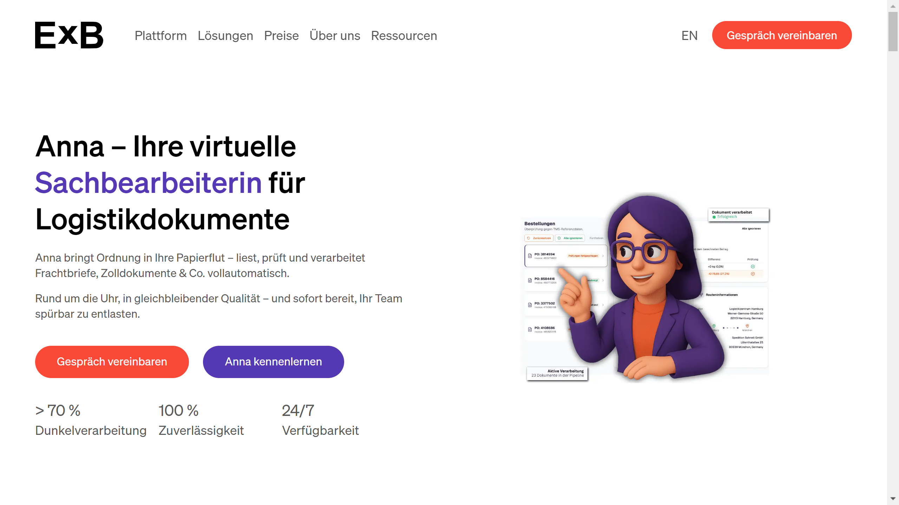

# ExB

ExB is a Munich-based intelligent document processing platform provider specializing in AI-powered data extraction from unstructured documents across multiple industries.

## Overview

ExB Labs, founded in 2000, develops AI-based document processing software combining machine learning, natural language processing, and optical character recognition for enterprise document automation. The company's Cognitive Workbench uses deep learning and computer vision to create trainable modules for understanding any document type across industries and languages. ExB raised €9.5 million in funding led by Alstin Capital, with participation from Bayern Kapital and other investors. The platform serves healthcare, insurance, manufacturing, retail, banking, and logistics sectors, processing both digital and scanned documents including invoices, emails, customer inquiries, reports, order confirmations, claims, and forms.

## Key Features

- **Cognitive Workbench**: Deep learning and computer vision platform for creating custom document understanding modules for any document type or language
- **Multi-Technology AI**: Combined machine learning, [NLP](../../capabilities/extraction/index.md), and [OCR](../../capabilities/ocr/index.md) for processing structured and unstructured data
- **Pre-Trained Modules**: Ready-to-use document processing modules requiring minimal technical implementation effort
- **Anna AI Assistant**: Autonomous processing of 70%+ of documents with validated results and high precision
- **Flexible Integration**: API-based connectivity to ERP, CRM, and workflow systems with automated data export
- **Universal Document Support**: Handles digital files, scanned documents, emails with attachments, and all forms of unstructured data

## Use Cases

### Healthcare Patient Record Processing

Healthcare providers automate intake of patient documents including referrals, test results, insurance forms, and medical histories. ExB extracts patient demographics, diagnoses, procedures, and insurance information from varied document formats submitted by physicians, labs, and patients. The platform handles handwritten notes and faxed documents, validating extracted data before feeding into electronic health record systems.

### Insurance Claims Automation

Insurance carriers process claims by extracting policyholder information, incident details, damage assessments, and supporting documentation from claim forms, police reports, repair estimates, and photos. The AI validates data consistency across documents, flags missing information, and routes claims to adjusters. The system adapts to different claim types and policy formats without template configuration.

### Manufacturing Order Processing

Manufacturers automate order confirmation processing by extracting product specifications, quantities, delivery dates, and pricing from customer emails and PDF order forms. ExB handles variations in customer order formats, validates against product catalogs and pricing agreements, and exports confirmed orders to ERP systems for production scheduling and fulfillment.

## Technical Specifications

| Feature | Specification |
|---------|---------------|
| Core Platform | Cognitive Workbench with deep learning and computer vision |
| AI Technology | Machine learning, NLP, OCR |
| Training Approach | Trainable modules for any document type, industry, language |
| Automation Rate | 70%+ autonomous processing (Anna AI assistant) |
| Document Types | Digital, scanned, emails, invoices, forms, reports, claims, inquiries |
| Pre-Built Modules | Available for immediate integration |
| Deployment | Cloud, on-premise options |
| Integration | API to ERP, CRM, workflow systems |
| Industries | Healthcare, insurance, manufacturing, retail, banking, logistics |
| Funding | €9.5M led by Alstin Capital, Bayern Kapital |

## Resources

- [Website](https://exb.de)
- [Platform Overview](https://exb.de/en/platform/)

## Company Information

Headquarters: Munich, Germany

Founded: 2000

Funding: €9.5 million (Alstin Capital lead, Bayern Kapital, Plug and Play Tech Center, Hannover Digital Investments, Blackrun Partners)

Industries: Finance, automotive, healthcare, insurance, manufacturing, retail, banking, logistics
