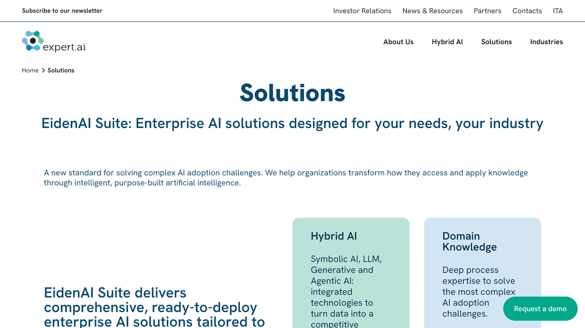

# Expert.ai

Expert.ai is a global leader in artificial intelligence applied to natural language processing (NLP) and understanding (NLU), providing a comprehensive platform that turns unstructured language data into actionable insights for businesses.

## Overview

Expert.ai offers specialized artificial intelligence solutions designed to help businesses understand and extract value from unstructured text data. The company has developed a hybrid AI platform that combines symbolic AI, machine learning, large language models (LLMs), and generative AI to comprehend language with human-like precision [[1]](https://www.expert.ai/products/expert-ai-platform-overview/).

Founded in 1989 in Modena, Italy (originally as Expert System), the company has evolved into a leading provider of natural language technology. Expert.ai serves organizations across various industries including insurance, banking, publishing, media, and defense and intelligence. Their solutions are particularly valuable for organizations dealing with large volumes of unstructured text data that require accurate understanding, classification, and extraction of insights.

Expert.ai's technology focuses on making natural language understanding accessible and practical for business applications. Their hybrid approach enables organizations to implement AI-powered text analysis for various applications including content enrichment, process automation, knowledge discovery, and risk management, delivering high accuracy even with complex language requirements [[2]](https://www.expert.ai/natural-language-understanding/).

## Key Features

- **Hybrid AI Architecture**: Combination of symbolic and machine learning approaches
- **Deep Linguistic Analysis**: Comprehensive understanding of language components
- **Knowledge Graph Integration**: Rich semantic network of concepts and relationships
- **Multi-language Support**: Processing of content in multiple languages
- **Domain-Specific Knowledge Models**: Tailored understanding for specific industries
- **Document Classification**: Automatic categorization of content
- **Entity Extraction**: Identification of key elements in text
- **Sentiment Analysis**: Assessment of emotional tone in content
- **Relationship Identification**: Recognition of connections between concepts
- **Taxonomy Management**: Organization of information hierarchies
- **Customizable Pipelines**: Flexible processing workflows
- **API Integration**: Connectivity with existing business systems

## Products

### Expert.ai Platform

Expert.ai Platform provides comprehensive capabilities for processing and understanding unstructured language data through a hybrid approach that combines the strengths of different AI methodologies. The platform features a hybrid natural language processing architecture that supports pipelines based on machine learning, symbolic AI, and combination approaches, providing flexibility to address diverse language challenges [[3]](https://www.expert.ai/app/uploads/2021/07/info-business-solution-package_Sept-2021.pdf). Core linguistic capabilities include part-of-speech tagging, syntactic analysis, and semantic disambiguation that enable deep understanding of text beyond surface-level keyword recognition. Knowledge graph integration incorporates a vast network of concepts, entities, and relationships that provides rich semantic context for language analysis. Document classification and categorization automatically organize content according to customizable taxonomies and ontologies, making information more discoverable and manageable. Entity and relationship extraction identifies key elements in text including people, organizations, locations, events, and the connections between them. Sentiment and emotional analysis evaluates the tone, opinion, and emotional content in text at both document and entity levels. By implementing the Expert.ai Platform, organizations can transform unstructured text into structured data for analytics and automation, improve the accuracy of text-based decisions through deeper understanding of language nuances, accelerate information processing with automated document analysis, and enable more sophisticated text applications through rich linguistic capabilities [[4]](https://content.expert.ai/resource/expert-ai-platform-video/).

### EidenAI Suite

Expert.ai's EidenAI Suite represents the company's newest offering, providing industry-specific AI solutions designed for enterprise deployment with a focus on practical business outcomes. The suite combines various AI technologies including symbolic AI, large language models, generative AI, and agentic AI in an integrated approach that maximizes the strengths of each methodology while compensating for individual limitations [[5]](https://www.expert.ai/solutions/). Industry-specific modules target particular sectors such as insurance, banking, publishing, and healthcare with pre-built capabilities tailored to common use cases in those domains. Workflow integration capabilities enable seamless connection with existing business processes and systems through APIs, connectors, and customizable interfaces. The solution emphasizes practical AI implementation focused on tangible business results rather than theoretical capabilities, with features designed to address specific business challenges. Governance and control mechanisms ensure responsible AI use with explainability, bias management, and compliance features built into the platform. Scalable deployment options support growth from departmental pilots to enterprise-wide implementation with consistent performance. By implementing the EidenAI Suite, organizations can accelerate time-to-value for AI initiatives through industry-specific starting points, maintain control and transparency over AI systems with the hybrid approach, integrate AI capabilities into existing workflows and systems with minimal disruption, and adapt solutions to evolving business needs through modular, flexible design.

### Natural Language API

Expert.ai's Natural Language API provides developers with programmatic access to advanced language understanding capabilities that can be embedded into applications and workflows. The API delivers comprehensive natural language processing features including part-of-speech tagging, lemmatization, syntactic analysis, semantic disambiguation, entity recognition, and relationship extraction through simple REST endpoints [[6]](https://www.prnewswire.com/news-releases/expertai-and-reveal-group-partner-to-create-nlp-bots-for-intelligent-automation-by-combining-robotic-process-automation-with-natural-language-understanding-301790555.html). Multi-language support enables processing of content in various languages with consistent quality and methodology across linguistic boundaries. Ready-to-use knowledge models provide pre-built understanding for general language as well as specific domains including finance, insurance, healthcare, and legal content. Customization capabilities allow fine-tuning of entity types, classifications, and extraction patterns to match specific business requirements without extensive development. Integration options include SDKs for major programming languages and platforms, streamlining implementation in diverse technical environments. The API is designed for scalable performance with optimized response times and throughput to handle enterprise-level content volumes. By implementing the Natural Language API, organizations can embed sophisticated language understanding into applications without requiring in-house NLP expertise, accelerate development timelines by leveraging pre-built language capabilities, ensure consistent text processing across different systems and touchpoints, and extend applications with intelligent text features including categorization, extraction, and analysis.

## Use Cases

### Intelligent Document Processing

Organizations implement Expert.ai's technology to transform how they process and extract value from large volumes of documents including contracts, policies, reports, and correspondence. The system automatically classifies incoming documents by type, purpose, and content, routing them to appropriate processing workflows without manual sorting. Intelligent extraction capabilities identify and capture key information including entities, dates, amounts, clauses, and relationships with high accuracy even from unstructured text portions. Context-aware understanding recognizes the significance of extracted elements based on their document context, distinguishing between similar terms with different meanings in various scenarios. Integration with existing document management systems and business processes enables seamless flow of extracted information into appropriate systems of record. This implementation dramatically reduces manual document handling time, particularly for complex or lengthy documents that would require significant human reading. It improves information accuracy through consistent, objective analysis compared to error-prone manual review. The approach enables more comprehensive document utilization by identifying relevant information that might be overlooked in manual skimming. It also accelerates document-dependent processes like claims handling, contract review, or compliance verification through automated information extraction and routing.

### Risk Assessment and Underwriting

Insurance companies and financial institutions leverage Expert.ai's natural language understanding to enhance risk assessment and underwriting processes for insurance policies, loans, and investments. The platform analyzes diverse text sources including applications, reports, news, social media, and internal documents to identify risk factors, exposures, and potential issues that might not be captured in structured data fields. Relationship identification uncovers connections between entities, events, and conditions that could impact risk profiles but are typically buried in narrative text. Sentiment and tone analysis evaluates subjective elements in reports and communications that might indicate emerging issues or changing risk conditions. Automated comparison of submitted information against existing policies, standards, and historical data highlights inconsistencies or unusual patterns requiring further investigation. Continuous monitoring of news and public information sources provides updates on changing risk factors related to specific industries, regions, or entities in the portfolio. This approach significantly improves risk assessment accuracy by incorporating insights from unstructured text that contains critical context and details. It accelerates underwriting processes through automated extraction and analysis of key information from applications and supporting documents. The implementation enables more consistent risk evaluation by applying the same comprehensive analysis to every case regardless of volume or complexity. It also enhances fraud detection by identifying subtle inconsistencies, unusual patterns, or suspicious relationships in textual information.

### Knowledge Discovery and Research

Research organizations, intelligence agencies, and knowledge-intensive businesses implement Expert.ai's technology to enhance how they discover insights and connections across vast collections of unstructured content. The system processes diverse text sources including research papers, reports, news articles, patents, and internal documents, automatically identifying key concepts, entities, and relationships to build comprehensive knowledge networks. Cross-document relationship identification uncovers connections between information fragments scattered across different sources, revealing patterns and insights that would be difficult to discover manually. Semantic search capabilities enable users to find information based on meaning and context rather than just keywords, retrieving relevant content even when specific terms aren't used. Topic and trend analysis identifies emerging themes, changing patterns, and developing issues across content collections over time. Customized knowledge models ensure that analysis is properly tuned to specific domains such as medicine, finance, or specific technical fields. This implementation dramatically improves research efficiency by automatically processing and connecting information across thousands of documents. It enables discovery of non-obvious relationships and insights that might be missed in manual review of separate documents. The approach supports more comprehensive analysis by ensuring relevant information isn't overlooked regardless of terminology variations. It also accelerates time-to-insight by quickly mapping knowledge landscapes across vast document collections.

## Technical Specifications

| Feature | Specification |
|---------|---------------|
| Deployment Options | Cloud, on-premises, hybrid |
| Architecture | Hybrid AI (symbolic + ML + LLMs) |
| Languages Supported | Multiple (including English, Spanish, French, Italian, German) |
| API | REST API with JSON response format |
| SDKs | Python, Java, .NET, JavaScript |
| Integration | Webhooks, connectors for major platforms |
| Processing Speed | Optimized for enterprise volumes |
| Knowledge Bases | General and domain-specific |
| Customization | Rules, taxonomies, entities, relationships |
| Security | Enterprise-grade data protection |
| Scalability | Horizontal scaling for high volumes |
| Data Formats | Text, HTML, PDF, Office documents |

## Use in Robotic Process Automation

Expert.ai's natural language capabilities can be integrated with robotic process automation (RPA) platforms to extend automation to unstructured text data. Through connectors like the UiPath integration, organizations can build intelligent document processing workflows that combine RPA's structured data handling with Expert.ai's text understanding capabilities [[7]](https://marketplace.uipath.com/listings/expertai-natural-language-understanding).

This integration enables the creation of NLP robots that can extract and categorize unstructured data with high accuracy, expanding automation potential beyond traditional structured data processes. By combining these technologies, organizations can automate more complex workflows that involve understanding and processing natural language content.

## Resources

- [Company Website](https://www.expert.ai/)

## Address

Via Virgilio, 48/H -- Scala 5

41123 Modena, Italy

Web: <https://www.expert.ai/>

Email: marketing@expert.ai

Tel: +39 059 894011