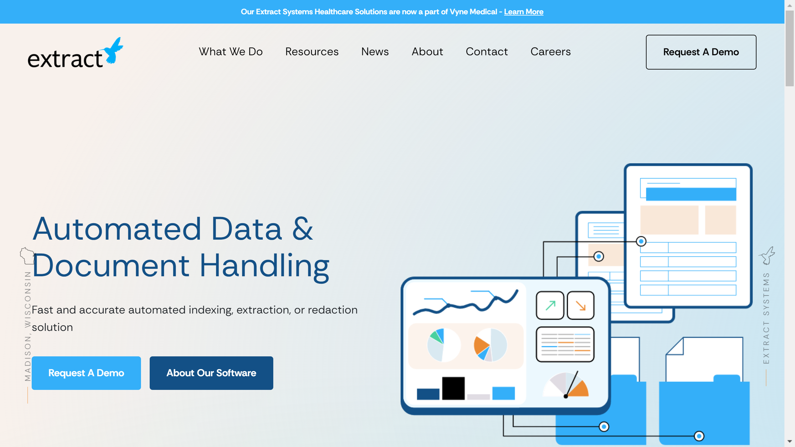

# Extract Systems

Extract Systems is a Wisconsin-based provider of automated data extraction, redaction, and classification software specializing in healthcare and government document processing.

## Overview

Extract Systems, headquartered in Madison, Wisconsin, develops AI-powered document processing software for unstructured data management in healthcare and government sectors. The company has processed over 6 billion pages for 250+ customers across 41 states, maintaining zero reported data privacy or security breaches. Their platform combines OCR, machine learning, and customizable rule sets to automate data extraction, redaction, and indexing workflows. Core products include ID Shield for automated redaction and LabDE for healthcare laboratory data extraction, both integrating with electronic medical record systems via HL7 interfaces.

## Key Features

- **ID Shield Redaction**: Automated identification and permanent removal of PHI and PII from documents without template dependencies
- **LabDE Platform**: Machine learning-powered extraction of laboratory results from faxed and scanned documents with EMR integration
- **Intelligent Classification**: AI-powered document type identification and routing
- **99.9% EMR Accuracy**: High-precision [data extraction](../../capabilities/extraction/index.md) validated to electronic medical record standards
- **Graphical Verification**: Human-in-the-loop interface for reviewing and validating AI-identified redactions and extractions
- **Continuous Learning**: Algorithms improve accuracy through ongoing processing and feedback

## Use Cases

### HIPAA-Compliant Document Redaction

Healthcare providers and government agencies use ID Shield to redact protected health information from medical records, legal documents, and land records before public release. The system identifies names, addresses, Social Security numbers, and medical identifiers across document types without requiring templates. Redactions are permanently burned into files, preventing recovery. Staff review flagged areas through the verification interface before finalizing redacted documents.

### Laboratory Data Automation

Hospital systems deploy LabDE to process faxed COVID test results, pathology reports, and lab findings arriving as scanned documents. The platform extracts patient identifiers, test types, results, and reference ranges, then maps inconsistent result descriptions ("+", "POS") to standardized EMR values ("Positive"). Validated data transmits via HL7 interfaces to the correct patient records, eliminating manual transcription of lab backlogs.

### Government Records Management

County clerk offices automate indexing of land records, court documents, and vital records by extracting key metadata including parties, dates, case numbers, and document types. Extract Systems' classification engine determines document categories, routes files to appropriate departments, and populates database fields for public records search systems.

## Technical Specifications

| Feature | Specification |
|---------|---------------|
| Core Products | Automated extraction, ID Shield redaction, LabDE healthcare data extraction |
| Recognition Technology | OCR, machine learning, AI |
| Accuracy | 99.9% to EMR standards |
| Pages Processed | 6+ billion |
| Customer Base | 250+ customers, 41 US states |
| Document Formats | TIF, PDF, BMP, JPG, PBM, PCX, PNG, PGM |
| File Limits | Up to 300MB, 999 pages per document |
| Healthcare Integration | HL7 interfaces with EMR/EHR systems |
| Security | Zero reported privacy/security breaches |
| Productivity Gain | 3x data entry productivity improvement |
| Industries | Healthcare, government, legal |

## Resources

- [Website](https://www.extractsystems.com)
- [Redaction Software](https://www.extractsystems.com/redaction-software/)
- [LabDE Platform](https://www.extractsystems.com/resources/labde/)

## Company Information

Headquarters: Madison, Wisconsin, United States

Address: 8517 Excelsior Drive, Suite 400

Contact: (608) 821-6520

Customers: 250+ across 41 states

Industries: Healthcare, government, legal
